<!--yml

category: 未分类

date: 2024-05-27 14:29:32

-->

# 拉撒路与FudModule Rootkit：超越BYOVD，利用管理员到内核的零日漏洞 - Avast威胁实验室

> 来源：[https://decoded.avast.io/janvojtesek/lazarus-and-the-fudmodule-rootkit-beyond-byovd-with-an-admin-to-kernel-zero-day/](https://decoded.avast.io/janvojtesek/lazarus-and-the-fudmodule-rootkit-beyond-byovd-with-an-admin-to-kernel-zero-day/)

## 关键点

+   Avast发现了一种针对appid.sys AppLocker驱动程序中先前未知的零日漏洞的现实中管理员到内核利用。

+   由于Avast的及时报告，微软在二月的补丁星期二更新中解决了这个漏洞，编号为[CVE-2024-21338](https://msrc.microsoft.com/update-guide/vulnerability/CVE-2024-21338)。

+   这次利用活动由臭名昭著的拉撒路组织策划，最终目标是建立内核读写原语。

+   这个原语使得拉撒路能够在其更新版本的仅数据型FudModule Rootkit中执行直接的内核对象操作，其之前的版本由[ESET](https://www.virusbulletin.com/uploads/pdf/conference/vb2022/papers/VB2022-Lazarus-and-BYOVD-evil-to-the-Windows-core.pdf)和[AhnLab](https://download.ahnlab.com/global/brochure/Analysis-Report-on-Lazarus-Groups-Rootkit-Attack-Using-BYOVD.pdf)分析过。

+   在彻底逆向工程这个更新的Rootkit变种之后，Avast发现在功能和隐蔽性方面有了显著进展，新增了四种新的和三种更新的Rootkit技术。

+   在关键进展中，Rootkit现在采用了一种新的句柄表项操作技术，试图挂起与Microsoft Defender、CrowdStrike Falcon和HitmanPro相关的PPL（受保护进程轻）受保护的进程。

+   另一个显著进步是利用零日漏洞，拉撒路以前利用更为喧哗的BYOVD（带上你自己的易受攻击驱动程序）技术越过管理员到内核的边界。

+   Avast的调查还恢复了感染链的大部分内容，导致Rootkit部署，发现与拉撒路有关的新远程访问木马（RAT）。

+   有关RAT和初始感染向量的技术细节将在随后发布的博客文章中公布，计划与我们的[Black Hat Asia 2024简报](https://www.blackhat.com/asia-24/briefings/schedule/#from-byovd-to-a--day-unveiling-advanced-exploits-in-cyber-recruiting-scams-37786)一同发布。

## 引言

谈及Windows安全时，管理员和内核之间存在着一道薄弱的界线。微软的[安全服务标准](https://www.microsoft.com/en-us/msrc/windows-security-servicing-criteria)长期以来断言，“管理员到内核不是安全边界”，这意味着微软保留了根据自身决定修补管理员到内核漏洞的权利。因此，Windows安全模型并不保证能防止管理员级别的攻击者直接访问内核。这不仅仅是理论上的问题。实际上，具有管理员权限的攻击者经常通过利用已知的易受攻击的驱动程序实现内核级访问，这种技术称为[BYOVD](https://www.welivesecurity.com/2022/01/11/signed-kernel-drivers-unguarded-gateway-windows-core/)（携带您自己的易受攻击驱动程序）。

尽管如此，微软并未放弃保护管理员到内核的界限。恰恰相反，微软在使这一界限更难越过方面取得了很大进展。深度防御保护措施，如[DSE](https://learn.microsoft.com/en-us/windows-hardware/drivers/install/driver-signing)（驱动程序签名强制执行）或[HVCI](https://learn.microsoft.com/en-us/windows-hardware/design/device-experiences/oem-hvci-enablement)（Hypervisor-Protected Code Integrity，Hypervisor保护的代码完整性），使得攻击者越来越难以在内核中执行自定义代码，迫使大多数攻击者转向仅通过读写内核内存来实现其恶意目标的数据攻击。其他防御措施，如[驱动程序黑名单](https://learn.microsoft.com/en-us/windows/security/application-security/application-control/windows-defender-application-control/design/microsoft-recommended-driver-block-rules)，正在推动攻击者转向利用较少人知的易受攻击驱动程序，导致攻击复杂性增加。尽管这些防御措施尚未达到我们能够正式称之为管理员到内核安全边界的程度（BYOVD攻击仍然可行，因此将其称为安全边界只会让用户产生虚假的安全感），但它们显然代表了朝着正确方向迈出的步伐。

从攻击者的角度来看，从管理员到内核的跨越打开了一个全新的[可能性](https://github.com/wavestone-cdt/EDRSandblast)领域。通过内核级访问，攻击者可能会干扰安全软件，隐藏感染指标（包括文件、网络活动、进程等），禁用内核模式遥测，关闭缓解措施等。此外，由于[PPL](https://learn.microsoft.com/en-us/windows/win32/services/protecting-anti-malware-services-)（受保护进程轻）的安全依赖于管理员到内核边界，我们的假想攻击者还能够篡改受保护进程或向任意进程添加保护。如果lsass被[用RunAsPPL保护](https://learn.microsoft.com/en-us/windows-server/security/credentials-protection-and-management/configuring-additional-lsa-protection)，则绕过PPL可能使攻击者能够转储原本无法访问的凭据，这尤为强大。

对于攻击者可能希望通过内核级访问实现的更具体示例，请继续阅读本博客——在[后半部分](#techniques)，我们将深入探讨FudModule rootkit中实施的所有技术。

##### 利用现有资源：易受攻击的驱动程序版本

似乎有越来越多的攻击者试图滥用前述内核功能中的一些能力，防御者别无选择，只能大力追捕驱动程序漏洞。因此，希望攻击防御良好网络的攻击者也必须提升他们的水平，以避免被检测到。我们可以将管理员到内核驱动程序利用漏洞广泛分为三类，每一类都代表了攻击难度和隐蔽性之间的一种权衡。

###### **N-Day BYOVD Exploits**

在最简单的情况下，攻击者可以利用BYOVD来利用公开已知的n-day漏洞。这非常容易实现，因为有大量公开的各种漏洞的概念验证利用。但是，这也相对容易检测，因为攻击者必须首先将已知的易受攻击的驱动程序放置到文件系统中，然后加载到内核中，从而产生两次很好的检测机会。更重要的是，一些系统可能启用了Microsoft的[vulnerable driver blocklist](https://learn.microsoft.com/en-us/windows/security/application-security/application-control/windows-defender-application-control/design/microsoft-recommended-driver-block-rules#microsoft-vulnerable-driver-blocklist)，这将阻止一些最常见的易受攻击的驱动程序加载。之前的[FudModule rootkit](https://www.virusbulletin.com/uploads/pdf/conference/vb2022/papers/VB2022-Lazarus-and-BYOVD-evil-to-the-Windows-core.pdf)的版本可以放入这个类别，最初利用已知的漏洞在[dbutil_2_3.sys](https://www.virustotal.com/gui/file/0296e2ce999e67c76352613a718e11516fe1b0efc3ffdb8918fc999dd76a73a5/detection)，然后在后续版本中转向目标[ene.sys](https://www.virustotal.com/gui/file/175eed7a4c6de9c3156c7ae16ae85c554959ec350f1c8aaa6dfe8c7e99de3347)。

###### **Zero-Day BYOVD漏洞利用**

在更复杂的情况下，攻击者会使用 BYOVD 来利用第三方签名驱动程序中的零日漏洞。自然地，这需要攻击者首先发现这样的零日漏洞，这初看起来可能是一项艰巨的任务。然而，请注意，任何一个有漏洞的签名驱动程序都可以，而且不幸的是低质量的第三方驱动程序并不少见。因此，发现这种漏洞的难度可能并不像初看起来的那么高。仅仅扫描一组驱动程序以查找已知的漏洞模式可能就足够了，正如 Carbon Black 研究人员最近使用批量静态分析揭示了超过 200 个签名驱动程序中的 34 个独特漏洞那样。这种零日 BYOVD 攻击比 n-day 攻击更加隐蔽，因为防御者不能再依赖已知易受攻击驱动程序的哈希进行检测。然而，仍然存在一些检测机会，因为加载随机驱动程序代表了一个可能需要进行更深入调查的可疑事件。例如，考虑间谍软件供应商 Candiru，我们曾经捕获其在其浏览器利用链的最终权限提升阶段中利用 [hw.sys](https://www.virustotal.com/gui/file/6a4875ae86131a594019dec4abd46ac6ba47e57a88287b814d07d929858fe3e5) 的零日漏洞进行攻击。

###### **超越 BYOVD**

最终，admin-to-kernel 的圣杯在于利用已知安装在目标机器上的驱动程序中的零日漏洞，超越 BYOVD。为了使攻击尽可能普遍化，最明显的目标应该是内置于操作系统中的 Windows 驱动程序。

在这种驱动程序中发现可利用的漏洞比之前的 BYOVD 场景要困难得多，原因有两个。首先，可能的目标驱动程序数量大大减少，导致攻击面大幅减少。其次，内置驱动程序的代码质量可以说比随机的第三方驱动程序要高，使得漏洞更难发现。还值得注意的是，虽然补丁通常无法有效阻止 BYOVD 攻击（即使供应商对其驱动程序进行了补丁，攻击者仍然可以滥用旧版本未修补的驱动程序），但对内置驱动程序进行补丁将使该漏洞不再适用于此类零日攻击。

即使攻击者尽管面对所有这些障碍成功利用了内置驱动程序的零日漏洞，他们也将获得无法与标准 BYOVD 攻击相媲美的隐蔽水平。通过利用这种漏洞，攻击者在某种意义上是在 [living off the land](https://www.crowdstrike.com/cybersecurity-101/living-off-the-land-attacks-lotl/)，无需携带、丢弃或加载任何自定义驱动程序，使得内核攻击真正做到无文件化。这不仅规避了大多数检测机制，还能够在启用了驱动程序白名单的系统上发动攻击（鉴于 CVE-2024-21338 是涉及 AppLocker 驱动程序，这可能有些讽刺）。

尽管我们只能推测 Lazarus 选择跨越管理员到内核边界的这种第三种方法的动机，但我们认为隐蔽性是他们的主要动机。考虑到他们的臭名昭著程度，他们将不得不在有人揭露他们当前使用的 BYOVD 技术时更换漏洞。也许他们还推理说，通过超越 BYOVD，他们可以通过更长时间地保持未被发现状态来最小化需要更换漏洞的需求。

## CVE-2024-21338

关于零日漏洞，CVE-2024-21338 相对于理解和利用来说都比较直接。这个漏洞存在于 `appid.sys` 中的 IOCTL（输入输出控制）调度程序中，它是内置于 Windows 的应用程序白名单技术 [AppLocker](https://learn.microsoft.com/zh-cn/windows/security/application-security/application-control/windows-defender-application-control/applocker/applocker-overview) 背后的核心驱动。易受攻击的控制代码 `0x22A018` 设计用于计算可执行映像文件的 *智能哈希*。这个 IOCTL 通过允许调用者指定驱动程序如何查询和读取哈希文件，提供了一些灵活性。问题在于，这种灵活性通过期望来自 IOCTL 输入缓冲区的两个内核函数指针来实现：一个包含用于查询哈希文件大小的回调指针，另一个包含用于读取要哈希的数据的回调指针。

由于用户模式通常不会处理内核函数指针，这种设计表明 IOCTL 可能最初是设计为从内核调用的。确实，虽然我们没有找到任何合法的用户模式调用者，但是其他 AppLocker 驱动程序确实会调用这个 IOCTL。例如，`applockerfltr.sys` 中有一个 `ZwDeviceIoControlFile` 调用，传递 `SmpQueryFile` 和 `SmpReadFile` 作为回调指针。此外，`appid.sys` 本身也使用这个功能，传递 `AipQueryFileHandle` 和 `AipReadFileHandle`（它们基本上只是 `ZwQueryInformationFile` 和 `ZwReadFile` 的包装器）。

尽管如此设计，这个脆弱的 IOCTL 仍然可以从用户空间访问，这意味着用户空间的攻击者可以滥用它，从而实质上欺骗内核调用任意指针。更重要的是，攻击者还部分控制了传递给调用回调函数的第一个参数所引用的数据。这提供了一个理想的利用场景，允许攻击者对第一个参数具有高度控制权的情况下调用任意内核函数。

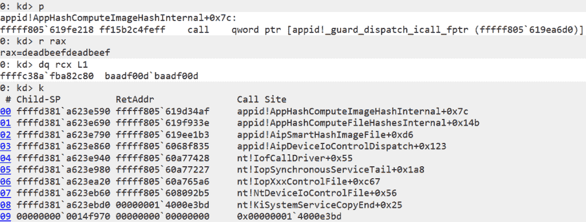

携带漏洞的 WinDbg 会话，追溯到任意回调函数的调用。请注意，攻击者控制着将要调用的函数指针（本次会话中为`0xdeadbeefdeadbeef`）和第一个参数所指向的数据（`0xbaadf00dbaadf00d`）。

如果利用听起来很简单，请注意此漏洞允许攻击者调用哪些指针存在一些限制。当然，在存在[SMEP](https://j00ru.vexillium.org/2011/06/smep-what-is-it-and-how-to-beat-it-on-windows/)（Supervisor Mode Execution Prevention）的情况下，攻击者不能仅提供用户模式的 shellcode 指针。更重要的是，回调调用是一个间接调用，可能由[kCFG](https://learn.microsoft.com/en-us/windows/win32/secbp/control-flow-guard)（Kernel Control Flow Guard）保护，要求提供的内核指针表示有效的 kCFG 调用目标。在实践中，这并不阻止利用，因为攻击者可以找到一些符合 kCFG 的小工具函数，将其转化为另一种基元，比如（有限的）读写。此外，IOCTL 输入缓冲区还有一些其他的约束条件，必须解决才能达到脆弱回调函数的调用。然而，这些问题也相对容易满足，因为攻击者只需伪造一些内核对象并提供正确的值，以便 IO 控制处理程序通过所有必要的检查，同时不会使内核崩溃。

该漏洞的 IOCTL 通过名为`\Device\AppId`的设备对象公开。[分解](https://learn.microsoft.com/en-us/windows-hardware/drivers/kernel/defining-i-o-control-codes) `0x22A018` 控制码并提取 `RequiredAccess` 字段显示，调用它需要具有写访问权限的句柄。检查设备的 ACL（访问控制列表；请参见下面的截图），有关`本地服务`、`管理员`和`appidsvc`的条目。虽然`管理员`的条目未授予写访问权限，但`本地服务`的条目确实授予了。因此，为了更准确地描述 CVE-2024-21338，我们应该将其标记为*本地服务到内核*而不是*管理员到内核*。还值得注意的是，`appid.sys`可能会创建两个额外的设备对象，分别是`\Device\AppidEDPPlugin`和`\Device\SrpDevice`。虽然这些设备对象的 ACL 更宽松，但通过它们无法访问漏洞的 IOCTL 处理程序，因此对于利用目的它们是无关紧要的。

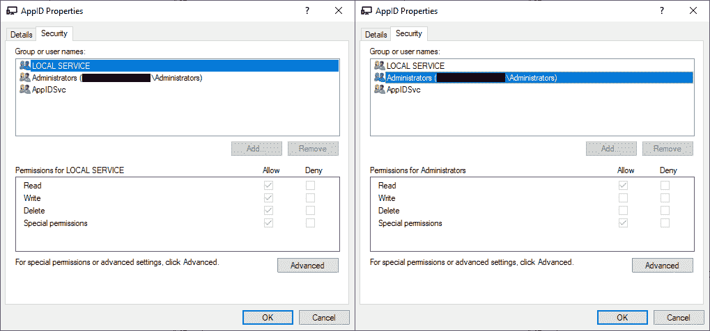

`\Device\AppId`的访问控制条目显示，虽然`本地服务`允许写访问，但`管理员`不允许。

由于[本地服务](https://learn.microsoft.com/en-us/windows/win32/services/localservice-account)帐户权限相对于管理员较低，这也使得该漏洞的影响比标准的管理员到内核漏洞更大。这可能是微软将 CVE 归类为“权限要求：低”的原因，考虑到`本地服务`进程并不总是必须以更高的完整性级别运行。然而，出于本博客的目的，我们仍选择将 CVE-2024-21338 主要描述为管理员到内核漏洞，因为我们认为这更好地反映了它在野外的使用方式——Lazarus 已经以提升的权限运行，然后才模拟本地服务帐户调用 IOCTL。

漏洞最初出现在 Win10 1703（RS2/15063）版本中，当`0x22A018` IOCTL 处理程序首次实现时。旧版本不受影响，因为它们不支持此漏洞的 IOCTL。有趣的是，Lazarus 利用程序在遇到早于 Win10 1809（RS5/17763）版本时会退出，完全忽略了三个完全有漏洞的 Windows 版本。至于更新版本，漏洞一直延伸到最新的构建，包括 Win11 23H2 版本。IOCTL 有些轻微更改，包括预期在输入缓冲区中的额外参数，但这并不能阻止利用。

我们开发了一个自定义的PoC（概念验证）漏洞利用，并于2023年8月作为漏洞报告的一部分提交给Microsoft，导致了2024年2月补丁星期二更新的[CVE-2024-21338](https://msrc.microsoft.com/update-guide/vulnerability/CVE-2024-21338)的公告。该更新通过在IOCTL处理程序中添加了一个`ExGetPreviousMode`检查来解决了这个漏洞（见下面的补丁）。这旨在防止用户模式发起的IOCTL触发任意回调。

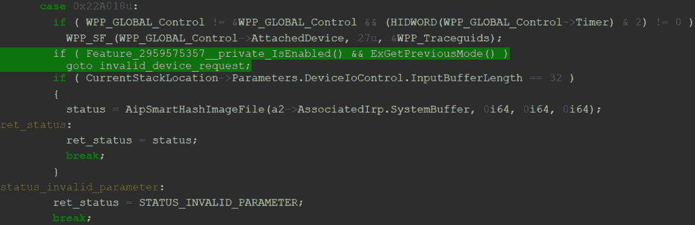

已打补丁的IOCTL处理程序。如果启用了功能`2959575357`，则尝试使用`PreviousMode==UserMode`调用IOCTL应立即导致`STATUS_INVALID_DEVICE_REQUEST`，甚至无法到达`AipSmartHashImageFile`。

尽管这个漏洞可能勉强达到了Microsoft的安全服务标准，但我们认为修补是正确的选择，并感谢Microsoft最终解决了这个问题。修补无疑会中断Lazarus的攻击操作，迫使他们要么找到一个新的管理员到内核的零日漏洞，要么回到使用BYOVD技术。虽然发现一个管理员到内核的零日漏洞可能不像在更有吸引力的攻击面（如标准用户到内核，甚至沙箱到内核）上发现零日那么具有挑战性，但我们认为找到一个仍需要Lazarus投入大量资源，可能会转移他们的注意力，从而攻击其他不幸的目标。

#### 利用

Lazarus漏洞利用从初始化阶段开始，该阶段为漏洞利用和rootkit（两者已编译到同一模块中）进行一次性设置。此初始化首先动态解析所有必要的Windows API函数，然后在`PEB.BeingDebugged`上进行简单的反调试检查。接着，漏洞利用程序检查构建版本，以确定是否运行在支持的Windows版本上。如果是，则加载针对当前构建的硬编码常量。有趣的是，有时常量的选择取决于更新版本号（UBR），展示了确保代码在广泛目标机器上干净运行的高度奉献精神。

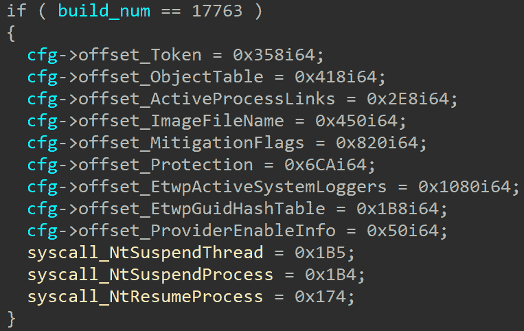

一个反编译的代码片段，加载特定于版本的硬编码常量。此特定示例包含Win10 1809的偏移量和系统调用号。

初始化过程继续泄露三个内核模块的基址：`ntoskrnl`、`netio`和`fltmgr`。这是通过使用`SystemModuleInformation`类调用`NtQuerySystemInformation`实现的。当前正在执行的线程的`KTHREAD`地址也以类似的方式泄露，通过复制当前线程的伪句柄，然后使用`SystemExtendedHandleInformation`系统信息类找到相应的内核对象地址。最后，攻击手动将`ntoskrnl`镜像加载到用户地址空间，仅仅是为了扫描一些感兴趣函数的相对虚拟地址（RVA）。

由于`appid.sys`驱动程序不需要预先加载到目标机器上，攻击可能首先需要自行加载它。攻击选择以间接方式完成此操作，通过向特定的与AppLocker相关的ETW（Windows事件跟踪）提供程序写入事件。一旦加载了`appid.sys`，攻击利用直接系统调用`NtSetInformationThread`来冒充`local service`账户，使用`ThreadImpersonationToken`线程信息类。通过冒充`local service`，它现在可以获取到`\Device\AppId`的读写句柄。利用这个句柄，攻击最终准备好IOCTL输入缓冲区，并通过`NtDeviceIoControlFile`系统调用触发漏洞。

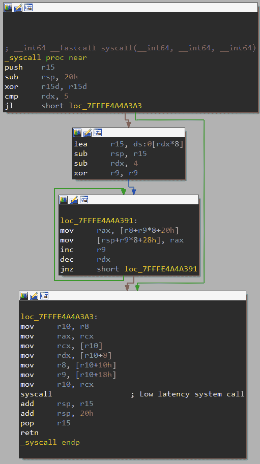

直接系统调用在整个攻击中被广泛使用。

攻击者设计了IOCTL输入缓冲区，使得易受攻击的回调本质上成为一个机器码片段，从IOCTL输入缓冲区复制64位到任意目标地址。选择的地址用于破坏当前线程的[PreviousMode](https://learn.microsoft.com/en-us/windows-hardware/drivers/kernel/previousmode)。通过确保IOCTL输入缓冲区中对应的源字节为零，复制将清除`PreviousMode`字段，实际上将其值解释为`KernelMode`。像这样针对`PreviousMode`的攻击技术在诸如`NtReadVirtualMemory`或`NtWriteVirtualMemory`等系统调用内的内核模式检查中广受欢迎，允许用户态攻击者读写任意内核内存。需要注意的是，尽管这种技术在一些Windows Insider Builds上已经得到了[缓解](https://x.com/GabrielLandau/status/1597001955909697536)，但在撰写时尚未普及到一般可用性。

有趣的是，漏洞利用可能会尝试两次触发易受攻击的IOCTL。这是由于在Win11 22H2中添加了一个额外的参数。因此，新版本的IOCTL处理程序期望输入缓冲区大小为`0x20`字节，而之前的预期大小仅为`0x18`字节。与其为当前构建选择适当的输入缓冲区大小，不如尝试两次调用IOCTL：首先使用输入缓冲区大小`0x18`，然后（如果不成功）使用`0x20`。这是一个有效的方法，因为IOCTL处理程序的第一个操作是检查输入缓冲区的大小，如果不匹配预期大小，它将立即返回`STATUS_INVALID_PARAMETER`。

为了检查漏洞利用是否成功，漏洞利用使用了`NtWriteVirtualMemory`系统调用，试图读取当前线程的`PreviousMode`（Lazarus避免使用`NtReadVirtualMemory`，稍后详细说明）。如果利用成功，系统调用应返回`STATUS_SUCCESS`，并且泄漏的`PreviousMode`字节应等于`0`（表示`KernelMode`）。否则，系统调用应返回错误状态码，因为未经损坏的`PreviousMode`是不可能读取内核内存的。

在我们的漏洞分析中，我们故意选择省略一些关键细节，比如回调小工具函数的选择。这一决定是为了在帮助防御者检测时找到适当平衡，既不让利用过于广泛可用，又能有效帮助防御。对于那些出于防御目的需要更多信息的人，我们可能会根据具体情况分享额外的细节。

## FudModule Rootkit

管理员到内核的漏洞利用的整体目标是破坏当前线程的`PreviousMode`。这允许使用`Nt(Read|Write)VirtualMemory`系统调用来进行强大的内核读写原语，受影响的用户模式线程可以读取和写入任意内核内存。利用这种原语，FudModule rootkit使用直接内核对象操作（DKOM）技术来破坏各种内核安全机制。值得重申的是，FudModule是一个仅包含数据的rootkit，意味着它完全在用户空间执行，所有内核篡改通过读写原语完成。

FudModule rootkit的第一个变体分别由AhnLab和ESET研究团队独立发现，并且两者分别在2022年9月发布了详细分析。该rootkit以`FudModule.dll`字符串作为其导出表中的名称命名。虽然这个构件不再存在，但毫无疑问我们发现的是同一rootkit的更新版本。AhnLab的[报告](https://download.ahnlab.com/global/brochure/Analysis-Report-on-Lazarus-Groups-Rootkit-Attack-Using-BYOVD.pdf)记录了2022年初的一个样本，该样本整合了七种仅限数据的rootkit技术，并通过[ene.sys](https://www.virustotal.com/gui/file/175eed7a4c6de9c3156c7ae16ae85c554959ec350f1c8aaa6dfe8c7e99de3347)的BYOVD漏洞进行启用。ESET的[报告](https://www.virusbulletin.com/uploads/pdf/conference/vb2022/papers/VB2022-Lazarus-and-BYOVD-evil-to-the-Windows-core.pdf)检查了2021年底稍早的一个变体，也包含了七种rootkit技术，但利用了[dbutil_2_3.sys](https://www.virustotal.com/gui/file/0296e2ce999e67c76352613a718e11516fe1b0efc3ffdb8918fc999dd76a73a5/detection)中不同的BYOVD漏洞。相比之下，我们的发现涉及一个样本，其中包含了九种rootkit技术，并利用了一个之前未知的管理员到内核漏洞。在这九种技术中，有四种是新的，三种是改进的，而另外两种与之前的变体保持不变。这导致了原本的七种技术中的两种被废弃，不再出现在最新的变体中。

每种rootkit技术被分配一个位，从`0x1`到`0x200`（当前变体中未使用`0x20`位）。FudModule按照分配位的升序顺序依次执行这些技术。这些位被用于报告单个技术的成功。在执行过程中，FudModule将构造一个整数值（在以下的反编译中命名为`bitfield_techniques`），其中仅设置了成功执行技术对应的位。这个整数最终被写入名为`tem1245.tmp`的文件中，报告rootkit的成功。有趣的是，我们没有在任何其他Lazarus样本中找到这个文件名的引用，这表明这个被丢弃的文件仅通过实际操作活动（可能通过远程访问木马命令）进行检查。这支持了我们的观点，即FudModule只是松散地集成到Lazarus的其他恶意软件生态系统中，并且Lazarus非常谨慎地使用这个rootkit，仅在适当的情况下按需部署。

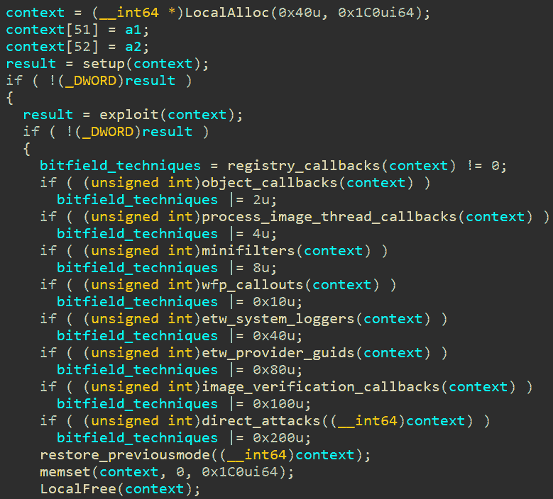

rootkit的“主”功能，执行各个rootkit技术。注意缺少的`0x20`技术。

根据大量更新，FudModule 似乎仍在积极开发中。最新的变体似乎更为稳健，避免了一些早期变体可能存在的问题实践。由于一些技术针对我们之前未曾遇到的未记录的内核内部，我们认为 Lazarus 必须正在进行自己的内核研究。此外，尽管这个 rootkit 显然技术复杂，我们仍然发现了一些散见的 bug。这些 bug 可能会限制 rootkit 的预期功能，甚至在适当条件下导致内核 bug 检查。虽然我们发现其中一些 bug 非常有趣，很愿意分享详细信息，但我们不喜欢为威胁行为者提供免费的 bug 报告，因此我们暂时保留它们，如果 bug 得到修复，可能稍后再分享一些信息。

有趣的是，FudModule 利用了 `NtWriteVirtualMemory` 系统调用来读取和写入内核内存，消除了调用 `NtReadVirtualMemory` 的必要性。这利用了一个特性，即当限制在单个虚拟地址空间时，`NtReadVirtualMemory` 和 `NtWriteVirtualMemory` 在源 `Buffer` 和目标 `BaseAddress` [参数](http://undocumented.ntinternals.net/index.html?page=UserMode%2FUndocumented%20Functions%2FMemory%20Management%2FVirtual%20Memory%2FNtWriteVirtualMemory.html) 的值方面基本上是反操作。换句话说，写入内核内存可以看作是从用户模式的 `Buffer` 写入到内核模式的 `BaseAddress`，而从内核内存读取则可以通过交换参数来实现，即从内核模式的 `Buffer` 写入到用户模式的 `BaseAddress`。Lazarus 的实现利用了这一点，这似乎是一个有意的设计决策，因为大多数开发者可能更倾向于使用 `NtReadVirtualMemory` 读取内核内存，而使用 `NtWriteVirtualMemory` 写入内核内存的方式更为直接。我们只能猜测为什么 Lazarus 选择了这种方法，但这可能是另一个增强隐蔽性的特性。通过他们的实现，他们只需使用一个可疑的系统调用而不是两个，可能减少了检测机会的数量。

###### **调试打印**

在我们深入讨论实际的 rootkit 技术之前，有一件值得讨论的事情。令我们最初感到惊讶的是，Lazarus 在编译代码中留下了一些明文调试打印信息。这类打印通常是恶意软件研究人员最希望看到的东西之一，因为它们往往显著加速了逆向工程过程。然而，在这种情况下，一些打印的效果恰恰相反，有时甚至让我们怀疑是否正确理解了代码。

举个例子，我们来提及字符串`get rop function addresses failed`。假设*rop*代表*return-oriented programming*，在利用漏洞的上下文中，这个字符串应该很合理，尽管没有一个返回地址在攻击中被损坏。

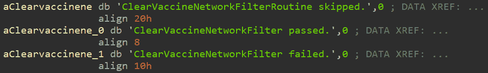

在rootkit中发现的明文调试字符串。术语*vaccine*用于指代安全软件。

虽然是用英语书写，但调试字符串表明其作者并非母语为英语者，有时甚至暗示其可能源自韩国。这在根工具包中频繁使用术语*vaccine*上尤为明显。一开始我们对此感到困惑，因为不清楚疫苗如何与rootkit功能相关。然而，很快就显而易见，该术语用于[指代](https://medium.com/s2wblog/detailed-analysis-of-darkgate-investigating-new-top-trend-backdoor-malware-0545ecf5f606#:~:text=use%20are%20different.-,Vaccine%20Detection,-DarkGate%20detects%20installed)安全软件。这可能源于翻译为韩语的*antivirus*（바이러스 백신），这是一个复合词，字面意思为*病毒疫苗*。需要注意的是，即使是朝鲜“自己”的反病毒软件也被称为[SiliVaccine](https://research.checkpoint.com/2018/silivaccine-a-look-inside-north-koreas-anti-virus/)，据我们所知，像这样使用*疫苗*这个术语在日语等其他语言中是不会出现的。此外，讲韩语的威胁行为者使用这个术语并非第一次。例如，AhnLab最近的[报告](https://asec.ahnlab.com/en/59387/)提到了以下显著的命令：

`cmd.exe /U /c wmic /namespace:\\root\securitycenter2 path antivirusproduct get displayname > vaccine.txt`

另一个谜题是缩写`pvmode`，我们认为指的是`PreviousMode`。在Google搜索中，关于`pvmode`的相关结果为零，我们怀疑大多数英语使用者会选择不同的缩写，比如`prvmode`或`prevmode`。然而，在与语言专家协商后，我们得知对于韩语使用者来说，使用缩写`pvmode`也是不寻常的。

最后，还有调试消息`disableV3Protection passed`。从上下文判断，这里的通用术语*V3*指的是*AhnLab V3 Endpoint Security*。考虑到地缘政治局势，朝鲜黑客组织很可能熟悉韩国的AhnLab，因此他们内部使用这种非特定的缩写是完全合理的。

#### 0x01 – Registry Callbacks

第一个rootkit技术旨在解决[注册回调](https://learn.microsoft.com/en-us/windows-hardware/drivers/kernel/filtering-registry-calls)问题。这是Windows文档化的机制，允许安全解决方案监视注册表操作。安全解决方案的内核模式组件可以调用`CmRegisterCallbackEx`例程来注册回调，每当系统上执行注册表操作时就会收到通知。而且，由于回调是同步调用的，可以在实际操作之前（或之后）阻止或修改禁止/恶意操作。FudModule的目标是移除现有的注册回调，从而干扰依赖这一机制的安全解决方案。

回调函数的移除是通过直接修改内核管理的一些内部数据结构来执行的。在之前的版本中也是如此，正如[ESET](https://www.virusbulletin.com/uploads/pdf/conference/vb2022/papers/VB2022-Lazarus-and-BYOVD-evil-to-the-Windows-core.pdf)和[AhnLab](https://download.ahnlab.com/global/brochure/Analysis-Report-on-Lazarus-Groups-Rootkit-Attack-Using-BYOVD.pdf)所记录的那样。在那里，rootkit找到了包含所有现有注册回调的双向循环链表的`nt!CallbackListHead`地址，并简单地通过将其指向自身来将其清空。

在当前版本的FudModule中，这种技术得到了改进，留下了一些选择的回调，也许使rootkit更隐蔽。这个更新版本开始方式与前一个版本相同：通过找到`nt!CallbackListHead`的地址。这是通过解析`CmUnRegisterCallback`（通过内存中`ntoskrnl`的导出表迭代）来完成的，扫描其函数体以查找`lea rcx,[nt!CallbackListHead]`指令，然后根据从指令的操作码中提取的偏移量计算最终地址。

使用`nt!CallbackListHead`地址，FudModule可以遍历注册回调链接列表。它检查每个条目，并确定回调例程是否实现在`ntoskrnl.exe`、`applockerfltr.sys`或`bfs.sys`中。如果是这样，回调将保持不变。否则，rootkit将回调例程指针替换为指向`ObIsKernelHandle`的指针，然后继续取消链接回调条目。

#### 0x02 – 对象回调

[对象回调](https://learn.microsoft.com/zh-cn/windows-hardware/drivers/ddi/wdm/nf-wdm-obregistercallbacks) 允许驱动程序在响应线程、进程和桌面句柄操作时执行自定义代码。它们经常用于自我防御，因为它们代表了一种方便的方式来保护关键进程免受篡改。由于保护是在内核级别强制执行的，这应该能够保护甚至高权限攻击者，只要他们停留在用户模式下。另外，对象回调还用于监控和检测可疑活动。

无论用例如何，对象回调可以使用 `ObRegisterCallbacks` 程序设置。FudModule 自然试图做完全相反的事情：即删除所有已注册的对象回调。这可能使其绕过自我防御机制并避开基于对象回调的检测/遥测。

这种 rootkit 技术的实现自上一个版本以来保持不变，因此没有必要过多详细说明。首先，rootkit 扫描 `ObGetObjectType` 程序的主体以获取 `nt!ObTypeIndexTable` 的地址。其中包含指向 `_OBJECT_TYPE` 结构的指针数组，每个结构表示一个不同的对象类型，例如 `Process`、`Token` 或 `SymbolicLink`。FudModule 遍历此数组（跳过前两个特殊含义的元素），检查每个 `_OBJECT_TYPE.CallbackList`，该列表包含为特定对象类型注册的对象回调的双向链表。然后，rootkit 通过使每个节点的前向和后向指针指向自身来清空 `CallbackList`。

#### 0x04 – 进程、线程和映像内核回调

接下来的 rootkit 技术旨在禁用另外三种类型的内核回调：[进程](https://learn.microsoft.com/zh-cn/windows-hardware/drivers/ddi/ntddk/nf-ntddk-pssetcreateprocessnotifyroutine)、[线程](https://learn.microsoft.com/zh-cn/windows-hardware/drivers/ddi/ntddk/nf-ntddk-pssetcreatethreadnotifyroutine) 和 [映像](https://learn.microsoft.com/zh-cn/windows-hardware/drivers/ddi/ntddk/nf-ntddk-pssetloadimagenotifyroutine) 回调。正如它们的名称所示，这些回调用于在创建新进程、生成新线程或加载新映像（例如将 DLL 加载到进程中）时执行自定义内核代码。这些回调对于检测恶意活动非常有用。例如，进程回调允许防病毒软件和EDR在每个要创建的新进程上执行各种检查。注册这些回调非常简单，只需将新回调程序作为参数传递给 `PsSetCreateProcessNotifyRoutine`、`PsSetCreateThreadNotifyRoutine` 或 `PsSetLoadImageNotifyRoutine`。这些例程还有它们更新的 `Ex` 变体，甚至在 `PsSetCreateProcessNotifyRoutineEx2` 的情况下有 `Ex2` 变体。

进程、线程和图像回调由内核几乎相同地管理，这使得 FudModule 能够使用基本相同的代码来禁用所有三者。我们发现，这段代码自上个版本以来并未有太大改动，主要区别在于新增了驱动程序列表中未被触及回调的驱动。

FudModule 首先查找 `nt!PspNotifyEnableMask`、`nt!PspLoadImageNotifyRoutine`、`nt!PspCreateThreadNotifyRoutine` 和 `nt!PspCreateProcessNotifyRoutine` 的地址。这些地址再次通过扫描导出函数的代码获取，具体的扫描方法可能会根据 Windows 版本号有所不同。在进行任何修改之前，rootkit 清除 `nt!PspNotifyEnableMask` 并休眠一段时间。此掩码包含当前启用的回调类型的位字段，清除它会禁用所有回调。尽管某些 EDR 绕过会在此停止（https://overlayhack.com/edr-bypass-evasion），但 FudModule 的目标不是不加选择地禁用所有回调，因此对 `nt!PspNotifyEnableMask` 的修改只是临时的，FudModule 最终会将其恢复到原始值。我们认为这个临时修改的想法是为了降低可能导致 bug check 的竞争条件的发生几率。

上述三个 `nt!Psp(LoadImage|CreateThread|CreateProcess)NotifyRoutine` 全局变量都组织为 `_EX_FAST_REF` 指针数组，指向 `_EX_CALLBACK_ROUTINE_BLOCK` 结构体（至少在 [ReactOS](https://github.com/reactos/reactos/blob/e0c17c3f462e3b62bf0c4ca2479c1e5c6b8ff496/sdk/include/ndk/extypes.h#L535) 中使用了这个名称，微软此处未公开符号名称）。FudModule 遍历所有这些结构体，并检查 `_EX_CALLBACK_ROUTINE_BLOCK.Function`（实际回调函数指针）是否实现在以下白名单模块之一。如果是，则将该指针追加到一个新数组中，用于替换原始数组。这有效地移除了除以下列出模块中实现的回调之外的所有回调。

| `ntoskrnl.exe ` | `ahcache.sys ` | `mmcss.sys ` | `cng.sys ` |
| --- | --- | --- | --- |
| `ksecdd.sys ` | `tcpip.sys ` | `iorate.sys ` | `ci.dll ` |
| `dxgkrnl.sys ` | `peauth.sys ` | `wtd.sys` |  |

在移除进程、线程和图像回调期间允许的内核模块。

#### 0x08 – 迷你过滤器驱动程序

[文件系统迷你过滤器](https://learn.microsoft.com/en-us/windows-hardware/drivers/ifs/filter-manager-concepts)提供了一种机制，用于拦截文件系统操作。它们在各种场景中被使用，包括加密、压缩、复制、监控、防病毒扫描或文件系统虚拟化。例如，加密迷你过滤器会在数据写入存储设备之前加密数据，并在读取后解密数据。FudModule试图消除所有监控和防病毒迷你过滤器，同时保留其他过滤器不受影响（毕竟，某些过滤器对系统运行至关重要）。关于保留哪些迷你过滤器和移除哪些的选择主要基于迷你过滤器的高度，这是一个整数值，用于决定处理顺序，以防同一操作附加了多个迷你过滤器。微软定义了[高度范围](https://learn.microsoft.com/en-us/windows-hardware/drivers/ifs/load-order-groups-and-altitudes-for-minifilter-drivers)，应由行为良好的迷你过滤器遵循。不幸的是，这些范围也为FudModule区分反恶意软件迷你过滤器和其他过滤器提供了一个非常方便的方法。

在其先前版本中，FudModule通过直接修补其过滤器函数的序言来禁用迷你过滤器。这在今天将被认为是非常不寻常的，特别是随着[HVCI](https://learn.microsoft.com/en-us/windows-hardware/drivers/bringup/device-guard-and-credential-guard)（Hypervisor-Protected Code Integrity）在Windows 11上默认启用，其使用越来越普遍。由于HVCI是一项旨在防止内核中执行任意代码的安全功能，这将阻碍FudModule尝试修补过滤器函数。这迫使Lazarus完全重新实现了这种Rootkit技术，因此FudModule的当前版本通过全新的数据攻击方式禁用了文件系统迷你过滤器。

这种攻击始于解析 `FltEnumerateFilters` 并利用其找到 `FltGlobals.FrameList.rList`。这是一个由 `FLTMGR!_FLTP_FRAME` 结构体组成的链表，每个结构体代表一个[过滤管理器帧](https://learn.microsoft.com/en-us/windows-hardware/drivers/ifs/filter-manager-concepts#:~:text=Each%20of%20FltMgr%27s%20filter%20device%20objects%20is%20called%20a%20frame)。从这里，FudModule 接着另一个链表 `_FLTP_FRAME.AttachedVolumes.rList`。该链表包含 `FLTMGR!_FLT_VOLUME` 结构体，描述了附加到特定文件系统卷上的迷你过滤器。有趣的是，rootkit 执行了一项健全性检查，以确保与 `_FLT_VOLUME` 分配相关联的池标记等于 `FMvo`。健全性检查通过后，FudModule 遍历 `_FLT_VOLUME.Callbacks.OperationsLists`，这是一个由 `FLTMGR!_CALLBACK_NODE` 结构体组成的链表数组，按 IRP 主要功能代码进行索引。例如，`OperationsLists[IRP_MJ_READ]` 是描述附加到特定卷上的 `读取` 操作的所有过滤器的链表。

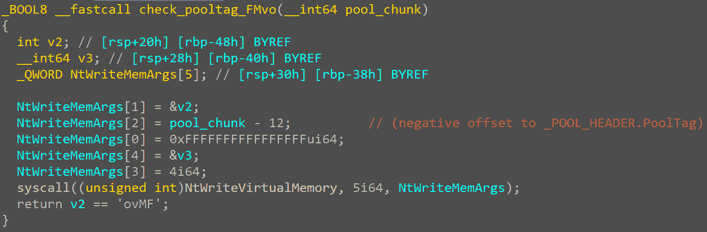

FudModule 确保 `_FLT_VOLUME` 块的池标记等于 `FMvo`。

对于每个 `_CALLBACK_NODE`，FudModule 获取相应的 `FLTMGR!_FLT_INSTANCE` 和 `FLTMGR!_FLT_FILTER` 结构体，并使用它们来决定是否取消链接回调节点。首先检查基于过滤器背后驱动程序的名称。如果是 `hmpalert.sys`（与 HitmanPro 反恶意软件解决方案相关联），则回调将立即取消链接。相反，如果驱动程序名称与以下列表中的条目匹配，则保留回调：

| `bindflt.sys ` | `storqosflt.sys ` | `wcifs.sys ` | `cldflt.sys ` |
| --- | --- | --- | --- |
| `filecrypt.sys ` | `luafv.sys ` | `npsvctrig.sys ` | `wof.sys ` |
| `fileinfo.sys ` | `applockerfltr.sys ` | `bfs.sys ` |  |

内核模块允许列出以保留其文件系统迷你过滤器。

如果没有驱动程序名称匹配，FudModule 使用 `_FLT_FILTER.DefaultAltitude` 做出最终决定。如果默认高度属于 `[320000, 329999]` 范围（由 Microsoft 定义为 `FSFilter Anti-Virus`），或者属于 `[360000, 389999]` 范围（`FSFilter Activity Monitor`），则取消链接回调节点。除了取消链接回调节点，FudModule 还会擦除相应 `_FLT_INSTANCE` 结构体中的整个 `_FLT_INSTANCE.CallbackNodes` 数组。

#### 0x10 – Windows Filtering Platform

[Windows Filtering Platform](https://learn.microsoft.com/en-us/windows/win32/fwp/windows-filtering-platform-start-page)（WFP）是一组文档化的 API，专为基于主机的网络流量过滤设计。WFP API 提供了深度数据包检查以及在网络堆栈的各个层次上修改或丢弃数据包的能力。这是非常有用的功能，因此它作为许多 Windows 网络安全软件的基础，包括入侵检测/预防系统、防火墙和网络监控工具。WFP API 在用户空间和内核空间都可以访问，内核部分提供了更强大的功能。具体而言，内核 API 允许安装所谓的 [callout 驱动程序](https://learn.microsoft.com/en-us/windows-hardware/drivers/network/introduction-to-windows-filtering-platform-callout-drivers)，这些驱动程序可以钩入网络堆栈，并对处理的网络流量执行任意操作。FudModule 正试图干扰已安装的 callout 例程，以试图破坏其提供的安全性。

这种 rootkit 技术仅在目标系统上存在卡巴斯基驱动程序（`klam.sys`、`klif.sys`、`klwfp.sys`、`klwtp.sys`、`klboot.sys`）且同时不存在赛门铁克/博通驱动程序（`symevnt.sys`、`bhdrvx64.sys`、`srtsp64.sys`）时才执行。在当前版本的 FudModule 中，这种检查似乎是一个新的添加。在其他方面，我们的分析显示，这种技术的核心思想与 ESET 研究人员在分析之前版本时描述的 [发现](https://www.virusbulletin.com/uploads/pdf/conference/vb2022/papers/VB2022-Lazarus-and-BYOVD-evil-to-the-Windows-core.pdf) 相匹配。

最初，FudModule解析`netio!WfpProcessFlowDelete`以定位`netio!gWfpGlobal`的地址。正如其名称所示，这是设计用来存储与WFP相关的全局变量。尽管其确切的布局未记录，但可以[不难找到](https://codemachine.com/articles/find_wfp_callouts.html)存储WFP调用结构数组指针的构建特定偏移量（此数组的长度存储在指针之前的偏移量中）。FudModule跟随此指针并遍历数组，跳过所有实现在`ndu.sys`、`tcpip.sys`、`mpsdrv.sys`或`wtd.sys`中的调用。对于剩余的调用，FudModule访问调用结构的标志，并设置存储在最低有效位中的标志。虽然调用结构本身未记录，但此特定的`0x01`标志在另一个结构中是[有文档记录的](https://learn.microsoft.com/en-us/windows-hardware/drivers/ddi/fwpsk/ns-fwpsk-fwps_callout2_)，在那里称为`FWP_CALLOUT_FLAG_CONDITIONAL_ON_FLOW`。文档中写道：“如果指定了此标志，过滤引擎仅在数据流相关联的情况下调用调用驱动程序的classifyFn2调用函数”。换句话说，设置此标志将在无流上下文可用的情况下有条件地禁用调用（请参阅下面`netio!IsActiveCallout`的实现）。

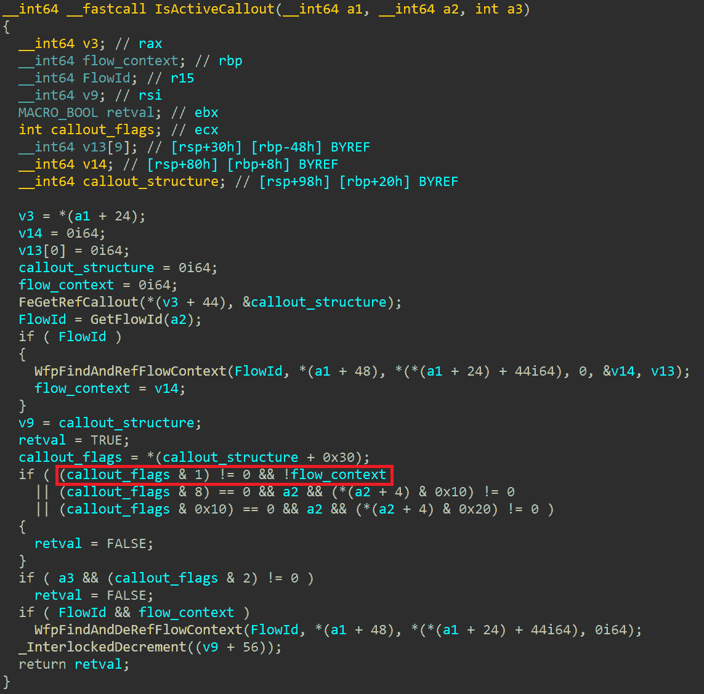

`FWP_CALLOUT_FLAG_CONDITIONAL_ON_FLOW`标志的含义可以在`netio!IsActiveCallout`中清晰地看到。如果设置了此标志并且无法获取流上下文，则`IsActiveCallout`将返回`false`（请参阅条件的突出部分）。

虽然此rootkit技术可能干扰某些WFP调用，但不足以干扰所有调用。许多由安全供应商注册的WFP调用已经设计为默认设置`FWP_CALLOUT_FLAG_CONDITIONAL_ON_FLOW`标志，因此这些调用不会受到此技术的影响。鉴于初始驱动程序检查，这项技术似乎可能直接针对卡巴斯基。虽然卡巴斯基确实安装了几十个WFP调用，但其中大约一半是为处理流而设计的，并且已经设置了`FWP_CALLOUT_FLAG_CONDITIONAL_ON_FLOW`标志。由于我们避免逆向工程竞争对手的产品，因此此rootkit技术的实际影响仍不清楚。

#### 0x20 – 缺失

到目前为止，我们分析的 rootkit 技术与 ESET 在早期 rootkit 变种的详细论文中描述的技术类似。但从现在开始，我们进入了全新的领域。曾用于处理 Windows 事件跟踪（ETW）的 `0x20` 技术已被弃用，使得 `0x20` 位未被使用。相反，有两种新的替代技术针对 ETW，分别用位 `0x40` 和 `0x80` 索引。索引过去到 `0x40`，这是一种通过禁用预取文件创建来阻碍取证分析的技术。然而，现在位数一直扩展到 `0x200`，增加了两种新技术，我们稍后会在本文中深入探讨。

#### 0x40 – Windows 事件跟踪：系统记录器

[Windows 事件跟踪](https://learn.microsoft.com/en-us/windows/win32/etw/about-event-tracing)（ETW）作为一种专门用于跟踪和记录事件的高性能机制。简而言之，它的主要目的是连接生成某些日志事件的提供者与处理生成事件的消费者。消费者可以定义他们想要消费哪些事件，例如通过选择感兴趣的特定提供者。操作系统内置了一些提供者，例如 `Microsoft-Windows-Kernel-Process`，它生成与进程相关的事件，例如进程创建或终止。然而，第三方应用程序也可以定义自定义提供者。

虽然许多内置提供者与安全无关，但有些生成的事件对于检测目的很有用。例如，`Microsoft-Windows-Threat-Intelligence` 提供者使得可以监视可疑事件，例如写入另一个进程的内存。此外，各种安全产品利用 ETW 定义其自定义提供者和消费者。FudModule 试图篡改 ETW 内部以拦截可疑事件，从而逃避检测。

这种 rootkit 技术的主要思想是通过将 `EtwpActiveSystemLoggers` 清零来禁用系统记录器。如何找到此地址的具体实现因目标 Windows 版本而异。在较新的版本中，首先解析 `nt!EtwSendTraceBuffer` 例程，并用于查找 `nt!EtwpHostSiloState`。这指向一个 `_ETW_SILODRIVERSTATE` 结构，使用硬编码的版本特定偏移量，rootkit 可以访问 `_ETW_SILODRIVERSTATE.SystemLoggerSettings.EtwpActiveSystemLoggers`。在较旧的版本中，rootkit 首先扫描整个 ntoskrnl 的 `.text` 部分，搜索与 `EtwTraceKernelEvent` 前导特定操作码字节相关的地址。然后从紧随其后的 `mov ebx, cs:EtwpActiveSystemLoggers` 指令中提取目标地址。

要理解这项技术的影响，我们可以看看内核中如何使用`EtwpActiveSystemLoggers`。通过按位访问，`EtwpStartLogger`例程中的最低有效八位可能会被设置。这表明该值本身是一个位字段，每个位表示特定系统记录器是否活动。查看其他关于`EtwpActiveSystemLoggers`的引用后，可以明显看出一个模式。在读取其值后，通常会有一个由`bsf`指令（位扫描前进）保护的循环。在循环内部通常会调用一个与ETW相关的例程，可能会生成日志事件。该循环的目的是迭代`EtwpActiveSystemLoggers`的设置位。当rootkit清除所有位时，循环体将不会执行，意味着事件将不会被记录。

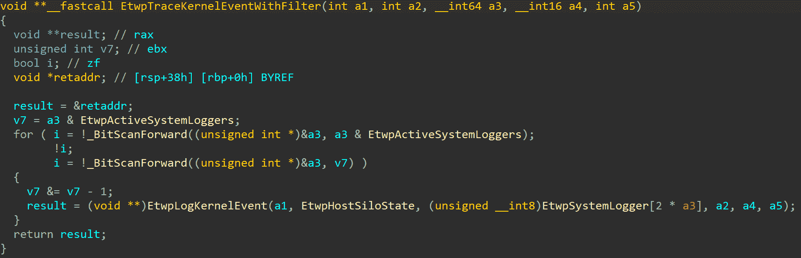

Example decompilation of `EtwpTraceKernelEventWithFilter`. After the rootkit zeroes out `EtwpActiveSystemLoggers`, `EtwpLogKernelEvent` will never get called from inside the loop since the condition guarding the loop will always evaluate to zero.

#### 0x80 – Windows 事件跟踪：提供程序 GUIDs

与前一技术相辅相成，`0x80`技术也旨在使ETW失效，但使用了不同的方法。虽然`0x40`技术相当通用，旨在禁用所有系统记录器，但这项技术采用更精准的方式操作。它包含一个[硬编码列表](https://github.com/avast/ioc/tree/master/FudModule#targeted-etw-provider-guids)，包括95个GUID，每个GUID代表某个特定ETW提供程序的标识符。rootkit会遍历所有这些GUID，并尝试禁用相应的提供程序。虽然这种方法要求攻击者投入一些精力来组装GUID列表，但它也为他们提供了更精细的控制，可以选择性地定位那些具有较高检测风险的提供程序，而忽略其他提供程序，以减小rootkit对目标系统的影响。

这项技术首先获取`EtwpHostSiloState`（或者在旧版本中为`EtwSiloState`）的地址。如果`EtwpHostSiloState`在前一项技术中已经解析过，rootkit 就会重复使用该地址。否则，rootkit 会沿着引用链`PsGetCurrentServerSiloName` -> `PsGetCurrentServerSiloGlobals` -> `PspHostSiloGlobals` -> `EtwSiloState`进行操作。无论哪种情况，结果都是rootkit 刚刚获取到指向`_ETW_SILODRIVERSTATE`结构的指针，其中包含名为`EtwpGuidHashTable`的成员。顾名思义，这是一个保存ETW GUID（`_ETW_GUID_ENTRY`）的哈希表。

FudModule 然后迭代其硬编码的 GUID 列表，并尝试在哈希表中定位每个 GUID。尽管哈希表的内部结构并未正式记录，Yarden Shafir 在她的[博客](https://windows-internals.com/exploiting-a-simple-vulnerability-in-35-easy-steps-or-less/)中提供了一个详细的描述，讲述了如何利用 ETW 漏洞。简而言之，哈希是通过将 128 位的 GUID 分成四个 32 位的部分并进行 XOR 运算来计算的。通过与 `0x3F` 进行 AND 运算，可以得到相关哈希桶（`_ETW_HASH_BUCKET`）的索引。桶中包含三个 `_ETW_GUID_ENTRY` 结构体的链表，每个链表针对不同类型的 GUID。FudModule 总是选择第一个（`EtwTraceGuidType`），并遍历它，寻找相关的 `_ETW_GUID_ENTRY` 结构。

有了指向与感兴趣的 GUID 对应的 `_ETW_GUID_ENTRY` 的指针后，FudModule 继续清除 `_ETW_GUID_ENTRY.ProviderEnableInfo.IsEnabled`。这个修改的目的似乎不言自明：FudModule 试图禁用 ETW 提供者。为了更好地理解其工作原理，让我们来看一下 `nt!EtwEventEnabled`（见下面反编译代码）。这通常是在调用 `nt!EtwWrite`（或 `nt!EtwWriteEx`）之前作为 `if` 条件的例程。

查看反编译结果，可以看到两个 `return 1` 语句。将 `ProviderEnableInfo.IsEnabled` 设置为零可以确保永远不会到达第一个语句。但是，第二个 `return` 语句仍然可能执行。为了确保这不会发生，rootkit 还会迭代 `_ETW_GUID_ENTRY.RegListHead` 链表中的所有 `_ETW_REG_ENTRY` 结构。对于每个结构，它会进行一次双字写入，将四个掩码清零，即 `EnableMask`、`GroupEnableMask`、`HostEnableMask` 和 `HostGroupEnableMask`（或仅在旧版本中，未引入后两个掩码时，只清除 `EnableMask` 和 `GroupEnableMask`）。

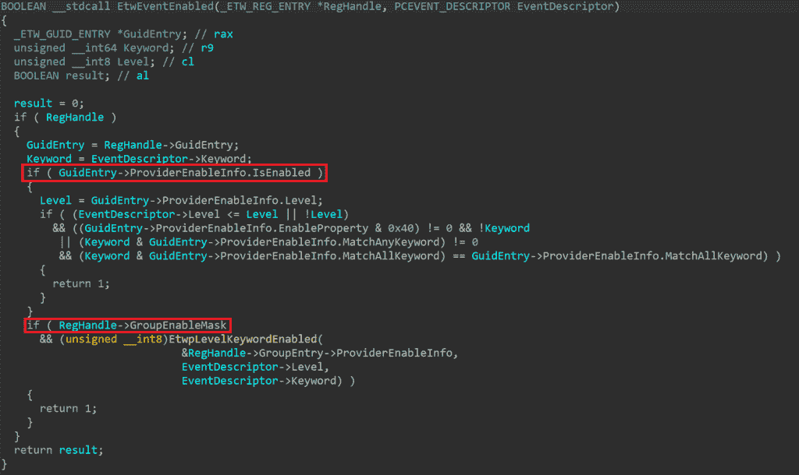

`nt!EtwEventEnabled` 的反编译。当 rootkit 完成其工作后，对于与目标 GUID 相关的事件，此例程将始终返回 `false`。这是因为 rootkit 清除了 `_ETW_GUID_ENTRY.ProviderEnableInfo.IsEnabled` 和 `_ETW_REG_ENTRY.GroupEnableMask`，强制高亮条件失败。

清除这些掩码还有一个额外的效果，即使 `EtwEventEnabled` 始终返回 `false`。这四个掩码也在 `EtwWriteEx` 中检查，这种修改有效地中和了该例程，因为当对于特定事件注册对象没有设置掩码时，执行将永远不会到达实现实际事件写入逻辑的低级例程（`nt!EtwpEventWriteFull`）。

#### 0x100 – 图像验证回调

图像验证回调是另一种被 FudModule 干扰的回调机制。设计与进程/线程/图像回调类似，图像验证回调应在将新驱动图像加载到内核内存时被调用。这对于反恶意软件软件来说是有用的功能，它们可以利用这些回调来将已知的恶意或易受攻击的驱动程序列入黑名单（尽管这种阻止方法在回调被异步调用时可能会遇到一些问题）。此外，图像验证回调还提供了有价值的遥测数据，可以显示出可疑驱动程序加载事件。这些回调可以通过`SeRegisterImageVerificationCallback`例程进行注册，这个例程是公开未记录的。由于这种未记录的性质，这里的使用主要限于深层反恶意软件软件。例如，Windows Defender 注册了一个名为`WdFilter!MpImageVerificationCallback`的回调。

由于内核内部以类似于我们已经探讨过的其他回调的方式管理图像验证回调，因此 rootkit 的移除实现无疑会显得很熟悉。首先，rootkit 解析`nt!SeRegisterImageVerificationCallback`例程，并扫描其主体以定位`nt!ExCbSeImageVerificationDriverInfo`。解引用此指针，它获取一个指向`_CALLBACK_OBJECT`结构的指针，该结构在`_CALLBACK_OBJECT.RegisteredCallbacks`链表中保存回调。此列表由`_CALLBACK_REGISTRATION`结构组成，其中实际的回调函数指针可以在`_CALLBACK_REGISTRATION.CallbackFunction`中找到。FudModule 通过使`RegisteredCallbacks`头部的`LIST_ENTRY`直接指向自身来清除整个列表。此外，它还遍历原始链表，并类似地短路链表中的每个`_CALLBACK_REGISTRATION`条目。

这种 rootkit 技术是在当前版本的 FudModule 中新实现的，我们只能推测其动机。这似乎是设计来帮助在加载易受攻击或恶意驱动程序时避免检测。然而，如果已经控制了内核，那么理解 Lazarus 为什么要加载额外的驱动可能会有些困难。如果他们已经利用了预安装的 Windows 驱动程序中的零日漏洞建立了内核读/写原语，那么加载易受攻击的驱动程序就没有多大意义。此外，即使在第一次利用易受攻击的驱动程序时（正如在之前版本的 FudModule 中的情况），现在取消回调也为时已晚。在执行此 rootkit 技术时，易受攻击的驱动程序的图像验证回调已经被调用。因此，我们认为最可能的解释是威胁行动者正在为以后加载一些恶意驱动程序做准备。也许他们只是想确保如果决定在将来部署一些额外的内核模式负载时能够得到覆盖。

#### 0x200 – 直接攻击安全软件

到目前为止，我们探索的 rootkit 技术都有些通用。每一种都针对某些安全相关的系统组件，并通过这些组件间接干扰依赖于它们的所有安全软件。相比之下，这最后一种技术直接去核心并旨在直接禁用特定的安全软件。特别是，目标安全解决方案包括 AhnLab V3 Endpoint Security、Windows Defender、CrowdStrike Falcon 和 HitmanPro。

攻击始于 rootkit 获取其自身 `_EPROCESS` 结构的地址。这是通过使用 `NtDuplicateHandle` 来复制当前进程的伪句柄，然后调用 `NtQuerySystemInformation` 来获取 `SystemExtendedHandleInformation` 完成的。通过扩展句柄信息，rootkit 寻找对应于复制句柄的条目，并从中获取 `_EPROCESS` 指针。使用 `NtQuerySystemInformation` 泄露内核指针是一种众所周知的技术，Microsoft [旨在限制](https://windows-internals.com/kaslr-leaks-restriction/) 这种技术，逐步建立起相应的缓解措施。然而，能够在高完整性级别下启用 `SeDebugPrivilege` 的攻击者超出了这些缓解措施的范围，因此 FudModule 可以继续使用这种技术，即使在即将推出的 24H2 版本上也是如此。有了 `_EPROCESS` 指针，FudModule 通过将 `_EPROCESS.MitigationFlags` 清零来禁用缓解措施。然后，它还从 `_EPROCESS.ObjectTable.Flags` 中清除 `EnableHandleExceptions` 标志。我们认为这是为了增加稳定性，以防后续处理句柄表条目操纵技术时发生错误。

关于用于攻击安全解决方案的具体技术，AhnLab的处理方式与其他三个目标不同。FudModule首先检查AhnLab是否正在运行，通过遍历`ActiveProcessLinks`链表，并查找名为`asdsvc.exe`（AhnLab Smart Defense Service）的进程，其`_EPROCESS.Token.AuthenticationId`设置为`SYSTEM_LUID`。如果找到这样的进程，FudModule清除其`_EPROCESS.Protection`字节，有效地关闭了该进程的PPL保护。虽然在通常情况下，`asdsvc.exe`进程被标准的`PsProtectedSignerAntimalware`级别保护，这种修改使其成为一个普通的非受保护进程。这使其成为用户模式进一步攻击的对象，现在甚至其他特权但非受保护的进程也能够篡改它。然而，我们怀疑这项技术背后的主要想法可能是破坏AhnLab的用户模式和内核模式组件之间的链接。通过移除服务的PPL保护，内核模式组件可能不再将其识别为合法的AhnLab组件。但这只是一个推测，因为我们没有测试这项技术的真实影响。

###### **句柄表条目操纵**

攻击Defender、CrowdStrike和HitmanPro的技术更具有趣味性：FudModule尝试使用新的句柄表条目操纵技术来挂起它们。为了更好地理解这项技术，让我们从简短的[句柄表背景](https://imphash.medium.com/windows-process-internals-a-few-concepts-to-know-before-jumping-on-memory-forensics-part-5-a-2368187685e)开始。当用户模式代码与内核对象（如进程、文件或互斥体）交互时，通常不直接使用对象。相反，它们通过句柄间接引用它们。在内部，内核必须能够将句柄转换为相应的对象，这就是句柄表发挥作用的地方。这个每个进程的表位于`_EPROCESS.ObjectTable.TableCode`，用作从句柄到底层对象的映射。它以数组形式组织，由句柄的整数值索引。每个元素是类型为`_HANDLE_TABLE_ENTRY`，包含两个关键信息：指向对象头部（`nt!_OBJECT_HEADER`）的（压缩的）指针和与句柄关联的访问位。

由于这种句柄设计，内核对象访问检查通常分为两个独立的逻辑步骤。第一步发生在进程尝试获取句柄时（例如使用 `CreateFile` 打开文件）。在此步骤中，当前线程的令牌通常会与目标对象的安全描述符进行检查，以确保允许线程使用所需访问掩码获取句柄。第二个检查发生在进程使用已经获取的句柄执行操作时（例如使用 `WriteFile` 写入文件）。这通常只涉及验证句柄是否足够强大（即具有正确的访问位）以执行请求的操作。

FudModule 作为非受保护进程执行，理论上不应能够获取到像 CrowdStrike Falcon 服务这样受 PPL 保护的进程的强大句柄。然而，利用内核读写原语，FudModule 具备直接访问句柄表的能力。这使得它可以创建一个定制的句柄表项，控制引用的对象和访问位。这样一来，它可以为任意对象创建一个任意句柄，完全绕过通常用于句柄获取的检查。更重要的是，如果设置了句柄的访问位，它还将满足执行所需操作时的后续句柄检查。

为了准备句柄表项操纵技术，FudModule 创建了一个仅将自身立即置于休眠状态的虚拟线程。线程本身并不重要。重要的是，通过调用 `CreateThread`，rootkit 刚刚获得了一个具有 `THREAD_ALL_ACCESS` 权限的线程句柄。这个句柄将被操纵其句柄表项。由于它已经拥有非常强大的访问位，rootkit 甚至不必触及其 `_HANDLE_TABLE_ENTRY.GrantedAccessBits`。它只需要覆盖 `_HANDLE_TABLE_ENTRY.ObjectPointerBits`，将句柄重定向到其选择的任意对象。这将使句柄引用该对象，并使 rootkit 能够在其上执行特权操作。注意，`ObjectPointerBits` 不是指向对象的完整指针：它只表示 64 位指针中的 44 位。但由于由 `ObjectPointerBits` 指向的 `_OBJECT_HEADER` 保证对齐（即最低有效四位必须为零）并位于内核地址空间（即最高有效十六位必须为 `0xFFFF`），剩余的 20 位可以很容易地推断出来。

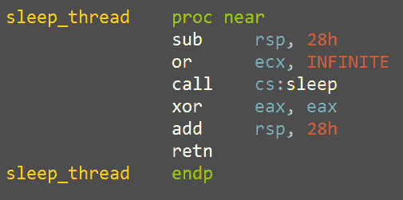

一个虚拟线程，其句柄将成为句柄表项操纵的主题。

这种技术的具体过程是针对 `MsSense.exe`, `MsMpEng.exe`, `CSFalconService.exe`, 和 `hmpalert.exe`。FudModule 首先找到它们各自的 `_EPROCESS` 结构体，使用与找到 AhnLab 服务相同的算法。然后，它执行一项健全性检查，以确保虚拟线程句柄不会过高，方法是将其与 `_EPROCESS.ObjectTable.NextHandleNeedingPool` 进行比较（该值包含当前句柄表分配大小下可能的最大句柄值信息）。健全性检查通过后，FudModule 访问句柄表本身 (`EPROCESS.ObjectTable.TableCode`) 并修改虚拟线程的 `_HANDLE_TABLE_ENTRY`，使其指向目标 `_EPROCESS` 的 `_OBJECT_HEADER`。最后，rootkit 使用重定向的句柄调用 `NtSuspendProcess`，以暂停目标进程。

被操作的句柄曾经是线程句柄，但现在它被用作进程句柄似乎有些奇怪。实际上，这并没有问题，因为句柄表本身不包含对象类型信息。对象类型存储在 `_OBJECT_HEADER.TypeIndex` 中，因此当 rootkit 重定向句柄时，它也有效地改变了句柄的对象类型。至于访问权限位，原始的 `THREAD_ALL_ACCESS` 在新的上下文中被重新解释为 `PROCESS_ALL_ACCESS`，因为这两个常量共享相同的底层值。

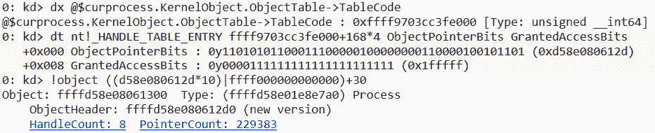

被操作的虚拟线程句柄 (`0x168`) 现在引用的是一个进程对象。

尽管暂停目标进程一开始可能看起来已经完成，但 FudModule 并未止步于此。在休眠五秒后，它还尝试遍历目标进程中的所有线程，逐个暂停它们。当所有线程都被暂停时，FudModule 使用 `NtResumeProcess` 恢复被暂停的进程。此时，虽然进程本身在技术上已经恢复，但其各个线程仍然处于暂停状态，这意味着进程仍然有效地处于暂停状态。我们只能推测 Lazarus 为何以这种方式实现进程暂停，但看起来是为了使技术更隐秘。毕竟，一个被暂停的进程比只有几个增加了暂停计数的线程更加显眼。

要枚举线程，FudModule调用`NtQuerySystemInformation`并使用`SystemExtendedHandleInformation`类。在返回的句柄信息上进行迭代，FudModule搜索来自目标进程的线程句柄。通过比较目标进程的PID与`SYSTEM_HANDLE_TABLE_ENTRY_INFO_EX.UniqueProcessId`来检查所有者进程，并通过比较`SYSTEM_HANDLE_TABLE_ENTRY_INFO_EX.ObjectTypeIndex`与线程类型索引来检查类型，此索引是先前使用`NtQueryObject`获取的`ObjectTypesInformation`。对于每个枚举的线程（可能会多次包括某些线程，因为同一线程可能有多个打开的句柄），FudModule操纵虚拟线程句柄，使其指向枚举的线程，并通过在操纵句柄上调用`SuspendThread`来暂停它。最后，在所有线程都被挂起并且进程恢复后，FudModule将操纵的句柄恢复到其原始状态，再次引用虚拟睡眠线程。

## 结论

Lazarus Group仍然是最具[多产和悠久历史](https://attack.mitre.org/groups/G0032/)的高级持续威胁行为者之一。尽管他们的标志性战术和技术现在被广泛认可，但他们偶尔仍然能够以意想不到的技术复杂性水平给我们带来惊喜。FudModule rootkit作为最新的例子，展示了Lazarus在其武器库中拥有的最复杂工具之一。在本博客中审查的最新更新显示，Lazarus致力于继续积极开发这一rootkit，专注于提升其隐秘性和功能性。

由于他们的admin-to-kernel零日漏洞现已被烧毁，Lazarus面临重大挑战。他们可以要么发现一个新的零日漏洞利用，要么恢复他们旧有的BYOVD技术。无论他们选择了哪种方式，我们将继续密切监控他们的活动，渴望看到他们如何应对这些新情况。

#### 威胁指标（IoCs）

最新的FudModule变种的YARA规则可以在[https://github.com/avast/ioc/tree/master/FudModule#yara](https://github.com/avast/ioc/tree/master/FudModule#yara)找到。
