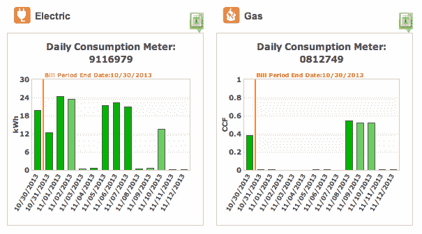

<!--yml

类别：未分类

日期：2024-05-29 12:01:32

-->

# 小数据：我们如何查询个人数据？

> 来源：[https://www.petekeen.net/little-data](https://www.petekeen.net/little-data)

我和妻子最近从俄勒冈州波特兰搬到了密歇根州安娜堡。在这样一次搬迁中涉及到的繁琐变化中，我们当然也换成了当地的公用事业公司。有一天我在他们的账单应用程序中浏览时，发现了一个显示我们能源使用情况日常图表的页面，据称有效地包括昨天的燃气和电力使用情况。还有一个按钮可以输出CSV文件的数据，这意味着如果我真的想要，我可以构建自己的工具来分析我们的使用情况。

这让我开始思考所有那些拥有我数据的小型数据库，这些数据我可能会认为是有用的。在这里，“有用”意味着通过查看数据的某种组合，我可以得出一些有用的结论并采取一些行动。以下是我立即想到的一些数据库列表：

在那个列表中，有些项目有着易于访问的API，比如RunKeeper和Withings。有些可以手动导出数据到CSV文件。然后有些确实*应该*有API，但却没有，比如LoseIt。那么如果我们能添加*更多*的数据呢？比如我们每天跑几次烘干机，暖气或空调多久开启一次及持续时间，我们是否在家等等。

这些都不是大数据。这都是小数据。这让我想起了[Quantified Self](http://quantifiedself.com/)运动，但更多地是关于将现有数据集合并成一个统一整体，而不是合成新数据。

我已经为其中一些数据集构建了隔离的储存空间。例如，我使用[ledger](http://www.ledger-cli.org)和各种自制工具来跟踪我的财务情况。我的电子邮件每小时备份一次，偶尔提供一些有用的数据。尽管如此，所有这些数据仍然处于单独的储存空间中。理想情况下，我希望能够将所有这些数据倒入某种个人“数据汤”中，以便能够用统一的界面查询并构建分析工具。

在这一点上，我有很多问题，但却没有答案。这些数据的形态是什么样子？数据如何进入，如何查询？我能真实回答哪些问题？我将继续思考这个问题，希望你也会。
