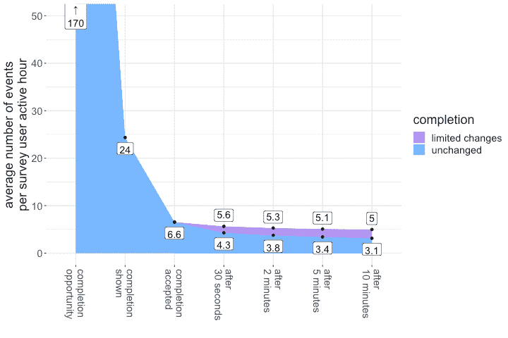
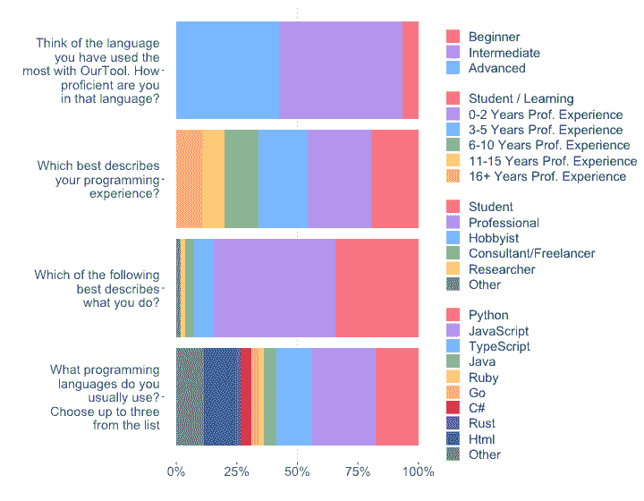
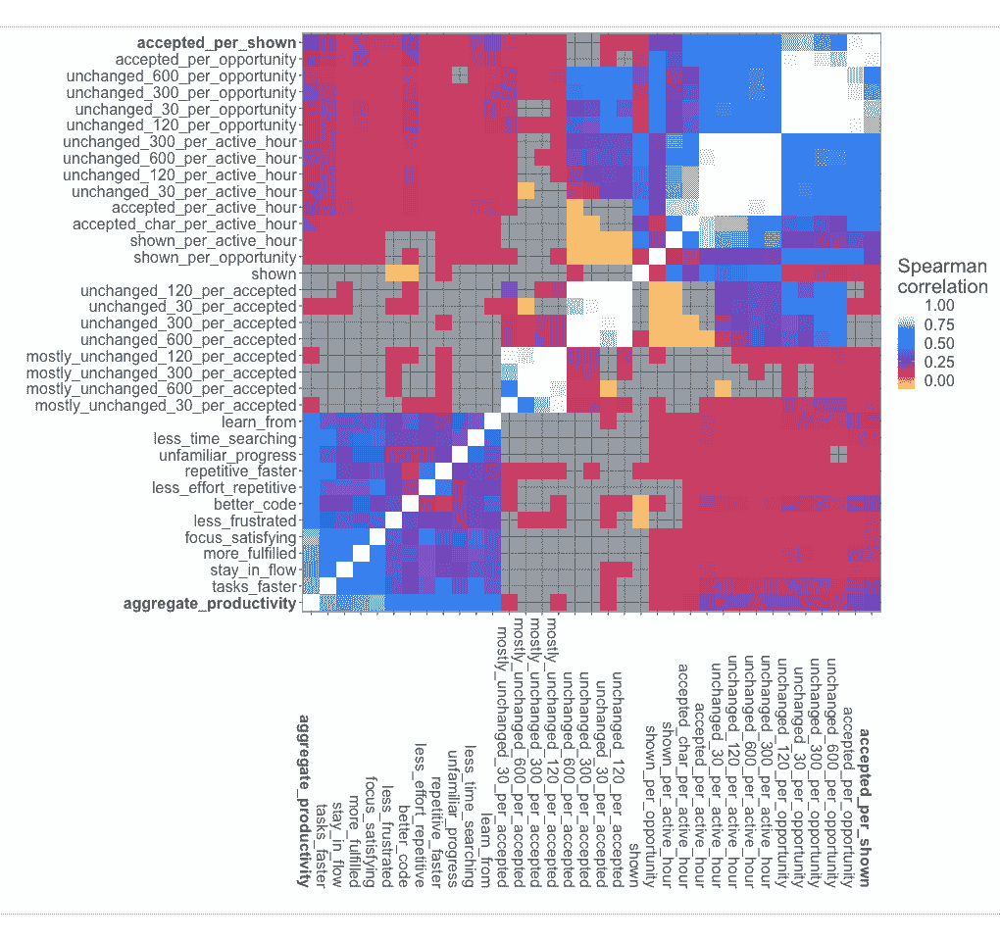
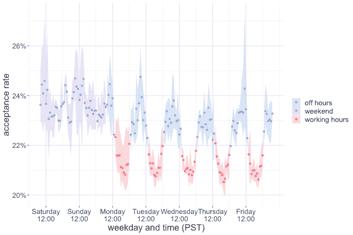

<!--yml

category: 未分类

date: 2024-05-27 14:29:09

-->

# 测量 GitHub Copilot 对生产力的影响 – ACM通讯

> 来源：[https://cacm.acm.org/research/measuring-github-copilots-impact-on-productivity/](https://cacm.acm.org/research/measuring-github-copilots-impact-on-productivity/)

提供代码补全建议给开发者在他们的集成开发环境（IDE）中已成为最常用的程序员辅助工具之一。^([1](#bib1)) 当生成整个代码片段时，它们通常使用大型语言模型（LLM）来预测用户接下来可能输入的内容（补全），根据用户此刻正在进行的工作上下文（提示）。^([2](#bib2)) 该系统允许在代码的任何位置进行补全，通常一次跨越多行。

## 关键见解

+   GitHub Copilot等AI协作编程工具对开发者的生产力有重大影响，不论开发者的技能水平如何，初级开发者看到的增益最大。

+   报告的受益来自于在编码时接收AI建议的各个方面，通常包括任务时间、产品质量、认知负荷、乐趣和学习等生产力方面。

+   感知到的生产力提升体现在开发者活动的客观测量中。

+   尽管建议的正确性很重要，但这些改进的驱动因素似乎不是正确性本身，而是建议是否作为进一步开发的起点有用。

自动生成大段代码的潜在好处是巨大的，但评估这些系统是具有挑战性的。离线评估中，系统展示部分代码片段然后要求其完成，这是困难的，尤其是对于较长的补全来说，有许多可接受的替代方案，并且没有简单的机制可以自动标记它们。^([5](#bib5)) 一些研究人员采取的额外步骤^([3](#bib3))^,^([21](#bib21))^,^([29](#bib29)) 是使用在线评估并跟踪真实用户接受建议的频率，假设系统为开发者代码做出的贡献越多，其效益越高。然而，这种假设的有效性在考虑诸如两个短补全是否比一个长补全更有价值，或者审核建议是否会对编程流程产生不利影响等问题时并不明显。

在集成开发环境中使用语言模型进行代码自动完成最初是由Hindle等人提出的^([9](#bib9))，如今像[GitHub Copilot](https://www.copilot.com/)、[CodeWhisperer](https://aws.amazon.com/codewhisperer/)和[TabNine](https://tabnine.com/)等神经合成工具在IDE中建议代码片段，明确表明旨在提高用户的生产力。开发者的生产力有许多方面，最近的研究表明，这些工具在部分反映为标准化任务完成时间等度量方面是有帮助的^([23](#bib23))^，^(或者，我们可以利用开发者自身作为其生产力的专家评估者。这与当前软件工程研究中的思考非常契合，建议在多个维度上衡量生产力并使用自报告数据。^([6](#bib6)) 因此，我们专注于研究*感知*生产力。)

在这里，我们研究了开发者与GitHub Copilot互动的使用量测量是否能预测开发者报告的感知生产力。我们分析了来自使用GitHub Copilot的开发者的<math xmlns="http://www.w3.org/1998/Math/MathML" display="inline"><mrow><mn>2</mn><mo>,</mo><mn>631</mn></mrow></math>份调查回应，并将他们的回应与从IDE中收集的测量数据进行匹配。我们考虑接受次数以及GitHub Copilot贡献的更详细的测量，例如由GitHub Copilot贡献的代码量和接受完成的持续性。**我们发现显示建议的接受率是预测感知生产力的更好指标**。我们还发现接受率在我们的开发者群体以及随时间的变化中有显著差异，并深入研究了其中一些变化。

我们的结果支持这样一个原则，即接受率可以用于粗粒度监控神经代码合成系统的性能。这种显示建议被接受的比率比贡献的更详细的测量更相关。然而，由于涉及许多人为因素，其他方法仍然是进行细粒度调查必不可少的。

## 背景

即使在可处理的情况下，代码完成的离线评估也可能存在缺陷，其中可以为正确性标记完成。例如，对Visual Studio中66位开发人员进行的<math xmlns="http://www.w3.org/1998/Math/MathML" display="inline"><mrow><mn>15</mn><mo>,</mo><mn>000</mn></mrow></math>个完成的研究发现，在模型评估中使用的合成基准和实际使用中存在显著差异。^([7](#bib7)) 对于Visual Studio IntelliCode的上下文感知API完成的评估考虑了Recall@5——在前五个建议中正确方法调用的完成比例。该指标从离线评估的<math xmlns="http://www.w3.org/1998/Math/MathML" display="inline"><mrow><mn>90</mn><mo>%</mo></mrow></math>下降到在线使用时的<math xmlns="http://www.w3.org/1998/Math/MathML" display="inline"><mrow><mn>70</mn><mo>%</mo></mrow></math>。^([21](#bib21))

**图 1.  GitHub Copilot的代码完成漏斗。**

> 即使在可处理的情况下，代码完成的离线评估也可能存在缺陷。

由于多行完成任务的潜在解决方案多样性，研究人员已经使用软件测试来评估完成的行为。竞争性编程网站已被用作这类数据的来源^([8](#bib8))^,^([11](#bib11))，以及手写编程问题。^([5](#bib5)) 然而，编程竞赛数据的表现如何在IDE中的交互式开发中推广，尚不清楚。

> 编程竞赛数据的表现如何在集成开发环境（IDE）中的交互式开发中推广，尚不清楚。

在这项工作中，我们将接受率定义为向开发人员展示的完成度的分数，随后这些完成度被接受并包含在源文件中。IntelliCode Compose系统使用术语*点击通过率*（CTR）来表示，并在在线试验中报告了<math xmlns="http://www.w3.org/1998/Math/MathML" display="inline"><mrow><mn>10</mn><mo>%</mo></mrow></math>的数值。^([20](#bib20)) 另一种度量方式是*每日用户接受的完成度*（DCPU），其中报告了大约20的数值。^([3](#bib3))^,^([29](#bib29)) 要计算接受率，当然要通过每天编码的时间对DCPU进行归一化。在我们的研究中，GitHub Copilot的接受率为<math xmlns="http://www.w3.org/1998/Math/MathML" display="inline"><mrow><mn>27</mn><mo>%</mo></mrow></math>，并且平均DCPU超过312（见图1）。^(这些差异可能是由于所提供完成的种类不同，或者由于用户界面选择的不同。我们稍后讨论开发者目标、编程语言选择甚至一天中的时间如何影响我们的数据。这些差异突显了使用接受率来理解系统价值的困难。)

有证据表明，接受率（甚至正确性）可能并不能讲述整个故事。一项开发者调查考虑使用AI支持编程语言之间的翻译，发现开发者容忍，并在某些情况下评价模型提供的错误建议。^([26](#bib26))

> 有证据表明，接受率（甚至正确性）可能并不能讲述整个故事。

通过随时间的活动计数来衡量开发者的生产力（这是从经济学借鉴的典型生产力定义）忽略了软件开发的复杂性，因为它们仅考虑开发者输出的子集。通过自我报告的数据跨多个维度形成更全面的图片，称为*感知*生产力，补充自动测量数据。我们使用SPACE框架^([6](#bib6))设计了一个捕捉自我报告生产力的调查，并将自我报告的数据与使用遥测数据配对。

据我们所知，这是第一项关于代码建议工具的研究，建立了使用测量与开发者生产力或幸福感之间的明确联系。一项先前的研究将GitHub Copilot与IntelliCode在25名参与者中进行比较，发现任务完成时间与调查回应之间没有显著相关性。^([22](#bib22))

**图2. 调查受访者的人口构成。**

## 数据与方法

### 使用测量。

GitHub Copilot使用OpenAI语言模型提供代码完成。它在IDE内运行，并在适当的时候向云托管的神经模型实例发送完成请求。GitHub Copilot可以在代码中的任意点生成完成，而不是例如仅在开发人员键入句号以调用对象方法时触发。各种规则确定何时请求完成，如果开发人员在模型准备好完成之前已经移动，则放弃请求，以及从模型响应中展示多少作为完成。

如我们使用条款所述，^(GitHub Copilot IDE扩展记录了表格 [1](#T1) 中所有用户的事件。我们通过计算这些事件来对每个开发人员进行使用量测量。)

**表格 1. GitHub Copilot 收集的开发者使用事件。**

| `opportunity` | IDE和插件基于启发式的判断，认为此时此刻可能适合完成（例如，光标不在单词中间） |
| --- | --- |
| `shown` | 显示给开发人员的完成 |
| `accepted` | 开发人员接受的用于包含在源文件中的完成 |
| `accepted_char` | 接受完成中的字符数 |
| `mostly_unchanged_X` | 在经过X秒后仍在源代码中保持几乎不变（Levenshtein距离小于33%），我们考虑了30、120、300和600秒的持续时间 |
| `unchanged_X` | 在经过X秒后仍在源代码中保持未修改的完成。 |
| (active) `hour` | 开发人员在使用带插件的IDE期间的小时数 |

我们的持久性措施超越了现有的工作，它们止步于接受。这里的直觉是，一个被接受到源文件中但随后被证明不正确的完成，可以认为在审核它以及后来不得不删除它时浪费了开发人员的时间。我们还记录了*大部分*未更改的完成：一个需要几个编辑的大完成仍然可能是积极的贡献。目前尚不清楚接受后应何时确认持久性，因此我们考虑了多种选择。

关于完成事件的信息形成了一个漏斗，我们在表格 [1](#T1) 中定量显示。我们在附录A中总结了所有数据。 ^((*本文所有附录均可在线查阅* [*https://dl.acm.org/doi/10.1145/3633453*](https://dl.acm.org/doi/10.1145/3633453)).)

我们将这些措施相互标准化，并写`X_per_Y`来指示我们已经通过度量`Y`对度量`X`进行了标准化。例如：`accepted_per_hour`被计算为`accepted`事件的总数除以（active）`hour`事件的总数。

表 [2](#T2) 定义了我们认为在此背景下具有自然解释的核心度量标准集。我们注意到还有其他替代方案，并在相关时将其纳入讨论。

**表 2.  本文考虑的核心测量指标集。**

| 自然名称 | 解释 |
| --- | --- |
| 显示率 | 导致向用户显示完整性的完成机会的比率 |
| 接受率 | 用户接受的显示完整性的比率 |
| 持久性率 | 在30、120、300和600秒后未更改的接受完整性的比率 |
| 模糊持久性率 | 在30、120、300和600秒后基本未更改的接受完整性的比率 |
| 效率 | 导致在30、120、300和600秒后接受并未更改的完成机会的比率 |
| 贡献速度 | 每个不同、活跃小时中接受完整性的字符数 |
| 接受频率 | 每个不同、活跃小时中接受的完整性数量 |
| 持久性频率 | 每个不同、活跃小时中未更改的完整性数量 |
| 总体量 | 显示给用户的完整性的总数 |
| 多话 | 每个不同、活跃小时中显示的完整性数量 |
| 热情度 | 每个机会中显示的完整性数量 |

### 生产力调查。

为了了解用户对 GitHub Copilot 的体验，我们通过电子邮件向 <math xmlns="http://www.w3.org/1998/Math/MathML" display="inline"><mrow><mn>17</mn><mo>,</mo><mn>420</mn></mrow></math> 名用户发送了一份在线调查链接。这些用户是在他们的日常编程任务中使用 GitHub Copilot 的未付费技术预览的参与者。唯一的选择标准是先前选择接收通讯。超过80% 的调查用户在前两天内填写了调查表格，截至2022年2月12日或之前。因此，我们关注的数据来自于前四周的期间（“研究期”）。我们总共收到了2,047份调查反馈，我们能够与研究期的使用数据匹配，最早的数据是在2022年2月10日，最晚的数据是在2022年3月6日。

调查包含关于人口统计信息的多项选择问题（见图 [2](#F2)）和关于生产力不同方面的Likert式问题，这些问题在呈现给用户时是随机排列的。图 [2](#F2) 显示了我们受访者的人口组成。我们注意到，回答调查的专业程序员比例相当大。

[SPACE 框架](https://wiki.example.org/space_framework)定义了5个生产力维度：**S**满意度和福祉，**P**表现，**A**活动，**C**沟通与协作，以及**E**效率和流程。我们使用其中的四个（S、P、C、E），因为对于（A）的自我报告通常被认为不如直接测量。除了一条陈述：“使用 GitHub Copilot 时我更加高效”，我们还包括了涵盖这四个维度的11个陈述。对于每个自我报告的生产力度量，我们将其五个序数响应值编码为数值标签（1 = 强烈不同意，<math xmlns="http://www.w3.org/1998/Math/MathML" display="inline"><mo>…</mo></math>，5 = 强烈同意）。我们在附录 C 中列出了这些问题的完整列表及其编码到 SPACE 框架的方式。有关 SPACE 框架及其如何讨论开发者生产力的更多信息，请参阅以下章节。

在分析早期，我们发现我们在使用度量部分描述的度量与每个生产力测量维度之间存在类似的对应，反过来，这些维度彼此高度相关（见图 [3](#F3)）。因此，我们添加了一个聚合生产力得分，计算方法是所有12个单独度量的平均值（不包括跳过的问题）。这作为生产力这一复杂概念的粗略代理，有助于识别总体趋势，这些趋势在个体变量上可能不太明显，因为存在更高的统计变异性。

**图 3.  指标之间的相关性。基于相关矩阵中的距离，按相似性排序指标，除了手动将总体生产力和接受率放在最后以增强可见性外。**

这篇文章中考虑的所有聚合生产力分数及使用度量的完整数据集可在 [https://github.com/wunderalbert/prod-neural-materials](https://github.com/wunderalbert/prod-neural-materials) 上找到。

鉴于目前无法制定统一的开发者生产力定义或指标，已有尝试综合影响生产力的因素，从而全面描述它，包括各种相关因素，并将开发者生产力视为综合评估的指标^([17](#bib17))^,^([19](#bib19))^,^([24](#bib24))。此外，组织通常使用自己的多维框架来实现生产力运作，反映其工程目标，例如，谷歌采用 QUANTS 框架，包含了5个生产力组件^([27](#bib27))。本文采用SPACE框架^([6](#bib6))，该框架基于领域内专家研究人员和实践者广泛和多样化的文献综合。

SPACE 是生产力的五个维度的首字母缩写：

+   **S（满意度与幸福感）**：这个维度旨在反映开发者对工作和使用的工具的满意程度，以及他们对工作的健康和幸福感。这个维度反映了一些容易忽视的权衡，尤其是在专注于速度加快时（例如，当我们以加快代码审查的速度为目标，而不考虑开发者的工作量影响或烧蚀现象）。

+   **P（绩效）**：这个维度旨在量化结果而非产出。例如，捕捉绩效的指标包括质量和可靠性，以及与此相关的指标如客户采用率或满意度。

+   **A（活动）**：这是开发者产出的计数，例如，开发者关闭的拉取请求数量。因此，这是一个最好通过系统数据来量化的维度。考虑到开发者工作中各种活动的多样性，活动维度不仅仅应该考虑编码活动，还应包括文档编写、创建设计规格等活动。

+   **C（沟通与协作）**：这个维度旨在捕捉现代软件开发团队的活动，因此受到文档的可发现性、回答问题的速度，以及新团队成员的入职时间和流程等影响。

+   **E（效率与流畅性）**：这个维度反映了在几乎没有中断或延迟的情况下完成工作或取得进展的能力。值得注意的是，延迟和中断可能由系统或人类造成，最好同时监控自我报告和观察到的测量结果，例如，利用对无中断工作能力的自我报告，以及测量工程系统中的等待时间。

## 什么推动了感知生产力？

为了检验用户行为的客观测量与自报告的生产力感知之间的关系，我们使用了一组核心使用量测量（表格 [2](#T2)）。然后，我们计算了每对使用量测量和感知生产力度量之间的Pearson相关系数R以及对应的F统计量的p值。我们还联合计算了所有使用量测量的PLS回归。

我们在图 [3](#F3) 中总结了这些结果，显示了所有测量与调查问题之间的相关系数。所有结果的完整表格包含在在线附录 B 中。

**我们发现接受率（accepted_per_shown）最能正面预测用户对生产力的感知，尽管鉴于混杂和人为因素，仍然存在显著的未解释方差。**

所有使用量测量中，接受率与总体生产力相关性最强（<math xmlns="http://www.w3.org/1998/Math/MathML" display="inline"><mrow><mi>ρ</mi><mo>=</mo><mn>0</mn><mo>.</mo><mn>24</mn></mrow></math>，<math xmlns="http://www.w3.org/1998/Math/MathML" display="inline"><mrow><mi>P</mi><mo><</mo><mn>0</mn><mo>.</mo><mn>0001</mn></mrow></math>）。在每个SPACE维度的至少一个调查问题中，该测量也表现最佳。这种相关性具有很高的置信度，但仍存在相当大的未解释方差。接下来，我们将探讨结合多种使用量测量以获得改进的方法。

在更详细地分析持久性指标时，我们发现短期内的持久性通常优于长期的持久性。从直觉上讲，较短时期使得这一测量接近接受率。我们还期待，在接受完成后的某个时刻，它只是代码的一部分，因此在此之后的任何变化（或者不变化）将不会归因于GitHub Copilot。所有持久性测量的相关性都比接受率低。

为了在单一模型中评估不同的指标，我们进行了投影到潜在结构（PLS）的回归。选择PLS的原因是它捕捉了这些变量的共同变化，并且与总体生产力线性相关，^([28](#bib28)) 这是由于单一指标的高共线性。第一个组件，每个考虑中的指标都正向贡献，解释了方差的 <math xmlns="http://www.w3.org/1998/Math/MathML" display="inline"><mrow><mn>43</mn><mo>.</mo><mn>2</mn><mo>%</mo></mrow></math>。第二个组件捕获了接受率/变化率二分法；它进一步解释了 <math xmlns="http://www.w3.org/1998/Math/MathML" display="inline"><mrow><mn>13</mn><mo>.</mo><mn>1</mn><mo>%</mo></mrow></math> 的方差。两者都主要来源于接受率。

这强烈表明接受率是感知生产力最直接的指标，尽管将其与其他指标结合以获得更全面的图像也是有益的。

## 经验

为了了解不同类型的开发人员如何与Copilot互动，我们的调查要求受访者以两种方式自报其经验水平：

+   “考虑您在使用Copilot时使用的语言。您在该语言中的熟练程度如何？”有“初学者”、“中级”和“高级”选项。

+   “哪个最能描述您的编程经验？”从“学生”开始，范围从“0-2年”到“16+年”，每两年一个间隔。

我们计算与生产力指标的相关性，包括这两个变量作为多变量回归分析中的协变量。我们发现，两者与我们的综合生产力度量呈负相关（熟练度：<math xmlns="http://www.w3.org/1998/Math/MathML" display="inline"><mrow><mi>ρ</mi><mo>=</mo><mo>–</mo><mn>0</mn><mo>.</mo><mn>095</mn></mrow></math>，<math xmlns="http://www.w3.org/1998/Math/MathML" display="inline"><mrow><mi>P</mi><mo>=</mo><mn>0</mn><mo>.</mo><mn>0001</mn></mrow></math>；经验年限：<math xmlns="http://www.w3.org/1998/Math/MathML" display="inline"><mrow><mi>ρ</mi><mo>=</mo><mo>–</mo><mn>0</mn><mo>.</mo><mn>161</mn></mrow></math>，<math xmlns="http://www.w3.org/1998/Math/MathML" display="inline"><mrow><mi>P</mi><mo><</mo><mn>0</mn><mo>.</mo><mn>0001</mn></mrow></math>）。然而，在控制人口统计学的多变量回归中，预测生产力从使用度量时，熟练度有非显著正效果（<math xmlns="http://www.w3.org/1998/Math/MathML" display="inline"><mrow><mi>c</mi><mi>o</mi><mi>e</mi><mi>f</mi><mi>f</mi><mo>=</mo><mn>0</mn><mo>.</mo><mn>021</mn></mrow></math>，<math xmlns="http://www.w3.org/1998/Math/MathML" display="inline"><mrow><mi>P</mi><mo>=</mo><mn>0</mn><mo>.</mo><mn>213</mn></mrow></math>），而经验年限有非显著负效果（<math xmlns="http://www.w3.org/1998/Math/MathML" display="inline"><mrow><mi>c</mi><mi>o</mi><mi>e</mi><mi>f</mi><mi>f</mi><mo>=</mo><mo>–</mo><mn>0</mn><mo>.</mo><mn>032</mn></mrow></math>，<math xmlns="http://www.w3.org/1998/Math/MathML" display="inline"><mrow><mi>P</mi><mo>=</mo><mn>0</mn><mo>.</mo><mn>122</mn></mrow></math>）。

进一步观察生产力的各项指标（表[3](#T3)），我们发现语言熟练度和经验年数均负向预测开发者认为Copilot帮助他们编写更好代码的态度。然而，熟练度正向预测开发者认为Copilot帮助他们保持工作状态流畅、专注于更令人满意的工作、减少重复任务的工作量以及更快地执行重复任务。经验年数负向预测开发者在编码会话中感到更少挫败感和在使用Copilot时更快地执行重复任务，但正向预测开发者在陌生语言工作时更快取得进展。这些发现表明，已经高技能且经验丰富的开发者使用Copilot编写更好代码的可能性较低，但Copilot在其他方面，特别是涉及新领域和自动化日常工作时，可以提升他们的生产力。

> 经验丰富的开发者，尽管已经高技能，使用Copilot编写更好的代码的可能性较低，但Copilot可以在其他方面提升他们的生产力。

**表3. 经验对生产力各方面的影响，线性回归结果为显著协变量。**

|   | **生产力度量** | **系数** |
| --- | --- | --- |
| 熟练度 | `better_code` | <math xmlns="http://www.w3.org/1998/Math/MathML" display="inline"><mrow><mo>–</mo> <mn>0</mn> <mo>.</mo> <msup><mn>061</mn> <mo>*</mo></msup></mrow></math> |
| 熟练度 | `stay_in_flow` | <math xmlns="http://www.w3.org/1998/Math/MathML" display="inline"><mrow><mn>0</mn> <mo>.</mo> <msup><mn>069</mn> <mo>*</mo></msup></mrow></math> |
| 熟练度 | `focus_satisfying` | <math xmlns="http://www.w3.org/1998/Math/MathML" display="inline"><mrow><mn>0</mn> <mo>.</mo> <msup><mn>067</mn> <mo>*</mo></msup></mrow></math> |
| 熟练度 | `less_effort_repetitive` | <math xmlns="http://www.w3.org/1998/Math/MathML" display="inline"><mrow><mn>0</mn> <mo>.</mo> <msup><mn>072</mn> <mrow><mo>**</mo></mrow></msup></mrow></math> |
| 熟练度 | `repetitive_faster` | <math xmlns="http://www.w3.org/1998/Math/MathML" display="inline"><mrow><mn>0</mn> <mo>.</mo> <msup><mn>055</mn> <mrow><mo>***</mo></mrow></msup></mrow></math> |
| 年数 | `better_code` | <math xmlns="http://www.w3.org/1998/Math/MathML" display="inline"><mrow><mo>–</mo> <mn>0</mn> <mo>.</mo> <msup><mn>087</mn> <mo>*</mo></msup></mrow></math> |
| 年数 | `less_frustrated` | <math xmlns="http://www.w3.org/1998/Math/MathML" display="inline"><mrow><mo>–</mo> <mn>0</mn> <mo>.</mo> <msup><mn>103</mn> <mrow><mo>**</mo></mrow></msup></mrow></math> |
| 年数 | `repetitive_faster` | <math xmlns="http://www.w3.org/1998/Math/MathML" display="inline"><mrow><mo>–</mo> <mn>0</mn> <mo>.</mo> <msup><mn>054</mn> <mo>*</mo></msup></mrow></math> |
| 年数 | `unfamiliar_progress` | <math xmlns="http://www.w3.org/1998/Math/MathML" display="inline"><mrow><mn>0</mn> <mo>.</mo> <msup><mn>081</mn> <mo>*</mo></msup></mrow></math> |

**表 4.  接受率与子组别的总体生产力相关性。**

| **子组别** | **系数** | **n** |
| --- | --- | --- |
| 无 | <math xmlns="http://www.w3.org/1998/Math/MathML" display="inline"><mrow><mn>0</mn> <mo>.</mo> <msup><mn>135</mn> <mo>*</mo></msup></mrow></math> | 344 |
| <math xmlns="http://www.w3.org/1998/Math/MathML" display="inline"><mo>≤</mo></math> 2 年 | <math xmlns="http://www.w3.org/1998/Math/MathML" display="inline"><mrow><mn>0</mn> <mo>.</mo> <msup><mn>178</mn> <mrow><mo>**</mo></mrow></msup></mrow></math> | 451 |
| 3 – 5 年 | <math xmlns="http://www.w3.org/1998/Math/MathML" display="inline"><mrow><mn>0</mn> <mo>.</mo> <msup><mn>255</mn> <mrow><mo>***</mo></mrow></msup></mrow></math> | 358 |
| 6 – 10 年 | <math xmlns="http://www.w3.org/1998/Math/MathML" display="inline"><mrow><mn>0</mn> <mo>.</mo> <msup><mn>265</mn> <mrow><mo>***</mo></mrow></msup></mrow></math> | 251 |
| 11 – 15 年 | <math xmlns="http://www.w3.org/1998/Math/MathML" display="inline"><mrow><mn>0</mn> <mo>.</mo> <msup><mn>171</mn> <mo>*</mo></msup></mrow></math> | 162 |
| <math xmlns="http://www.w3.org/1998/Math/MathML" display="inline"><mo>≥</mo></math> 16 年 | <math xmlns="http://www.w3.org/1998/Math/MathML" display="inline"><mrow><mn>0</mn> <mo>.</mo> <msup><mn>153</mn> <mo>*</mo></msup></mrow></math> | 214 |
| JavaScript | <math xmlns="http://www.w3.org/1998/Math/MathML" display="inline"><mrow><mn>0</mn> <mo>.</mo> <msup><mn>227</mn> <mrow><mo>***</mo></mrow></msup></mrow></math> | 1184 |
| TypeScript | <math xmlns="http://www.w3.org/1998/Math/MathML" display="inline"><mrow><mn>0</mn> <mo>.</mo> <msup><mn>165</mn> <mrow><mo>***</mo></mrow></msup></mrow></math> | 654 |
| Python | <math xmlns="http://www.w3.org/1998/Math/MathML" display="inline"><mrow><mn>0</mn> <mo>.</mo> <msup><mn>172</mn> <mrow><mo>***</mo></mrow></msup></mrow></math> | 716 |
| 其他 | <math xmlns="http://www.w3.org/1998/Math/MathML" display="inline"><mrow><mn>0</mn> <mo>.</mo> <msup><mn>178</mn> <mrow><mo>***</mo></mrow></msup></mrow></math> | 1829 |

初级开发人员不仅报告更高的生产力增益；他们还倾向于接受更多建议。然而，在“什么驱动感知生产力”的部分观察到的连接并不仅仅是因为经验水平不同。事实上，这种连接在每一个经验组中都存在，如图[5](#F5)所示。

## 随时间的变化

它与感知生产力的联系促使我们更加关注接受率及其受影响因素。当模型或底层提示生成技术得到改进时，接受率通常会全面提升。但即使这些条件保持不变（研究期间未见到任何变化），也会出现更精细的时间模式。

为了确保时间和工作日的文化影响的一致性，本节中的所有数据都限制在美国用户（无论是否在调查中）。我们使用了与上一节调查相同的时间框架。在缺乏更精细地理定位的情况下，我们使用相同的时区解释时间戳和日期界限（太平洋标准时间），并认识到这将由于美国时区的不均匀性引入一定程度的噪音。

尽管如此，我们观察到整体接受率存在强烈的正规模式（图[6](#F6)）。这些模式使我们能够区分三种不同的时间制度，所有这些制度在统计上都显著不同于<math xmlns="http://www.w3.org/1998/Math/MathML" display="inline"><mrow><mi>p</mi><mo><</mo><mn>0</mn><mo>.</mo><mn>001</mn><mo>%</mo></mrow></math>（使用自举重抽样）。

**图 6.  每周平均接受率。每个点表示一个小时的平均值，阴影带显示了观察到的四周期间的最小-最大变化。**

+   周末：星期六和星期日，此时平均接受率相对较高，为<math xmlns="http://www.w3.org/1998/Math/MathML" display="inline"><mrow><mn>23</mn><mo>.</mo><mn>5</mn><mo>%</mo></mrow></math>。

+   一周中的典型非工作时间：太平洋标准时间下午4:00后至上午7:00，此时平均接受率也相当高，为<math xmlns="http://www.w3.org/1998/Math/MathML" display="inline"><mrow><mn>23</mn><mo>%</mo></mrow></math>。

+   一周中的典型工作时间从太平洋标准时间上午7:00到下午4:00，此时平均接受率要低得多，为<math xmlns="http://www.w3.org/1998/Math/MathML" display="inline"><mrow><mn>21</mn><mo>.</mo><mn>2</mn><mo>%</mo></mrow></math>。

## 结论

当我们着手将GitHub Copilot的生产力优势与开发者活动的使用度量连接起来时，我们收集了关于接受完成的度量，与之前的工作保持一致，同时也开发了持久性指标，据称捕捉了对生成代码的持续和直接影响。我们惊讶地发现接受率（接受次数与显示的完成次数归一化后的比率）与报告的生产力相关性更好，超过了我们的持久性测量。

事后看来，这是有道理的。编码不是简单的打字，GitHub Copilot 的核心价值不在于成为用户输入大部分代码的方式。相反，它的价值在于帮助用户朝着他们的目标取得最佳进展。一个作为有用模板供调整的建议，可能比一个完全正确（但显而易见）且仅仅为用户节省了几次击键的代码行更好或者同样好。

这表明，狭窄地关注建议的正确性并不能完整地解释这类工具的全部情况。相反，我们可以将IDE内的代码建议视为更类似于对话的形式。虽然像ChatGPT这样的聊天机器人已经被用于编程任务，但它们明确被结构化为对话形式。在这里，我们假设与非聊天机器人Copilot的互动具有许多类似于自然语言对话的特征。

在线上关于GitHub Copilot的评论中我们可以看到此类的实证证据（详见附录 E），用户们在其中讨论了互动的序列。在这种情况下，对话转折由完成请求中的提示和完成本身的回复组成。开发者对完成的响应来自随后的变更，这些变更被合并到对模型的下一个提示中。对于影响对话质量的因素，如特异性和重复，已经明确了与编程的明显并行之处^([18](#bib18))。研究人员已经调查了自然语言反馈在指导程序综合方面的好处^([2](#bib2))，因此将编码完成的对话框架视为不是一种激进的建议。但我们还没有看到这一建议被采纳。
