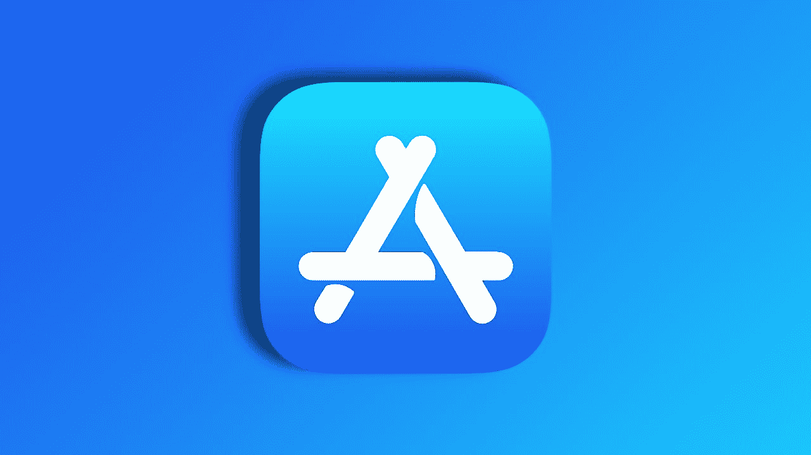

<!--yml
category: 未分类
date: 2024-05-29 12:01:33
-->

# Progressive Web Apps in EU will work fine in iOS 17.4

> 来源：[https://appleinsider.com/articles/24/03/01/apple-reverses-course-on-death-of-progressive-web-apps-in-eu](https://appleinsider.com/articles/24/03/01/apple-reverses-course-on-death-of-progressive-web-apps-in-eu)

Progressive Web Apps aren't getting changed in the EU

 

After a few weeks of internet drama, Apple has responded to complaints about the death of Progressive Web Apps in the European Union and is restoring them to how they worked in iOS 17.3 and before.

When the first iOS 17.4 beta launched, European Union users were [hit by problems](https://appleinsider.com/articles/24/02/09/something-is-happening-to-progressive-web-apps-in-ios-174----but-they-arent-dead) with Progressive Web Apps that weren't working properly. Further iterations of the beta, including the release candidates on February 27, [made this worse](https://appleinsider.com/articles/24/02/15/apple-blames-new-law-for-why-progressive-web-apps-dont-work-right-in-the-eu).

And now, Apple has changed its mind on the matter. Apple says that it has reversed course because of numerous requests by consumers to keep the feature.

Apple has altered its page on what the Digital Markets App [changes entail](https://developer.apple.com/support/dma-and-apps-in-the-eu/#browser-alt-eu) to reflect the Progressive Web App direction change.

Apple's new page reads as follows:

> Previously, Apple announced plans to remove the Home Screen web apps capability in the EU as part of our efforts to comply with the DMA. The need to remove the capability was informed by the complex security and privacy concerns associated with web apps to support alternative browser engines that would require building a new integration architecture that does not currently exist in iOS.
> 
> We have received requests to continue to offer support for Home Screen web apps in iOS, therefore we will continue to offer the existing Home Screen web apps capability in the EU. This support means Home Screen web apps continue to be built directly on WebKit and its security architecture, and align with the security and privacy model for native apps on iOS.
> 
> Developers and users who may have been impacted by the removal of Home Screen web apps in the beta release of iOS in the EU can expect the return of the existing functionality for Home Screen web apps with the availability of iOS 17.4 in early March.

For support, the Progressive Web Apps will still need to be built on WebKit, with all that entails.

The European Union Digital Markets Act that spawned all these changes has an implementation deadline of March 8\. If Apple follows its normal course, iOS 17.4 with the contained [App Store](https://appleinsider.com/inside/app-store "App Store") concessions to suit the law will arrive on Tuesday, March 5.

## Apple's DMA plans and subsequent complaints

On January 25, Apple [revealed its changes](https://appleinsider.com/articles/24/01/25/apple-will-charge-eu-developers-to-sideload-but-its-not-quite-as-bad-as-rumored) that will come into effect from March 2024 to comply with DMA. For all users, Apple will start to notarize all [iOS](https://appleinsider.com/inside/ios "iOS") apps, regardless of where they're sold.

Developers can offer their own app marketplace in the EU, but they must be approved by Apple and use a human review process. Those stores are also responsible for their own refunds but can use alternative third-party payment processors.

At the same time, Apple is changing its fee structure, reducing the standard commission of 30% down to 17%. For apps that stay within the [App Store](https://appleinsider.com/inside/app-store "App Store"), there will also be a 3% fee for using Apple's payment processing services.

Controversially, all apps not sold via the App Store will be subject to a Core Technology Fee of 0.50 Euro per first install of an app annually, waived for the first million installs.

Alongside the changes is a mandate that iOS supports multiple browser engines beyond custom front-ends on top of WebKit. In short, in the EU, Apple has to fully support Mozilla's Firefox instead of just using Apple's WebKit.

At the same time, it crippled Progressive Web Apps. Presumably, it did so because it thought it would have to support them across all browsers that didn't use WebKit, but that is not the case.

Apple's move also comes after a threat to look into the issue by European Commission authorities.

"We are indeed looking at the compliance packages of all gatekeepers, including Apple," the European Commission said in a statement on February 26\. "In that context, we're in particular looking into the issue of progressive web apps, and can confirm sending the requests for information to Apple and to app developers, who can provide useful information for our assessment."

Apple's proposals have, naturally, attracted complaints. Spotify CEO Daniel Ek [called the fees](https://appleinsider.com/articles/24/01/27/spotify-ceo-unhappy-with-apples-eu-app-store-extortion) "extortion, plain and simple," while Epic Games CEO Tim Sweeney [referred to it](https://appleinsider.com/articles/24/01/25/epics-tim-sweeney-is-mad-about-apples-eu-app-store-concessions) as "hot garbage" and a "devious new instance of malicious compliance."