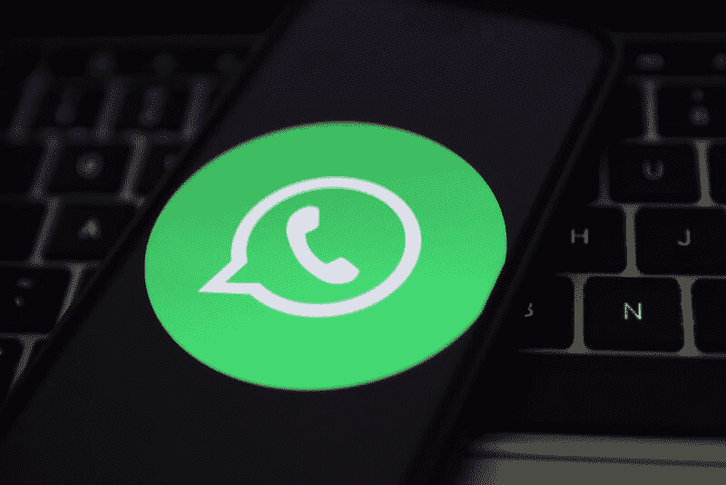

<!--yml

category: 未分类

日期：2024-05-27 14:29:16

-->

# WhatsApp终于迫使Pegasus间谍软件制造商分享其秘密代码 | Ars Technica

> 来源：[https://arstechnica.com/tech-policy/2024/03/whatsapp-finally-forces-pegasus-spyware-maker-to-share-its-secret-code/](https://arstechnica.com/tech-policy/2024/03/whatsapp-finally-forces-pegasus-spyware-maker-to-share-its-secret-code/)

WhatsApp很快将获准探索NSO Group的Pegasus间谍软件的“全部功能”——这款以色列国防部长长期以来视为“高度追捧”的国家秘密，据《卫报》 [报道](https://www.theguardian.com/technology/2024/feb/29/pegasus-surveillance-code-whatsapp-meta-lawsuit-nso-group)。

自2019年以来，WhatsApp声称Pegasus被用来监视1400名WhatsApp用户，持续两周时间，未经授权地访问其敏感数据，包括加密消息。WhatsApp起诉NSO，Ars [指出](https://arstechnica.com/information-technology/2019/10/whatsapp-suit-says-israeli-spyware-maker-exploited-its-app-to-infect-1400-users/)，这是一场“前所未有的法律行动”，旨在“打击向全球各国政府销售高级恶意软件服务的无监管行业”。

最初，NSO试图因“美国和以色列的各种限制”而阻止此诉讼中的所有发现，但这一全面请求被拒绝。然后，上周，NSO再次失败，未能阻止WhatsApp获取其秘密代码。

当法院审议各方强制发现的动议时，美国地区法官Phyllis Hamilton [驳回](https://cdn.arstechnica.net/wp-content/uploads/2024/03/WhatsApp-v-NSO-Group-Order-2-23-2024.pdf)了NSO关于仅需提交有关Pegasus安装层信息的论点。

Hamilton支持WhatsApp，允许这款由Meta拥有的应用程序获取“关于相关间谍软件全部功能的信息”请求，“信息显示仅关于相关间谍软件安装层功能的信息将不足以让原告理解相关间谍软件如何执行访问和提取数据的功能。”

WhatsApp声称Pegasus可以“拦截发送到和从设备的通信，包括iMessage、Skype、Telegram、WeChat、Facebook Messenger、WhatsApp和其他应用”，并且它还可以“根据不同目的进行定制，包括拦截通信、捕获屏幕截图和窃取浏览器历史记录。”

Hamilton 下结论称，为了证明这一点，WhatsApp 需要访问“所有相关的间谍软件”——特别是“任何 NSO 的间谍软件针对或定向于 WhatsApp 服务器，或以任何方式使用 WhatsApp 访问目标设备”，“从所谓的攻击发生前一年到所谓的攻击发生后一年”的时期。

到目前为止，NSO 尚未对此做出评论，但 WhatsApp 对此结果感到满意。

WhatsApp 的发言人告诉《卫报》：“最近的法院裁决是我们长期保护 WhatsApp 用户免受非法攻击目标的重要里程碑。间谍软件公司和其他恶意行为者需要明白，他们可能会被捕捉，并且无法无视法律。”

但 Hamilton 没有授予 WhatsApp 所有的发现请求，避免 NSO 分享其服务器架构的具体信息，因为 WhatsApp “可以通过所谓的间谍软件的全部功能获得相同的信息”。

或许更重要的是，NSO 也不会被强制揭示其客户的身份。虽然 NSO 并不公开其购买其间谍软件的政府的名称，但有报道显示波兰、沙特阿拉伯、卢旺达、印度、匈牙利和阿联酋使用它[来针对异见者](https://arstechnica.com/information-technology/2019/10/activists-phones-targeted-by-one-of-the-worlds-most-advanced-espionage-apps/)，据《卫报》报道。2021 年，[美国将 NSO 列入黑名单](https://arstechnica.com/tech-policy/2021/11/us-blacklists-maker-of-pegasus-spyware-that-helps-governments-spy-on-activists/)，指责其传播“用于压制的数字工具”。

在同一命令中，Hamilton 还拒绝了 NSO 的请求，强迫 WhatsApp 分享其与 Citizen Lab 的投诉后通信，后者在案件中作为第三方证人支持 WhatsApp 的论点，“Pegasus 被 NSO 的客户误用于‘公民社会’而非用于调查恐怖主义和严重犯罪”。

似乎 NSO 寻求 WhatsApp 与 Citizen Lab 的投诉后通信，作为潜在的压力手段，希望 WhatsApp 撤回 Citizen Lab 对案件的陈述。Hamilton 引用了 NSO 的法庭文件，奇怪地指出：“如果原告同意从他们的案件中撤回 Citizen Lab 的论点，即 Pegasus 被用于针对‘公民社会’的成员而不是用于调查恐怖主义和严重犯罪，那么这种发现的必要性就会大大减少。”

最终，Hamilton 拒绝了 NSO 的请求，因为“法院认为所请求的发现材料的相关性不明确。”

随着案件的发现程序继续进行，法院预计将于 2025 年 3 月 3 日开始的审判前收到双方的专家披露材料，预定于 2023 年 8 月 30 日收到。
