<!--yml
category: 未分类
date: 2024-05-27 14:29:32
-->

# Lazarus and the FudModule Rootkit: Beyond BYOVD with an Admin-to-Kernel Zero-Day - Avast Threat Labs

> 来源：[https://decoded.avast.io/janvojtesek/lazarus-and-the-fudmodule-rootkit-beyond-byovd-with-an-admin-to-kernel-zero-day/](https://decoded.avast.io/janvojtesek/lazarus-and-the-fudmodule-rootkit-beyond-byovd-with-an-admin-to-kernel-zero-day/)

## Key Points

*   Avast discovered an in-the-wild admin-to-kernel exploit for a previously unknown zero-day vulnerability in the appid.sys AppLocker driver. 
*   Thanks to Avast’s prompt report, Microsoft addressed this vulnerability as [CVE-2024-21338](https://msrc.microsoft.com/update-guide/vulnerability/CVE-2024-21338) in the February Patch Tuesday update. 
*   The exploitation activity was orchestrated by the notorious Lazarus Group, with the end goal of establishing a kernel read/write primitive. 
*   This primitive enabled Lazarus to perform direct kernel object manipulation in an updated version of their data-only FudModule rootkit, a previous version of which was analyzed by [ESET](https://www.virusbulletin.com/uploads/pdf/conference/vb2022/papers/VB2022-Lazarus-and-BYOVD-evil-to-the-Windows-core.pdf) and [AhnLab](https://download.ahnlab.com/global/brochure/Analysis-Report-on-Lazarus-Groups-Rootkit-Attack-Using-BYOVD.pdf). 
*   After completely reverse engineering this updated rootkit variant, Avast identified substantial advancements in terms of both functionality and stealth, with four new – and three updated – rootkit techniques. 
*   In a key advancement, the rootkit now employs a new handle table entry manipulation technique in an attempt to suspend PPL (Protected Process Light) protected processes associated with Microsoft Defender, CrowdStrike Falcon, and HitmanPro. 
*   Another significant step up is exploiting the zero-day vulnerability, where Lazarus previously utilized much noisier BYOVD (Bring Your Own Vulnerable Driver) techniques to cross the admin-to-kernel boundary. 
*   Avast’s investigation also recovered large parts of the infection chain leading up to the deployment of the rootkit, resulting in the discovery of a new RAT (Remote Access Trojan) attributed to Lazarus. 
*   Technical details concerning the RAT and the initial infection vector will be published in a follow-up blog post, scheduled for release along with our [Black Hat Asia 2024 briefing](https://www.blackhat.com/asia-24/briefings/schedule/#from-byovd-to-a--day-unveiling-advanced-exploits-in-cyber-recruiting-scams-37786). 

## Introduction 

When it comes to Windows security, there is a thin line between admin and kernel. Microsoft’s [security servicing criteria](https://www.microsoft.com/en-us/msrc/windows-security-servicing-criteria) have long asserted that “[a]dministrator-to-kernel is not a security boundary”, meaning that Microsoft reserves the right to patch admin-to-kernel vulnerabilities at its own discretion. As a result, the Windows security model does not guarantee that it will prevent an admin-level attacker from directly accessing the kernel. This isn’t just a theoretical concern. In practice, attackers with admin privileges [frequently](https://www.rapid7.com/blog/post/2021/12/13/driver-based-attacks-past-and-present/#:~:text=Known%20usage%20in%20the%20wild) achieve kernel-level access by exploiting known vulnerable drivers, in a technique called [BYOVD](https://www.welivesecurity.com/2022/01/11/signed-kernel-drivers-unguarded-gateway-windows-core/) (Bring Your Own Vulnerable Driver). 

Microsoft hasn’t given up on securing the admin-to-kernel boundary though. Quite the opposite, it has made a great deal of progress in making this boundary harder to cross. Defense-in-depth protections, such as [DSE](https://learn.microsoft.com/en-us/windows-hardware/drivers/install/driver-signing) (Driver Signature Enforcement) or [HVCI](https://learn.microsoft.com/en-us/windows-hardware/design/device-experiences/oem-hvci-enablement) (Hypervisor-Protected Code Integrity), have made it increasingly difficult for attackers to execute custom code in the kernel, forcing most to resort to data-only attacks (where they achieve their malicious objectives solely by reading and writing kernel memory). Other defenses, such as [driver blocklisting,](https://learn.microsoft.com/en-us/windows/security/application-security/application-control/windows-defender-application-control/design/microsoft-recommended-driver-block-rules) are pushing attackers to move to exploiting less-known vulnerable drivers, resulting in an increase in attack complexity. Although these defenses haven’t yet reached the point where we can officially call admin-to-kernel a security boundary (BYOVD attacks are still feasible, so calling it one would just mislead users into a false sense of security), they clearly represent steps in the right direction. 

From the attacker’s perspective, crossing from admin to kernel opens a whole new realm of [possibilities](https://github.com/wavestone-cdt/EDRSandblast). With kernel-level access, an attacker might disrupt security software, conceal indicators of infection (including files, network activity, processes, etc.), disable kernel-mode telemetry, turn off mitigations, and more. Additionally, as the security of [PPL](https://learn.microsoft.com/en-us/windows/win32/services/protecting-anti-malware-services-) (Protected Process Light) relies on the admin-to-kernel boundary, our hypothetical attacker also gains the ability to tamper with protected processes or add protection to an arbitrary process. This can be especially powerful if lsass is [protected with RunAsPPL](https://learn.microsoft.com/en-us/windows-server/security/credentials-protection-and-management/configuring-additional-lsa-protection) as bypassing PPL could enable the attacker to dump otherwise unreachable credentials.  

For more specific examples of what an attacker might want to achieve with kernel-level access, keep reading this blog – in the [latter half](#techniques), we will dive into all the techniques implemented in the FudModule rootkit. 

##### Living Off the Land: Vulnerable Drivers Edition 

With a seemingly growing number of attackers seeking to abuse some of the previously mentioned kernel capabilities, defenders have no choice but to hunt heavily for driver exploits. Consequently, attackers wishing to target well-defended networks must also step up their game if they wish to avoid detection. We can broadly break down admin-to-kernel driver exploits into three categories, each representing a trade-off between attack difficulty and stealth. 

###### **N-Day BYOVD Exploits** 

In the simplest case, an attacker can leverage BYOVD to exploit a publicly known n-day vulnerability. This is very easy to pull off, as there are plenty of public proof-of-concept exploits for various vulnerabilities. However, it’s also relatively straightforward to detect since the attacker must first drop a known vulnerable driver to the file system and then load it into the kernel, resulting in two great detection opportunities. What’s more, some systems may have Microsoft’s [vulnerable driver blocklist](https://learn.microsoft.com/en-us/windows/security/application-security/application-control/windows-defender-application-control/design/microsoft-recommended-driver-block-rules#microsoft-vulnerable-driver-blocklist) enabled, which would block some of the most common vulnerable drivers from loading. [Previous](https://www.virusbulletin.com/uploads/pdf/conference/vb2022/papers/VB2022-Lazarus-and-BYOVD-evil-to-the-Windows-core.pdf) [versions](https://download.ahnlab.com/global/brochure/Analysis-Report-on-Lazarus-Groups-Rootkit-Attack-Using-BYOVD.pdf) of the FudModule rootkit could be placed in this category, initially exploiting a known vulnerability in [dbutil_2_3.sys](https://www.virustotal.com/gui/file/0296e2ce999e67c76352613a718e11516fe1b0efc3ffdb8918fc999dd76a73a5/detection) and then moving on to targeting [ene.sys](https://www.virustotal.com/gui/file/175eed7a4c6de9c3156c7ae16ae85c554959ec350f1c8aaa6dfe8c7e99de3347) in later versions. 

###### **Zero-Day BYOVD Exploits** 

In more sophisticated scenarios, an attacker would use BYOVD to exploit a zero-day vulnerability within a signed third-party driver. Naturally, this requires the attacker to first discover such a zero-day vulnerability, which might initially seem like a daunting task. However, note that any exploitable vulnerability in any signed driver will do, and there is unfortunately no shortage of low-quality third-party drivers. Therefore, the difficulty level of discovering such a vulnerability might not be as high as it would initially seem. It might suffice to scan a collection of drivers for known vulnerability patterns, as demonstrated by Carbon Black researchers who recently used bulk static analysis to [uncover](https://blogs.vmware.com/security/2023/10/hunting-vulnerable-kernel-drivers.html) 34 unique vulnerabilities across more than 200 signed drivers. Such zero-day BYOVD attacks are notably stealthier than n-day attacks since defenders can no longer rely on hashes of known vulnerable drivers for detection. However, some detection opportunities still remain, as loading a random driver represents a suspicious event that might warrant deeper investigation. For an example of an attack belonging to this category, consider the spyware vendor Candiru, which we [caught](https://decoded.avast.io/janvojtesek/the-return-of-candiru-zero-days-in-the-middle-east/) exploiting a zero-day vulnerability in [hw.sys](https://www.virustotal.com/gui/file/6a4875ae86131a594019dec4abd46ac6ba47e57a88287b814d07d929858fe3e5) for the final privilege escalation stage of their browser exploit chain. 

###### **Beyond BYOVD** 

Finally, the holy grail of admin-to-kernel is going beyond BYOVD by exploiting a zero-day in a driver that’s known to be already installed on the target machine. To make the attack as universal as possible, the most obvious target here would be a built-in Windows driver that’s already a part of the operating system.  

Discovering an exploitable vulnerability in such a driver is significantly more challenging than in the previous BYOVD scenarios for two reasons. First, the number of possible target drivers is vastly smaller, resulting in a much-reduced attack surface. Second, the code quality of built-in drivers is arguably higher than that of random third-party drivers, making vulnerabilities much more difficult to find. It’s also worth noting that – while patching tends to be ineffective at stopping BYOVD attacks (even if a vendor patches their driver, the attacker can still abuse the older, unpatched version of the driver) – patching a built-in driver will make the vulnerability no longer usable for this kind of zero-day attacks. 

If an attacker, despite all of these hurdles, manages to exploit a zero-day vulnerability in a built-in driver, they will be rewarded with a level of stealth that cannot be matched by standard BYOVD exploitation. By exploiting such a vulnerability, the attacker is in a sense [living off the land](https://www.crowdstrike.com/cybersecurity-101/living-off-the-land-attacks-lotl/) with no need to bring, drop, or load any custom drivers, making it possible for a kernel attack to be truly fileless. This not only evades most detection mechanisms but also enables the attack on systems where driver allowlisting is in place (which might seem a bit ironic, given that CVE-2024-21338 concerns an AppLocker driver).  

While we can only speculate on Lazarus’ motivation for choosing this third approach for crossing the admin-to-kernel boundary, we believe that stealth was their primary motivation. Given their level of notoriety, they would have to swap vulnerabilities any time someone burned their currently used BYOVD technique. Perhaps they also reasoned that, by going beyond BYOVD, they could minimize the need for swapping by staying undetected for longer. 

## CVE-2024-21338 

As far as zero-days go, CVE-2024-21338 is relatively straightforward to both understand and exploit. The vulnerability resides within the IOCTL (Input and Output Control) dispatcher in `appid.sys`, which is the central driver behind [AppLocker](https://learn.microsoft.com/en-us/windows/security/application-security/application-control/windows-defender-application-control/applocker/applocker-overview), the application whitelisting [technology](https://www.tiraniddo.dev/2019/11/the-internals-of-applocker-part-1.html) built into Windows. The vulnerable control code `0x22A018` is designed to compute a *smart hash* of an executable image file. This IOCTL offers some flexibility by allowing the caller to specify how the driver should query and read the hashed file. The problem is, this flexibility is achieved by expecting two kernel function pointers referenced from the IOCTL’s input buffer: one containing a callback pointer to query the hashed file’s size and the other a callback pointer to read the data to be hashed.  

Since user mode would typically not be handling kernel function pointers, this design suggests the IOCTL may have been initially designed to be invoked from the kernel. Indeed, while we did not find any legitimate user-mode callers, the IOCTL does get invoked by other AppLocker drivers. For instance, there is a `ZwDeviceIoControlFile` call in `applockerfltr.sys`, passing `SmpQueryFile` and `SmpReadFile` for the callback pointers. Aside from that, `appid.sys` itself also uses this functionality, passing `AipQueryFileHandle` and `AipReadFileHandle` (which are basically just wrappers over `ZwQueryInformationFile` and `ZwReadFile`, respectively). 

Despite this design, the vulnerable IOCTL remained accessible from user space, meaning that a user-space attacker could abuse it to essentially trick the kernel into calling an arbitrary pointer. What’s more, the attacker also partially controlled the data referenced by the first argument passed to the invoked callback function. This presented an ideal exploitation scenario, allowing the attacker to call an arbitrary kernel function with a high degree of control over the first argument. 

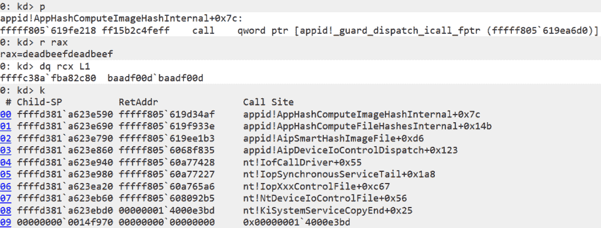

A WinDbg session with the triggered vulnerability, traced to the arbitrary callback invocation. Note that the attacker controls both the function pointer to be called (`0xdeadbeefdeadbeef` in this session) and the data pointed to by the first argument (`0xbaadf00dbaadf00d`). 

If exploitation sounds trivial, note that there are some constraints on what pointers this vulnerability allows an attacker to call. Of course, in the presence of [SMEP](https://j00ru.vexillium.org/2011/06/smep-what-is-it-and-how-to-beat-it-on-windows/) (Supervisor Mode Execution Prevention), the attacker cannot just supply a user-mode shellcode pointer. What’s more, the callback invocation is an indirect call that may be safeguarded by [kCFG](https://learn.microsoft.com/en-us/windows/win32/secbp/control-flow-guard) (Kernel Control Flow Guard), requiring that the supplied kernel pointers represent valid kCFG call targets. In practice, this does not prevent exploitation, as the attacker can just find some kCFG-compliant gadget function that would turn this into another primitive, such as a (limited) read/write. There are also a few other constraints on the IOCTL input buffer that must be solved in order to reach the vulnerable callback invocation. However, these too are relatively straightforward to satisfy, as the attacker only needs to fake some kernel objects and supply the right values so that the IOCTL handler passes all the necessary checks while at the same time not crashing the kernel. 

The vulnerable IOCTL is exposed through a device object named `\Device\AppId`. [Breaking down](https://learn.microsoft.com/en-us/windows-hardware/drivers/kernel/defining-i-o-control-codes) the `0x22A018` control code and extracting the `RequiredAccess` field reveals that a handle with write access is required to call it. Inspecting the device’s ACL (Access Control List; see the screenshot below), there are entries for `local service`, `administrators`, and `appidsvc`. While the entry for `administrators` does not grant write access, the entry for `local service` does. Therefore, to describe CVE-2024-21338 more accurately, we should label it *local service-to-kernel* rather than *admin-to-kernel*. It’s also noteworthy that `appid.sys` might create two additional device objects, namely `\Device\AppidEDPPlugin` and `\Device\SrpDevice`. Although these come with more permissive ACLs, the vulnerable IOCTL handler is unreachable through them, rendering them irrelevant for exploitation purposes. 

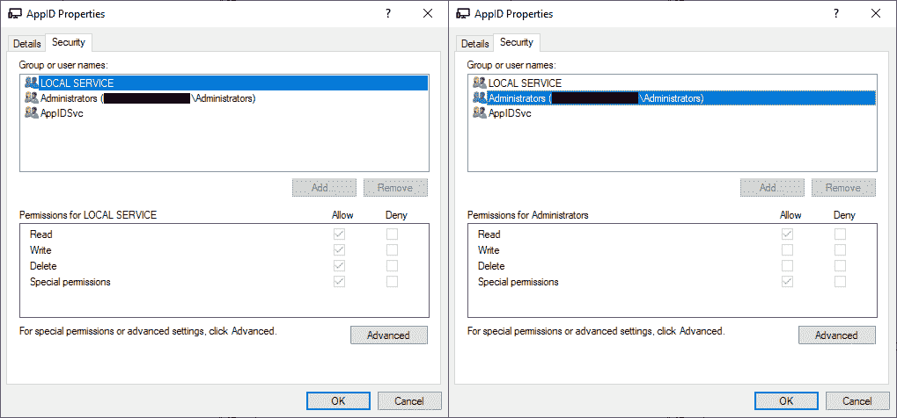

Access control entries of `\Device\AppId`, revealing that while `local service` is allowed write access, `administrators` are not. 

As the [local service](https://learn.microsoft.com/en-us/windows/win32/services/localservice-account) account has reduced privileges compared to administrators, this also gives the vulnerability a somewhat higher impact than standard admin-to-kernel. This might be the reason Microsoft characterized the CVE as `Privileges Required: Low`, taking into account that `local service` processes do not always necessarily have to run at higher integrity levels. However, for the purposes of this blog, we still chose to refer to CVE-2024-21338 mainly as an admin-to-kernel vulnerability because we find it better reflects how it was used in the wild – Lazarus was already running with elevated privileges and then impersonated the local service account just prior to calling the IOCTL. 

The vulnerability was introduced in Win10 1703 (RS2/15063) when the `0x22A018` IOCTL handler was first implemented. Older builds are not affected as they lack support for the vulnerable IOCTL. Interestingly, the Lazarus exploit bails out if it encounters a build older than Win10 1809 (RS5/17763), completely disregarding three perfectly vulnerable Windows versions. As for the later versions, the vulnerability extended all the way up to the most recent builds, including Win11 23H2\. There have been some slight changes to the IOCTL, including an extra argument expected in the input buffer, but nothing that would prevent exploitation.  

We developed a custom PoC (Proof of Concept) exploit and submitted it in August 2023 as part of a vulnerability report to Microsoft, leading to an advisory for [CVE-2024-21338](https://msrc.microsoft.com/update-guide/vulnerability/CVE-2024-21338) in the February Patch Tuesday update. The update addressed the vulnerability by adding an `ExGetPreviousMode` check to the IOCTL handler (see the patch below). This aims to prevent user-mode initiated IOCTLs from triggering the arbitrary callbacks. 

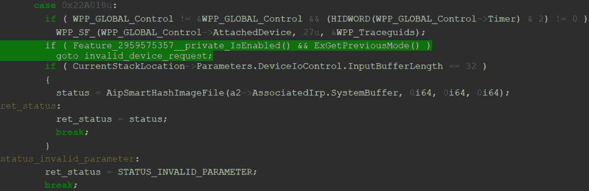

The patched IOCTL handler. If feature `2959575357` is enabled, attempts to call the IOCTL with `PreviousMode==UserMode` should immediately result in `STATUS_INVALID_DEVICE_REQUEST`, failing to even reach `AipSmartHashImageFile`. 

Though the vulnerability may only barely meet Microsoft’s security servicing criteria, we believe patching was the right choice and would like to thank Microsoft for eventually addressing this issue. Patching will undoubtedly disrupt Lazarus’ offensive operations, forcing them to either find a new admin-to-kernel zero-day or revert to using BYOVD techniques. While discovering an admin-to-kernel zero-day may not be as challenging as discovering a zero-day in a more attractive attack surface (such as standard user-to-kernel, or even sandbox-to-kernel), we believe that finding one would still require Lazarus to invest significant resources, potentially diverting their focus from attacking some other unfortunate targets. 

#### Exploitation 

The Lazarus exploit begins with an initialization stage, which performs a one-time setup for both the exploit and the rootkit (both have been compiled into the same module). This initialization starts by dynamically resolving all necessary Windows API functions, followed by a low-effort anti-debug check on `PEB.BeingDebugged`. Then, the exploit inspects the build number to see if it’s running on a supported Windows version. If so, it loads hardcoded constants tailored to the current build. Interestingly, the choice of constants sometimes comes down to the update build revision (UBR), showcasing a high degree of dedication towards ensuring that the code runs cleanly across a wide range of target machines.  

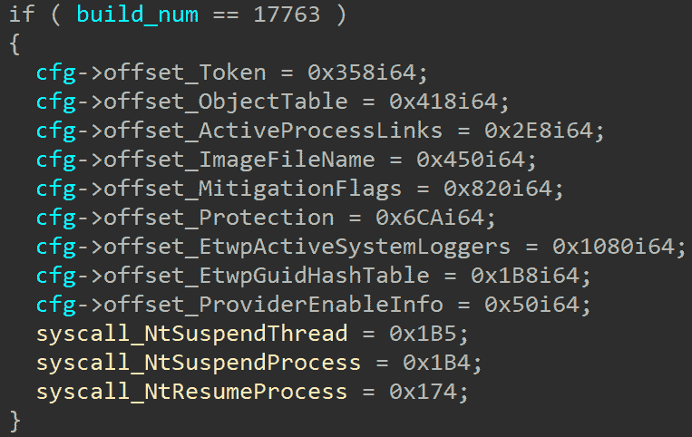

A decompiled code snippet, loading version-specific hardcoded constants. This particular example contains offsets and syscall numbers for Win10 1809. 

The initialization process then continues with leaking the base addresses of three kernel modules: `ntoskrnl`, `netio`, and `fltmgr`. This is achieved by calling `NtQuerySystemInformation` using the `SystemModuleInformation` class. The `KTHREAD` address of the currently executing thread is also leaked in a similar fashion, by duplicating the current thread pseudohandle and then finding the corresponding kernel object address using the `SystemExtendedHandleInformation` system information class. Finally, the exploit manually loads the `ntoskrnl` image into the user address space, only to scan for relative virtual addresses (RVAs) of some functions of interest. 

Since the `appid.sys` driver does not have to be already loaded on the target machine, the exploit may first have to load it itself. It chooses to accomplish this in an indirect way, by writing an event to one specific AppLocker-related ETW (Event Tracing for Windows) provider. Once `appid.sys` is loaded, the exploit impersonates the `local service` account using a direct syscall to `NtSetInformationThread` with the `ThreadImpersonationToken` thread information class. By impersonating `local service`, it can now obtain a read/write handle to `\Device\AppId`. With this handle, the exploit finally prepares the IOCTL input buffer and triggers the vulnerability using the `NtDeviceIoControlFile` syscall.  

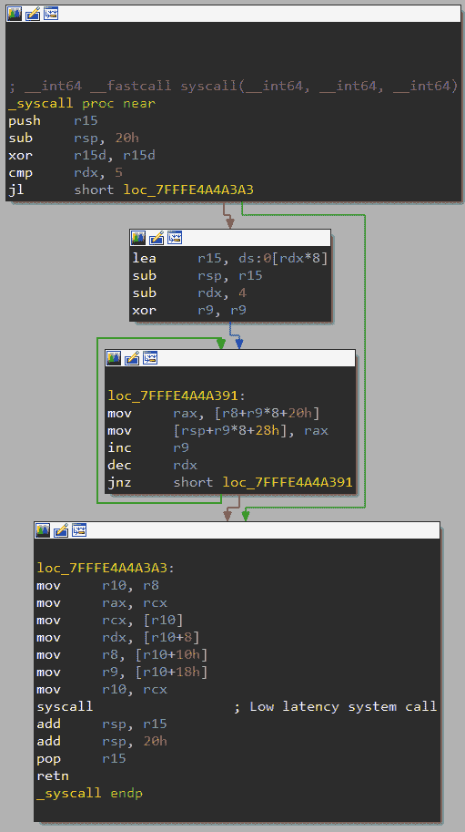

Direct syscalls are heavily used throughout the exploit. 

The exploit crafts the IOCTL input buffer in such a way that the vulnerable callback is essentially a gadget that performs a 64-bit copy from the IOCTL input buffer to an arbitrary target address. This address was chosen to corrupt the [PreviousMode](https://learn.microsoft.com/en-us/windows-hardware/drivers/kernel/previousmode) of the current thread. By ensuring the corresponding source byte in the IOCTL input buffer is zero, the copy will clear the `PreviousMode` field, effectively resulting in its value being interpreted as `KernelMode`. Targeting `PreviousMode` like this is a widely popular [exploitation technique](https://research.nccgroup.com/2020/05/25/cve-2018-8611-exploiting-windows-ktm-part-5-5-vulnerability-detection-and-a-better-read-write-primitive/#previousmode-abuse:~:text=into%20PreviousMode%20further.-,PreviousMode%20%E2%80%93%20a%20%22god%20mode%22%20primitive%3F,-PreviousMode%20on%2064), as corrupting this one byte in the `KTHREAD` structure bypasses kernel-mode checks inside syscalls such as `NtReadVirtualMemory` or `NtWriteVirtualMemory`, allowing a user-mode attacker to read and write arbitrary kernel memory. Note that while this technique was [mitigated](https://x.com/GabrielLandau/status/1597001955909697536) on some Windows Insider Builds, this mitigation has yet to reach general availability at the time of writing. 

Interestingly, the exploit may attempt to trigger the vulnerable IOCTL twice. This is due to an extra argument that was added in Win11 22H2\. As a result, the IOCTL handler on newer builds expects the input buffer to be `0x20` bytes in size while, previously, the expected size was only `0x18`. Rather than selecting the proper input buffer size for the current build, the exploit just tries calling the IOCTL twice: first with an input buffer size `0x18` then – if not successful – with `0x20`. This is a valid approach since the IOCTL handler’s first action is to check the input buffer size, and if it doesn’t match the expected size, it would just immediately return `STATUS_INVALID_PARAMETER`.  

To check if it was successful, the exploit employs the `NtWriteVirtualMemory` syscall, attempting to read the current thread’s `PreviousMode` (Lazarus avoids using `NtReadVirtualMemory`, more on this later). If the exploit succeeded, the syscall should return `STATUS_SUCCESS`, and the leaked `PreviousMode` byte should equal `0` (meaning `KernelMode`). Otherwise, the syscall should return an error status code, as it should be impossible to read kernel memory without a corrupted `PreviousMode`.  

In our exploit analysis, we deliberately chose to omit some key details, such as the choice of the callback gadget function. This decision was made to strike the right balance between helping defenders with detection but not making exploitation too widely accessible. For those requiring more information for defensive purposes, we may be able to share additional details on a case-by-case basis. 

## The FudModule Rootkit

The entire goal of the admin-to-kernel exploit was to corrupt the current thread’s `PreviousMode`. This allows for a powerful kernel read/write primitive, where the affected user-mode thread can read and write arbitrary kernel memory using the `Nt(Read|Write)VirtualMemory` syscalls. Armed with this primitive, the FudModule rootkit employs direct kernel object manipulation (DKOM) techniques to disrupt various kernel security mechanisms. It’s worth reiterating that FudModule is a data-only rootkit, meaning it executes entirely from user space and all the kernel tampering is performed through the read/write primitive.  

The first variants of the FudModule rootkit were independently discovered by AhnLab and ESET research teams, with both publishing detailed analyses in September 2022\. The rootkit was named after the `FudModule.dll` string used as the name in its export table. While this artifact is not present anymore, there is no doubt that what we found is an updated version of the same rootkit. AhnLab’s [report](https://download.ahnlab.com/global/brochure/Analysis-Report-on-Lazarus-Groups-Rootkit-Attack-Using-BYOVD.pdf) documented a sample from early 2022, which incorporated seven data-only rootkit techniques and was enabled through a BYOVD exploit for [ene.sys](https://www.virustotal.com/gui/file/175eed7a4c6de9c3156c7ae16ae85c554959ec350f1c8aaa6dfe8c7e99de3347). ESET’s [report](https://www.virusbulletin.com/uploads/pdf/conference/vb2022/papers/VB2022-Lazarus-and-BYOVD-evil-to-the-Windows-core.pdf) examined a slightly earlier variant from late 2021, also featuring seven rootkit techniques but exploiting a different BYOVD vulnerability in [dbutil_2_3.sys](https://www.virustotal.com/gui/file/0296e2ce999e67c76352613a718e11516fe1b0efc3ffdb8918fc999dd76a73a5/detection). In contrast, our discovery concerns a sample featuring nine rootkit techniques and exploiting a previously unknown admin-to-kernel vulnerability. Out of these nine techniques, four are new, three are improved, and two remain unchanged from the previous variants. This leaves two of the original seven techniques, which have been deprecated and are no longer present in the latest variant. 

Each rootkit technique is assigned a bit, ranging from `0x1` to `0x200` (the `0x20` bit is left unused in the current variant). FudModule executes the techniques sequentially, in an ascending order of the assigned bits. The bits are used to report on the success of the individual techniques. During execution, FudModule will construct an integer value (named `bitfield_techniques` in the decompilation below), where only the bits corresponding to successfully executed techniques will be set. This integer is ultimately written to a file named `tem1245.tmp`, reporting on the rootkit’s success. Interestingly, we did not find this filename referenced in any other Lazarus sample, suggesting the dropped file is only inspected through hands-on-keyboard activity, presumably through a RAT (Remote Access Trojan) command. This supports our beliefs that FudModule is only loosely integrated into the rest of Lazarus’ malware ecosystem and that Lazarus is very careful about using the rootkit, only deploying it on demand under the right circumstances. 

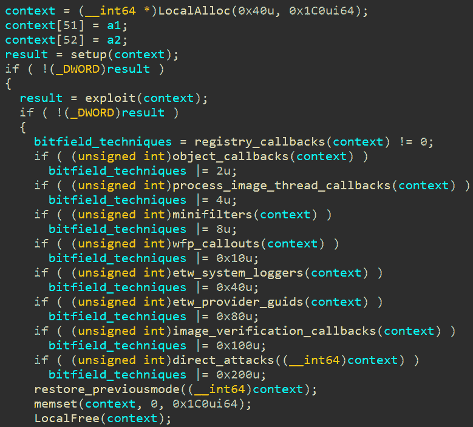

The rootkit’s “main” function, executing the individual rootkit techniques. Note the missing `0x20` technique. 

Based on the large number of updates, it seems that FudModule remains under active development. The latest variant appears more robust, avoiding some potentially problematic practices from the earlier variants. Since some techniques target undocumented kernel internals in a way that we have not previously encountered, we believe that Lazarus must be conducting their own kernel research. Further, though the rootkit is certainly technically sophisticated, we still identified a few bugs here and there. These may either limit the rootkit’s intended functionality or even cause kernel bug checks under the right conditions. While we find some of these bugs very interesting and would love to share the details, we do not enjoy the idea of providing free bug reports to threat actors, so we will hold onto them for now and potentially share some information later if the bugs get fixed. 

Interestingly, FudModule utilizes the `NtWriteVirtualMemory` syscall for both reading and writing kernel memory, eliminating the need to call `NtReadVirtualMemory`. This leverages the property that, when limited to a single virtual address space, `NtReadVirtualMemory` and `NtWriteVirtualMemory` are basically inverse operations with respect to the values of the source `Buffer` and the destination `BaseAddress` [arguments](http://undocumented.ntinternals.net/index.html?page=UserMode%2FUndocumented%20Functions%2FMemory%20Management%2FVirtual%20Memory%2FNtWriteVirtualMemory.html). In other words, writing to kernel memory can be thought of as writing from a user-mode `Buffer` to a kernel-mode `BaseAddress`, while reading from kernel memory could be conversely achieved by swapping arguments, that is writing from a kernel-mode `Buffer` to a user-mode `BaseAddress`. Lazarus’ implementation takes advantage of this, which seems to be an intentional design decision since most developers would likely prefer the more straightforward way of using `NtReadVirtualMemory` for reading kernel memory and `NtWriteVirtualMemory` for writing kernel memory. We can only guess why Lazarus chose this approach, but this might be yet another stealth-enhancing feature. With their implementation, they only must use one suspicious syscall instead of two, potentially reducing the number detection opportunities. 

###### **Debug Prints** 

Before we delve into the actual rootkit techniques, there is one last thing worth discussing. To our initial surprise, Lazarus left a handful of plaintext debug prints in the compiled code. Such prints are typically one of the best things that can happen to a malware researcher, because they tend to accelerate the reverse engineering process significantly. In this instance, however, some of the prints had the opposite effect, sometimes even making us question if we understood the code correctly.  

As an example, let us mention the string `get rop function addresses failed`. Assuming *rop* stands for *return-oriented programming*, this string would make perfect sense in the context of exploitation, if not for the fact that not a single return address was corrupted in the exploit.  

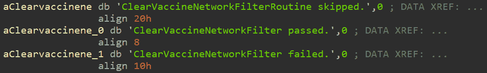

Plaintext debug strings found in the rootkit. The term *vaccine* is used to refer to security software. 

While written in English, the debug strings suggest their authors are not native speakers, occasionally even pointing to their supposed Korean origin. This is best seen on the frequent usage of the term *vaccine* throughout the rootkit. This had us scratching our heads at first, because it was unclear how vaccines would relate to the rootkit functionality. However, it soon became apparent that the term was used to [refer](https://medium.com/s2wblog/detailed-analysis-of-darkgate-investigating-new-top-trend-backdoor-malware-0545ecf5f606#:~:text=use%20are%20different.-,Vaccine%20Detection,-DarkGate%20detects%20installed) to security software. This might originate from a common Korean [translation](https://translate.google.com/?sl=en&tl=ko&text=antivirus&op=translate) of *antivirus* (바이러스 백신), a compound word with the literal meaning *virus vaccine*. Note that even North Korea’s “own” antivirus was called [SiliVaccine](https://research.checkpoint.com/2018/silivaccine-a-look-inside-north-koreas-anti-virus/), and to the best of our knowledge, the term *vaccine* would not be used like this in other languages such as Japanese. Additionally, this is not the first time Korean-speaking threat actors have used this term. For instance, AhnLab’s recent [report](https://asec.ahnlab.com/en/59387/) on Kimsuky mentions the following telltale command: 

`cmd.exe /U /c wmic /namespace:\\root\securitycenter2 path antivirusproduct get displayname > vaccine.txt`

Another puzzle is the abbreviation `pvmode`, which we believe refers to `PreviousMode`. A Google search for `pvmode` yields exactly zero relevant results, and we suspect most English speakers would choose different abbreviations, such as `prvmode` or `prevmode`. However, after consulting this with language experts, we learned that using the abbreviation `pvmode` would be unusual for Korean speakers too. 

Finally, there is also the debug message `disableV3Protection passed`. Judging from the context, the rather generic term *V3* here refers to *AhnLab V3 Endpoint Security*. Considering the geopolitical situation, North Korean hacker groups are likely well-acquainted with South Korean AhnLab, so it would make perfect sense that they internally refer to them using such a non-specific shorthand. 

#### 0x01 – Registry Callbacks 

The first rootkit technique is designed to address [registry callbacks.](https://learn.microsoft.com/en-us/windows-hardware/drivers/kernel/filtering-registry-calls) This is a documented Windows mechanism which allows security solutions to monitor registry operations. A security solution’s kernel-mode component can call the `CmRegisterCallbackEx` routine to register a callback, which gets notified whenever a registry operation is performed on the system. What’s more, since the callback is invoked synchronously, before (or after) the actual operation is performed, the callback can even block or modify forbidden/malicious operations. FudModule’s goal here is to remove existing registry callbacks and thus disrupt security solutions that rely on this mechanism. 

The callback removal itself is performed by directly modifying some internal data structures managed by the kernel. This was also the case in the previous version, as documented by [ESET](https://www.virusbulletin.com/uploads/pdf/conference/vb2022/papers/VB2022-Lazarus-and-BYOVD-evil-to-the-Windows-core.pdf) and [AhnLab](https://download.ahnlab.com/global/brochure/Analysis-Report-on-Lazarus-Groups-Rootkit-Attack-Using-BYOVD.pdf). There, the rootkit found the address of `nt!CallbackListHead` (which contains a doubly linked, circular list of all existing registry callbacks) and simply emptied it by pointing it to itself. 

In the current version of FudModule, this technique was improved to leave some selected callbacks behind, perhaps making the rootkit stealthier. This updated version starts the same as the previous one: by finding the address of `nt!CallbackListHead`. This is done by resolving `CmUnRegisterCallback` (this resolution is performed by name, through iterating over the export table of `ntoskrnl` in memory), scanning its function body for the `lea rcx,[nt!CallbackListHead]` instruction, and then calculating the final address from the offset extracted from the instruction’s opcodes. 

With the `nt!CallbackListHead` address, FudModule can iterate over the registry callback linked list. It inspects each entry and determines if the callback routine is implemented in `ntoskrnl.exe`, `applockerfltr.sys`, or `bfs.sys`. If it is, the callback is left untouched. Otherwise, the rootkit replaces the callback routine pointer with a pointer to `ObIsKernelHandle` and then proceeds to unlink the callback entry. 

#### 0x02 – Object Callbacks 

[Object callbacks](https://learn.microsoft.com/en-us/windows-hardware/drivers/ddi/wdm/nf-wdm-obregistercallbacks) allow drivers to execute custom code in response to thread, process, and desktop handle operations. They are often used in self-defense, as they represent a convenient way to protect critical processes from being tampered with. Since the protection is enforced at the kernel level, this should protect even against elevated attackers, as long as they stay in user mode. Alternatively, object callbacks are also useful for monitoring and detecting suspicious activity.  

Whatever the use case, object callbacks can be set up using the `ObRegisterCallbacks` routine. FudModule naturally attempts to do the exact opposite: that is to remove all registered object callbacks. This could let it bypass self-defense mechanisms and evade object callback-based detection/telemetry. 

The implementation of this rootkit technique has stayed the same since the previous version, so there is no need to go into too much detail. First, the rootkit scans the body of the `ObGetObjectType` routine to obtain the address of `nt!ObTypeIndexTable`. This contains an array of pointers to `_OBJECT_TYPE` structures, each of which represents a distinct object type, such as `Process`, `Token`, or `SymbolicLink`. FudModule iterates over this array (skipping the first two special-meaning elements) and inspects each `_OBJECT_TYPE.CallbackList`, which contains a doubly linked list of object callbacks registered for the particular object type. The rootkit then empties the `CallbackList` by making each node’s forward and backward pointer point to itself. 

#### 0x04 – Process, Thread, and Image Kernel Callbacks 

This next rootkit technique is designed to disable three more types of kernel callbacks: [process](https://learn.microsoft.com/en-us/windows-hardware/drivers/ddi/ntddk/nf-ntddk-pssetcreateprocessnotifyroutine), [thread](https://learn.microsoft.com/en-us/windows-hardware/drivers/ddi/ntddk/nf-ntddk-pssetcreatethreadnotifyroutine), and [image](https://learn.microsoft.com/en-us/windows-hardware/drivers/ddi/ntddk/nf-ntddk-pssetloadimagenotifyroutine) callbacks. As their names suggest, these are used to execute custom kernel code whenever a new process is created, a new thread spawned, or a new image loaded (e.g. a DLL loaded into a process). These callbacks are extremely useful for detecting malicious activity. For instance, process callbacks allow AVs and EDRs to perform various checks on each new process that is to be created. Registering these callbacks is very straightforward. All that is needed is to pass the new callback routine as an argument to `PsSetCreateProcessNotifyRoutine`, `PsSetCreateThreadNotifyRoutine`, or `PsSetLoadImageNotifyRoutine`. These routines also come in their updated `Ex` variants, or even `Ex2` in the case of `PsSetCreateProcessNotifyRoutineEx2`. 

Process, thread, and image callbacks are managed by the kernel in an almost identical way, which allows FudModule to use essentially the same code to disable all three of them. We find that this code has not changed much since the previous version, with the main difference being new additions to the list of drivers whose callbacks are left untouched.  

FudModule first finds the addresses of `nt!PspNotifyEnableMask`, `nt!PspLoadImageNotifyRoutine`, `nt!PspCreateThreadNotifyRoutine`, and `nt!PspCreateProcessNotifyRoutine`. These are once again obtained by scanning the code of exported routines, with the exact scanning method subject to some variation based on the Windows build number. Before any modification is performed, the rootkit clears `nt!PspNotifyEnableMask` and sleeps for a brief amount of time. This mask contains a bit field of currently enabled callback types, so clearing it disables all callbacks. While some EDR bypasses would [stop here](https://overlayhack.com/edr-bypass-evasion), FudModule’s goal is not to disable all callbacks indiscriminately, so the modification of `nt!PspNotifyEnableMask` is only temporary, and FudModule eventually restores it back to its original value. We believe the idea behind this temporary modification is to decrease the chance of a race condition that could potentially result in a bug check. 

All three of the above `nt!Psp(LoadImage|CreateThread|CreateProcess)NotifyRoutine` globals are organized as an array of `_EX_FAST_REF` pointers to `_EX_CALLBACK_ROUTINE_BLOCK` structures (at least that’s the name used in [ReactOS,](https://github.com/reactos/reactos/blob/e0c17c3f462e3b62bf0c4ca2479c1e5c6b8ff496/sdk/include/ndk/extypes.h#L535) Microsoft does not share a symbol name here). FudModule iterates over all these structures and checks if `_EX_CALLBACK_ROUTINE_BLOCK.Function` (the actual callback routine pointer) is implemented in one of the below-whitelisted modules. If it is, the pointer will get appended to a new array that will be used to replace the original one. This effectively removes all callbacks except for those implemented in one of the below-listed modules. 

| `ntoskrnl.exe ` | `ahcache.sys ` | `mmcss.sys ` | `cng.sys ` |
| `ksecdd.sys ` | `tcpip.sys ` | `iorate.sys ` | `ci.dll ` |
| `dxgkrnl.sys ` | `peauth.sys ` | `wtd.sys` |  |

Kernel modules that are allowed during the removal of process, thread, and image callbacks. 

#### 0x08 – Minifilter Drivers 

[File system minifilters](https://learn.microsoft.com/en-us/windows-hardware/drivers/ifs/filter-manager-concepts) provide a mechanism for drivers to intercept file system operations. They are used in a wide range of scenarios, including encryption, compression, replication, monitoring, antivirus scanning, or file system virtualization. For instance, an encryption minifilter would encrypt the data before it is written to the storage device and, conversely, decrypt the data after it is read. FudModule is trying to get rid of all the monitoring and antivirus minifilters while leaving the rest untouched (after all, some minifilters are crucial to keep the system running). The choice about which minifilters to keep and which to remove is based mainly on the minifilter’s altitude, an integer value that is used to decide the processing order in case there are multiple minifilters attached to the same operation. Microsoft defines [altitude ranges](https://learn.microsoft.com/en-us/windows-hardware/drivers/ifs/load-order-groups-and-altitudes-for-minifilter-drivers) that should be followed by well-behaved minifilters. Unfortunately, these ranges also represent a very convenient way for FudModule to distinguish anti-malware minifilters from the rest. 

In its previous version, FudModule disabled minifilters by directly patching their filter functions’ prologues. This would be considered very unusual today, with [HVCI](https://learn.microsoft.com/en-us/windows-hardware/drivers/bringup/device-guard-and-credential-guard) (Hypervisor-Protected Code Integrity) becoming more prevalent, even turned on by default on Windows 11\. Since HVCI is a security feature designed to prevent the execution of arbitrary code in the kernel, it would stand in the way of FudModule trying to patch the filter function. This forced Lazarus to completely reimplement this rootkit technique, so the current version of FudModule disables file system minifilters in a brand-new data-only attack. 

This attack starts by resolving `FltEnumerateFilters` and using it to find `FltGlobals.FrameList.rList`. This is a linked list of `FLTMGR!_FLTP_FRAME` structures, each representing a single [filter manager frame](https://learn.microsoft.com/en-us/windows-hardware/drivers/ifs/filter-manager-concepts#:~:text=Each%20of%20FltMgr%27s%20filter%20device%20objects%20is%20called%20a%20frame). From here, FudModule follows another linked list at `_FLTP_FRAME.AttachedVolumes.rList`. This linked list consists of `FLTMGR!_FLT_VOLUME` structures, describing minifilters attached to a particular file system volume. Interestingly, the rootkit performs a sanity check to make sure that the pool tag associated with the `_FLT_VOLUME` allocation is equal to `FMvo`. With the sanity check satisfied, FudModule iterates over `_FLT_VOLUME.Callbacks.OperationsLists`, which is an array of linked lists of `FLTMGR!_CALLBACK_NODE` structures, indexed by IRP major function codes. For instance, `OperationsLists[IRP_MJ_READ]` is a linked list describing all filters attached to the `read` operation on a particular volume. 

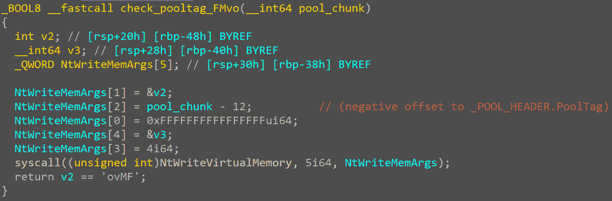

FudModule making sure the pool tag of a `_FLT_VOLUME` chunk is equal to `FMvo`. 

For each `_CALLBACK_NODE`, FudModule obtains the corresponding `FLTMGR!_FLT_INSTANCE` and `FLTMGR!_FLT_FILTER` structures and uses them to decide whether to unlink the callback node. The first check is based on the name of the driver behind the filter. If it is `hmpalert.sys` (associated with the HitmanPro anti-malware solution), the callback will get immediately unlinked. Conversely, the callback is preserved if the driver’s name matches an entry in the following list: 

| `bindflt.sys ` | `storqosflt.sys ` | `wcifs.sys ` | `cldflt.sys ` |
| `filecrypt.sys ` | `luafv.sys ` | `npsvctrig.sys ` | `wof.sys ` |
| `fileinfo.sys ` | `applockerfltr.sys ` | `bfs.sys ` |  |

Kernel modules that are allowlisted to preserve their file system minifilters.

If there was no driver name match, FudModule uses `_FLT_FILTER.DefaultAltitude` to make its ultimate decision. Callbacks are unlinked if the default altitude belongs either to the range `[320000, 329999]` ([defined](https://learn.microsoft.com/en-us/windows-hardware/drivers/ifs/load-order-groups-and-altitudes-for-minifilter-drivers#:~:text=recover%20deleted%20files.-,FSFilter%20Anti%2DVirus,-320000%2D329999) as `FSFilter Anti-Virus` by Microsoft) or the range `[360000, 389999]` (`FSFilter Activity Monitor`). Besides unlinking the callback nodes, FudModule also wipes the whole `_FLT_INSTANCE.CallbackNodes` array in the corresponding `_FLT_INSTANCE` structures. 

#### 0x10 – Windows Filtering Platform 

[Windows Filtering Platform](https://learn.microsoft.com/en-us/windows/win32/fwp/windows-filtering-platform-start-page) (WFP) is a documented set of APIs designed for host-based network traffic filtering. The WFP API offers capabilities for deep packet inspection as well as for modification or dropping of packets at various layers of the network stack. This is very useful functionality, so it serves as a foundation for a lot of Windows network security software, including intrusion detection/prevention systems, firewalls, and network monitoring tools. The WFP API is accessible both in user and kernel space, with the kernel part offering more powerful functionality. Specifically, the kernel API allows for installing so-called [callout drivers,](https://learn.microsoft.com/en-us/windows-hardware/drivers/network/introduction-to-windows-filtering-platform-callout-drivers) which can essentially hook into the network stack and perform arbitrary actions on the processed network traffic. FudModule is trying to interfere with the installed callout routines in an attempt to disrupt the security they provide.  

This rootkit technique is executed only when Kaspersky drivers (`klam.sys`, `klif.sys`, `klwfp.sys`, `klwtp.sys`, `klboot.sys`) are present on the targeted system and at the same time Symantec/Broadcom drivers (`symevnt.sys`, `bhdrvx64.sys`, `srtsp64.sys`) are absent. This check appears to be a new addition in the current version of FudModule. In other aspects, our analysis revealed that the core idea of this technique matches the [findings](https://www.virusbulletin.com/uploads/pdf/conference/vb2022/papers/VB2022-Lazarus-and-BYOVD-evil-to-the-Windows-core.pdf) described by ESET researchers during their analysis of the previous version. 

Initially, FudModule resolves `netio!WfpProcessFlowDelete` to locate the address of `netio!gWfpGlobal`. As the name suggests, this is designed to store WFP-related global variables. Although its exact layout is undocumented, it is [not hard to find](https://codemachine.com/articles/find_wfp_callouts.html) the build-specific offset where a pointer to an array of WFP callout structures is stored (with the length of this array stored at an offset immediately preceding the pointer). FudModule follows this pointer and iterates over the array, skipping all callouts implemented in `ndu.sys`, `tcpip.sys`, `mpsdrv.sys`, or `wtd.sys`. For the remaining callouts, FudModule accesses the callout structure’s flags and sets the flag stored in the least significant bit. While the callout structure itself is undocumented, this particular `0x01` flag is [documented in another structure](https://learn.microsoft.com/en-us/windows-hardware/drivers/ddi/fwpsk/ns-fwpsk-fwps_callout2_), where it is called `FWP_CALLOUT_FLAG_CONDITIONAL_ON_FLOW`. The documentation reads “if this flag is specified, the filter engine calls the callout driver’s classifyFn2 callout function only if there is a context associated with the data flow”. In other words, setting this flag will conditionally disable the callout in cases where no flow context is available (see the implementation of `netio!IsActiveCallout` below). 

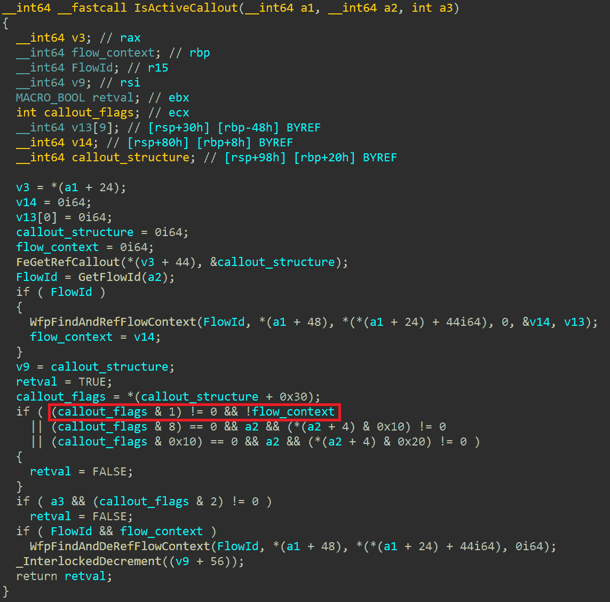

The meaning of the `FWP_CALLOUT_FLAG_CONDITIONAL_ON_FLOW` flag can be nicely seen in `netio!IsActiveCallout`. If this flag is set and no flow context can be obtained, `IsActiveCallout` will return `false` (see the highlighted part of the condition). 

While this rootkit technique has the potential to interfere with some WFP callouts, it will not be powerful enough to disrupt all of them. Many WFP callouts registered by security vendors already have the `FWP_CALLOUT_FLAG_CONDITIONAL_ON_FLOW` flag set by design, so they will not be affected by this technique at all. Given the initial driver check, it seems like this technique might be targeted directly at Kaspersky. While Kaspersky does install dozens of WFP callouts, about half of those are designed for processing flows and already have the `FWP_CALLOUT_FLAG_CONDITIONAL_ON_FLOW` flag set. Since we refrained from reverse engineering our competitor’s products, the actual impact of this rootkit technique remains unclear. 

#### 0x20 – Missing 

So far, the rootkit techniques we analyzed were similar to those detailed by ESET in their paper on the earlier rootkit variant. But starting from now, we are getting into a whole new territory. The `0x20` technique, which used to deal with Event Tracing for Windows (ETW), has been deprecated, leaving the `0x20` bit unused. Instead, there are two new replacement techniques that target ETW, indexed with the bits `0x40` and `0x80`. The indexing used to end at `0x40`, which was a technique to obstruct forensic analysis by disabling prefetch file creation. However, now the bits go all the way up to `0x200`, with two additional new techniques that we will delve into later in this blog. 

#### 0x40 – Event Tracing for Windows: System Loggers

[Event Tracing for Windows](https://learn.microsoft.com/en-us/windows/win32/etw/about-event-tracing) (ETW) serves as a high-performance mechanism dedicated to tracing and logging events. In a nutshell, its main purpose is to connect providers (who generate some log events) with consumers (who process the generated events). Consumers can define which events they would like to consume, for instance, by selecting some specific providers of interest. There are providers built into the operating system, like `Microsoft-Windows-Kernel-Process` which generates process-related events, such as process creation or termination. However, third-party applications can also define their custom providers.  

While many built-in providers are not security-related, some generate events useful for detection purposes. For instance, the `Microsoft-Windows-Threat-Intelligence` provider makes it possible to watch for suspicious events, such as writing another process’ memory. Furthermore, various security products take advantage of ETW by defining their custom providers and consumers. FudModule tampers with ETW internals in an attempt to intercept suspicious events and thus evade detection. 

The main idea behind this rootkit technique is to disable system loggers by zeroing out `EtwpActiveSystemLoggers`. The specific implementation of how this address is found varies based on the target Windows version. On newer builds, the `nt!EtwSendTraceBuffer` routine is resolved first and used to find `nt!EtwpHostSiloState`. This points to an `_ETW_SILODRIVERSTATE` structure, and using a hardcoded build-specific offset, the rootkit can access `_ETW_SILODRIVERSTATE.SystemLoggerSettings.EtwpActiveSystemLoggers`. On older builds, the rootkit first scans the entire ntoskrnl `.text` section, searching for opcode bytes specific to the `EtwTraceKernelEvent` prologue. The rootkit then extracts the target address from the `mov ebx, cs:EtwpActiveSystemLoggers` instruction that immediately follows. 

To understand the technique’s impact, we can take a look at how `EtwpActiveSystemLoggers` is used in the kernel. Accessed on a bit-by-bit basis, its least significant eight bits might be set in the `EtwpStartLogger` routine. This indicates that the value itself is a bit field, with each bit signifying whether a particular system logger is active. Looking at the other references to `EtwpActiveSystemLoggers`, a clear pattern emerges. After its value is read, there tends to be a loop guarded by a `bsf` instruction (bit scan forward). Inside the loop tends to be a call to an ETW-related routine that might generate a log event. The purpose of this loop is to iterate over the set bits of `EtwpActiveSystemLoggers`. When the rootkit clears all the bits, the body of the loop will never get executed, meaning the event will not get logged. 

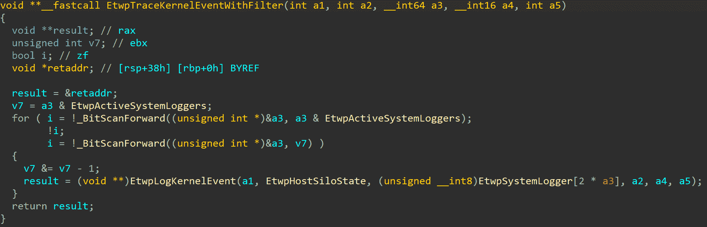

Example decompilation of `EtwpTraceKernelEventWithFilter`. After the rootkit zeroes out `EtwpActiveSystemLoggers`, `EtwpLogKernelEvent` will never get called from inside the loop since the condition guarding the loop will always evaluate to zero. 

#### 0x80 – Event Tracing for Windows: Provider GUIDs 

Complementing the previous technique, the `0x80` technique is also designed to blind ETW, however using a different approach. While the `0x40` technique was quite generic – aiming to disable all system loggers – this technique operates in a more surgical fashion. It contains a [hardcoded list](https://github.com/avast/ioc/tree/master/FudModule#targeted-etw-provider-guids) of 95 GUIDs, each representing an identifier for some specific ETW provider. The rootkit iterates over all these GUIDs and attempts to disable the respective providers. While this approach requires the attackers to invest some effort into assembling the list of GUIDs, it also offers them a finer degree of control over which ETW providers they will eventually disrupt. This allows them to selectively target providers that pose a higher detection risk and ignore the rest to minimize the rootkit’s impact on the target system. 

This technique starts by obtaining the address of `EtwpHostSiloState` (or `EtwSiloState` on older builds). If `EtwpHostSiloState` was already resolved during the previous technique, the rootkit just reuses the address. If not, the rootkit follows the reference chain `PsGetCurrentServerSiloName` -> `PsGetCurrentServerSiloGlobals` -> `PspHostSiloGlobals` -> `EtwSiloState`. In both scenarios, the result is that the rootkit just obtained a pointer to an `_ETW_SILODRIVERSTATE` structure, which contains a member named `EtwpGuidHashTable`. As the name suggests, this is a hash table holding ETW GUIDs (`_ETW_GUID_ENTRY`).  

FudModule then iterates over its hardcoded list of GUIDs and attempts to locate each of them in the hash table. Although the hash table internals are officially undocumented, Yarden Shafir provided a nice description in her [blog](https://windows-internals.com/exploiting-a-simple-vulnerability-in-35-easy-steps-or-less/) on exploiting an ETW vulnerability. In a nutshell, the hash is computed by just splitting the 128-bit GUID into four 32-bit parts and XORing them together. By ANDing the hash with `0x3F`, an index of the relevant hash bucket (`_ETW_HASH_BUCKET`) can be obtained. The bucket contains three linked lists of `_ETW_GUID_ENTRY` structures, each designated for a different type of GUIDs. FudModule always opts for the first one (`EtwTraceGuidType`) and traverses it, looking for the relevant `_ETW_GUID_ENTRY` structure. 

With a pointer to `_ETW_GUID_ENTRY` corresponding to a GUID of interest, FudModule proceeds to clear `_ETW_GUID_ENTRY.ProviderEnableInfo.IsEnabled`. The purpose of this modification seems self-explanatory: FudModule is trying to disable the ETW provider. To better understand how this works, let’s examine `nt!EtwEventEnabled` (see the decompiled code below). This is a routine that often serves as an `if` condition before `nt!EtwWrite` (or `nt!EtwWriteEx`) gets called.  

Looking at the decompilation, there are two `return 1` statements. Setting `ProviderEnableInfo.IsEnabled` to zero ensures that the first one is never reached. However, the second `return` statement could still potentially execute. To make sure this doesn’t happen, the rootkit also iterates over all `_ETW_REG_ENTRY` structures from the `_ETW_GUID_ENTRY.RegListHead` linked list. For each of them, it makes a single doubleword write to zero out four masks, namely `EnableMask`, `GroupEnableMask`, `HostEnableMask`, and `HostGroupEnableMask` (or only `EnableMask` and `GroupEnableMask` on older builds, where the latter two masks were not yet introduced).  

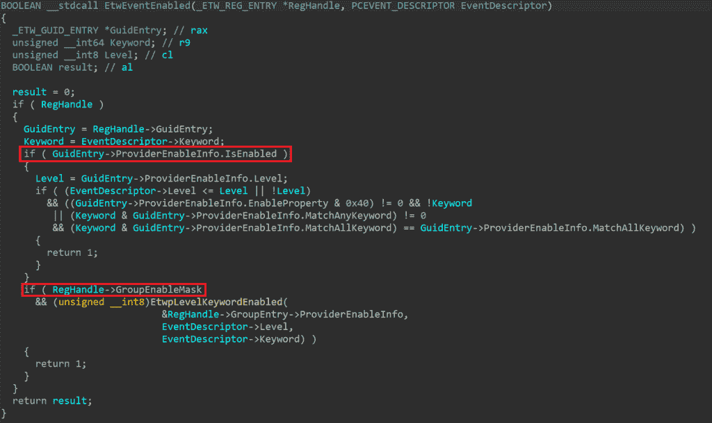

Decompilation of `nt!EtwEventEnabled`. After the rootkit has finished its job, this routine will always return `false` for events related to the targeted GUIDs. This is because the rootkit cleared both `_ETW_GUID_ENTRY.ProviderEnableInfo.IsEnabled` and `_ETW_REG_ENTRY.GroupEnableMask`, forcing the highlighted conditions to fail. 

Clearing these masks also has an additional effect beyond making `EtwEventEnabled` always return `false`. These four are all also checked in `EtwWriteEx` and this modification effectively neutralizes this routine, as when no mask is set for a particular event registration object, execution will never proceed to a lower-level routine (`nt!EtwpEventWriteFull`) where the bulk of the actual event writing logic is implemented. 

#### 0x100 – Image Verification Callbacks 

Image verification callbacks are yet another callback mechanism disrupted by FudModule. Designed similarly to process/thread/image callbacks, image verification callbacks are supposed to get invoked whenever a new driver image is loaded into kernel memory. This represents useful functionality for anti-malware software, which can leverage them to blocklist known malicious or vulnerable drivers (though there might be some problems with this blocking approach as the callbacks get invoked asynchronously). Furthermore, image verification callbacks also offer a valuable source of telemetry, providing visibility into suspicious driver load events. The callbacks can be registered using the `SeRegisterImageVerificationCallback` routine, which is publicly undocumented. As a result of this undocumented nature, the usage here is limited mainly to deep-rooted anti-malware software. For instance, Windows Defender registers a callback named `WdFilter!MpImageVerificationCallback`. 

As the kernel internally manages image verification callbacks in a similar fashion to some of the other callbacks we already explored, the rootkit’s removal implementation will undoubtedly seem familiar. First, the rootkit resolves the `nt!SeRegisterImageVerificationCallback` routine and scans its body to locate `nt!ExCbSeImageVerificationDriverInfo`. Dereferencing this, it obtains a pointer to a `_CALLBACK_OBJECT` structure, which holds the callbacks in the `_CALLBACK_OBJECT.RegisteredCallbacks` linked list. This list consists of `_CALLBACK_REGISTRATION` structures, where the actual callback function pointer can be found in `_CALLBACK_REGISTRATION.CallbackFunction`. FudModule clears the entire list by making the `RegisteredCallbacks` head `LIST_ENTRY` point directly to itself. Additionally, it also walks the original linked list and similarly short-circuits each individual `_CALLBACK_REGISTRATION` entry in the list. 

This rootkit technique is newly implemented in the current version of FudModule, and we can only speculate on the motivation here. It seems to be designed to help avoid detection when loading either a vulnerable or a malicious driver. However, it might be hard to understand why Lazarus should want to load an additional driver if they already have control over the kernel. It would make little sense for them to load a vulnerable driver, as they already established their kernel read/write primitive by exploiting a zero-day in a preinstalled Windows driver. Further, even if they were exploiting a vulnerable driver in the first place (as was the case in the previous version of FudModule), it would be simply too late to unlink the callback now. By the time this rootkit technique executes, the image verification callback for the vulnerable driver would have already been invoked. Therefore, we believe the most likely explanation is that the threat actors are preparing the grounds for loading some malicious driver later. Perhaps the idea is that they just want to be covered in case they decide to deploy some additional kernel-mode payload in the future. 

#### 0x200 – Direct Attacks on Security Software 

The rootkit techniques we explored up to this point were all somewhat generic. Each targeted some security-related system component and, through it, indirectly interfered with all security software that relied on the component. In contrast, this final technique goes straight to the point and aims to directly disable specific security software. In particular, the targeted security solutions are AhnLab V3 Endpoint Security, Windows Defender, CrowdStrike Falcon, and HitmanPro. 

The attack starts with the rootkit obtaining the address of its own `_EPROCESS` structure. This is done using `NtDuplicateHandle` to duplicate the current process pseudohandle and then calling `NtQuerySystemInformation` to get `SystemExtendedHandleInformation`. With the extended handle information, the rootkit looks for an entry corresponding to the duplicated handle and obtains the `_EPROCESS` pointer from there. Using `NtQuerySystemInformation` to leak kernel pointers is a well-known technique that Microsoft [aims to restrict](https://windows-internals.com/kaslr-leaks-restriction/) by gradually building up mitigations. However, attackers capable of enabling `SeDebugPrivilege` at high integrity levels are out of scope of these mitigations, so FudModule can keep using this technique, even on the upcoming 24H2 builds. With the `_EPROCESS` pointer, FudModule disables mitigations by zeroing out `_EPROCESS.MitigationFlags`. Then, it also clears the `EnableHandleExceptions` flag from `_EPROCESS.ObjectTable.Flags`. We believe this is meant to increase stability in case something goes wrong later during the handle table entry manipulation technique that we will describe shortly.  

Regarding the specific technique used to attack the security solutions, AhnLab is handled differently than the other three targets. FudModule first checks if AhnLab is even running, by traversing the `ActiveProcessLinks` linked list and looking for a process named `asdsvc.exe` (AhnLab Smart Defense Service) with `_EPROCESS.Token.AuthenticationId` set to `SYSTEM_LUID`. If such a process is found, FudModule clears its `_EPROCESS.Protection` byte, effectively toggling off PPL protection for the process. While this `asdsvc.exe` process is under usual circumstances meant to be protected at the standard `PsProtectedSignerAntimalware` level, this modification makes it just a regular non-protected process. This opens it up to further attacks from user mode, where now even other privileged, yet non-protected processes could be able to tamper with it. However, we suspect the main idea behind this technique might be to disrupt the link between AhnLab’s user-mode and kernel-mode components. By removing the service’s PPL protection, the kernel-mode component might no longer recognize it as a legitimate AhnLab component. However, this is just a speculation as we didn’t test the real impact of this technique. 

###### **Handle Table Entry Manipulation** 

The technique employed to attack Defender, CrowdStrike, and HitmanPro is much more intriguing: FudModule attempts to suspend them using a new handle table entry manipulation technique. To better understand this technique, let’s begin with a brief [background on handle tables](https://imphash.medium.com/windows-process-internals-a-few-concepts-to-know-before-jumping-on-memory-forensics-part-5-a-2368187685e). When user-mode code interacts with kernel objects such as processes, files, or mutexes, it typically doesn’t work with the objects directly. Instead, it references them indirectly through handles. Internally, the kernel must be able to translate the handle to the corresponding object, and this is where the handle table comes in. This per-process table, available at `_EPROCESS.ObjectTable.TableCode`, serves as a mapping from handles to the underlying objects. Organized as an array, it is indexed by the integer value of the handle. Each element is of type `_HANDLE_TABLE_ENTRY` and contains two crucial pieces of information: a (compressed) pointer to the object’s header (`nt!_OBJECT_HEADER`) and access bits associated with the handle. 

Due to this handle design, kernel object access checks are typically split into two separate logical steps. The first step happens when a process attempts to acquire a handle (such as opening a file with `CreateFile`). During this step, the current thread’s token is typically checked against the target object’s security descriptor to ensure that the thread is allowed to obtain a handle with the desired access mask. The second check takes place when a process performs an operation using an already acquired handle (such as writing to a file with `WriteFile`). This typically only involves verifying that the handle is powerful enough (meaning it has the right access bits) for the requested operation.  

FudModule executes as a non-protected process, so it theoretically shouldn’t be able to obtain a powerful handle to a PPL-protected process such as the CrowdStrike Falcon Service. However, leveraging the kernel read/write primitive, FudModule has the ability to access the handle table directly. This allows it to craft a custom handle table entry with control over both the referenced object and the access bits. This way, it can conjure an arbitrary handle to any object, completely bypassing the check typically needed for handle acquisition. What’s more, if it sets the handle’s access bits appropriately, it will also satisfy the subsequent handle checks when performing its desired operations. 

To prepare for the handle table entry manipulation technique, FudModule creates a dummy thread that just puts itself to sleep immediately. The thread itself is not important. What is important is that by calling `CreateThread`, the rootkit just obtained a thread handle with `THREAD_ALL_ACCESS` rights. This handle is the one that will have its handle table entry manipulated. Since it already has very powerful access bits, the rootkit will not even have to touch its `_HANDLE_TABLE_ENTRY.GrantedAccessBits`. All it needs to do is overwrite `_HANDLE_TABLE_ENTRY.ObjectPointerBits` to redirect the handle to an arbitrary object of its choice. This will make the handle reference that object and enable the rootkit to perform privileged operations on it. Note that `ObjectPointerBits` is not the whole pointer to the object: it only represents 44 bits of the 64-bit pointer. But since the `_OBJECT_HEADER` pointed to by `ObjectPointerBits` is guaranteed to be aligned (meaning the least significant four bits must be zero) and in kernel address space (meaning the most significant sixteen bits must be `0xFFFF`), the remaining 20 bits can be easily inferred. 

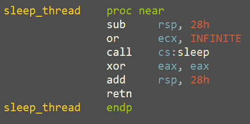

A dummy thread whose handle will be the subject of handle table entry manipulation. 

The specific processes targeted by this technique are `MsSense.exe`, `MsMpEng.exe`, `CSFalconService.exe`, and `hmpalert.exe`. FudModule first finds their respective `_EPROCESS` structures, employing the same algorithm as it did to find the AhnLab service. Then, it performs a sanity check to ensure that the dummy thread handle is not too high by comparing it with `_EPROCESS.ObjectTable.NextHandleNeedingPool` (which holds information on the maximum possible handle value given the current handle table allocation size). With the sanity check satisfied, FudModule accesses the handle table itself (`EPROCESS.ObjectTable.TableCode`) and modifies the dummy thread’s `_HANDLE_TABLE_ENTRY` so that it points to the `_OBJECT_HEADER` of the target `_EPROCESS`. Finally, the rootkit uses the redirected handle to call `NtSuspendProcess`, which will suspend the targeted process.  

It might seem odd that the manipulated handle used to be a thread handle, but now it’s being used as a process handle. In practice, there is nothing wrong with this since the handle table itself holds no object type information. The object type is stored in `_OBJECT_HEADER.TypeIndex` so when the rootkit redirected the handle, it also effectively changed the handle object type. As for the access bits, the original `THREAD_ALL_ACCESS` gets reinterpreted in the new context as `PROCESS_ALL_ACCESS` since both constants share the same underlying value. 

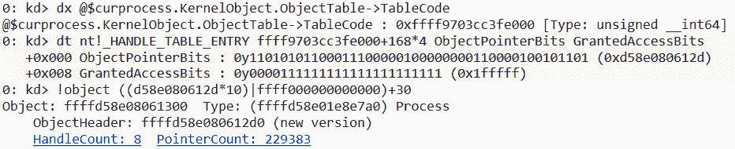

The manipulated dummy thread handle (`0x168`), now referencing a process object. 

Though suspending the target process might initially appear to be a completed job, FudModule doesn’t stop here. After taking five seconds of sleep, it also attempts to iterate over all the threads in the target process, suspending them one by one. When all threads are suspended, FudModule uses `NtResumeProcess` to resume the suspended process. At this point, while the process itself is technically resumed, its individual threads remain suspended, meaning the process is still effectively in a suspended state. We can only speculate why Lazarus implemented process suspension this way, but it seems like an attempt to make the technique stealthier. After all, a suspended process is much more conspicuous than just several threads with increased suspend counts. 

To enumerate threads, FudModule calls `NtQuerySystemInformation` with the `SystemExtendedHandleInformation` class. Iterating over the returned handle information, FudModule searches for thread handles from the target process. The owner process is checked by comparing the PID of the target process with `SYSTEM_HANDLE_TABLE_ENTRY_INFO_EX.UniqueProcessId` and the type is checked by comparing `SYSTEM_HANDLE_TABLE_ENTRY_INFO_EX.ObjectTypeIndex` with the thread type index, which was previously obtained using `NtQueryObject` to get `ObjectTypesInformation`. For each enumerated thread (which might include some threads multiple times, as there might be more than one open handle to the same thread), FudModule manipulates the dummy thread handle so that it points to the enumerated thread and suspends it by calling `SuspendThread` on the manipulated handle. Finally, after all threads are suspended and the process resumed, FudModule restores the manipulated handle to its original state, once again referencing the dummy sleep thread. 

## Conclusion 

The Lazarus Group remains among the most [prolific and long-standing](https://attack.mitre.org/groups/G0032/) advanced persistent threat actors. Though their signature tactics and techniques are well-recognized by now, they still occasionally manage to surprise us with an unexpected level of technical sophistication. The FudModule rootkit serves as the latest example, representing one of the most complex tools Lazarus holds in their arsenal. Recent updates examined in this blog show Lazarus’ commitment to keep actively developing this rootkit, focusing on improvements in both stealth and functionality. 

With their admin-to-kernel zero-day now burned, Lazarus is confronted with a significant challenge. They can either discover a new zero-day exploit or revert to their old BYOVD techniques. Regardless of their choice, we will continue closely monitoring their activity, eager to see how they will cope with these new circumstances. 

#### Indicators of Compromise (IoCs) 

A YARA rule for the latest FudModule variant is available at [https://github.com/avast/ioc/tree/master/FudModule#yara](https://github.com/avast/ioc/tree/master/FudModule#yara).