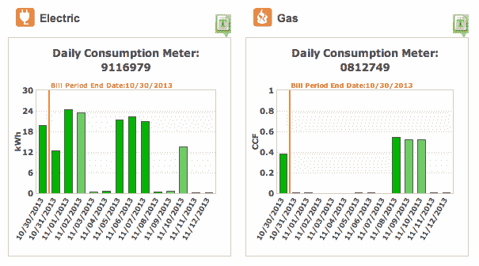

<!--yml
category: 未分类
date: 2024-05-29 12:01:32
-->

# Little Data: How do we query personal data?

> 来源：[https://www.petekeen.net/little-data](https://www.petekeen.net/little-data)

My wife and I recently moved from Portland, OR to Ann Arbor, MI. Among the cacophony of change that is involved with a move like that, we of course changed to the local utility company. Browsing around in their billing application one day I came across a page that showed a daily graph of our energy usage, supposedly valid through yesterday for both gas and electric. And it has a button that spits out a CSV file of the date, which means if I actually wanted to I could build my own tool to analyze our usage.

This got me thinking about all of the little databases out there that have data about me that I might actually consider useful. Useful, in this case, means that by looking some combination of the data I could draw some useful conclusions and take some sort of action. Here's a list of the ones that immediately came to mind:

Some of the things in that list have easily accessed APIs, like RunKeeper and Withings. Some of them you can export the data manually to CSVs. And then some of them really *should* have an API but don't, like LoseIt. And then what if we could add *more* data? Things like how often we run the clothes dryer, how often the furnace or AC kicks in and for how long, whether we're in the house or not, etc.

None of this is Big Data. This is all Little Data. It's reminiscent of the [Quantified Self](http://quantifiedself.com/) movement, but it's more about combining existing data sets into a unified whole than synthesizing new data.

I've gone so far as to build isolated silos for some of these data sets. For example, I track my finances using [ledger](http://www.ledger-cli.org) and a [variety of home-grown tools](/tag/Ledger). My email gets backed up hourly and that's provided some useful data occasionally. Even so, all of it is still in individual silos. Ideally I would be able to dump all of this into some kind of personal "data soup" that I could query with a unified interface and build analytics tools on top of.

At this point I have a bunch of questions and no answers. What shape does the data soup take? How does data get in, how would it get queried? What questions could I realistically answer? I'm going to keep thinking about this and hopefully you will too.