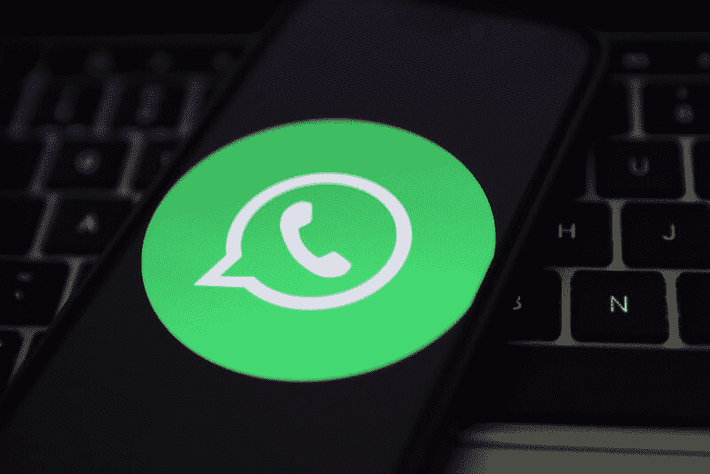

<!--yml
category: 未分类
date: 2024-05-27 14:29:16
-->

# WhatsApp finally forces Pegasus spyware maker to share its secret code | Ars Technica

> 来源：[https://arstechnica.com/tech-policy/2024/03/whatsapp-finally-forces-pegasus-spyware-maker-to-share-its-secret-code/](https://arstechnica.com/tech-policy/2024/03/whatsapp-finally-forces-pegasus-spyware-maker-to-share-its-secret-code/)

WhatsApp will soon be granted access to explore the "full functionality" of the NSO Group's Pegasus spyware—sophisticated malware the Israeli Ministry of Defense has long guarded as a "highly sought" state secret, The Guardian [reported](https://www.theguardian.com/technology/2024/feb/29/pegasus-surveillance-code-whatsapp-meta-lawsuit-nso-group).

Since 2019, WhatsApp has pushed for access to the NSO's spyware code after alleging that Pegasus was used to spy on 1,400 WhatsApp users over a two-week period, gaining unauthorized access to their sensitive data, including encrypted messages. WhatsApp suing the NSO, Ars [noted](https://arstechnica.com/information-technology/2019/10/whatsapp-suit-says-israeli-spyware-maker-exploited-its-app-to-infect-1400-users/) at the time, was "an unprecedented legal action" that took "aim at the unregulated industry that sells sophisticated malware services to governments around the world."

Initially, the NSO sought to block all discovery in the lawsuit "due to various US and Israeli restrictions," but that blanket request was denied. Then, last week, the NSO lost another fight to keep WhatsApp away from its secret code.

As the court considered each side's motions to compel discovery, a US district judge, Phyllis Hamilton, [rejected](https://cdn.arstechnica.net/wp-content/uploads/2024/03/WhatsApp-v-NSO-Group-Order-2-23-2024.pdf) the NSO's argument that it should only be required to hand over information about Pegasus' installation layer.

Hamilton sided with WhatsApp, granting the Meta-owned app's request for "information concerning the full functionality of the relevant spyware," writing that "information showing the functionality of only the installation layer of the relevant spyware would not allow plaintiffs to understand how the relevant spyware performs the functions of accessing and extracting data."

WhatsApp has alleged that Pegasus can "intercept communications sent to and from a device, including communications over iMessage, Skype, Telegram, WeChat, Facebook Messenger, WhatsApp, and others” and that it could also be "customized for different purposes, including to intercept communications, capture screenshots, and exfiltrate browser history."

To prove this, WhatsApp needs access to "all relevant spyware"—specifically “any NSO spyware targeting or directed at WhatsApp servers, or using WhatsApp in any way to access Target Devices"—for "a period of one year before the alleged attack to one year after the alleged attack," Hamilton concluded.

The NSO has so far not commented on the order, but WhatsApp was pleased with this outcome.

“The recent court ruling is an important milestone in our long running goal of protecting WhatsApp users against unlawful attacks," WhatsApp's spokesperson told The Guardian. "Spyware companies and other malicious actors need to understand they can be caught and will not be able to ignore the law."

But Hamilton did not grant all of WhatsApp's requests for discovery, sparing the NSO from sharing specific information regarding its server architecture because WhatsApp "would be able to glean the same information from the full functionality of the alleged spyware."

Perhaps more significantly, the NSO also won't be compelled to identify its clients. While the NSO does not publicly name the governments that purchase its spyware, reports indicate that Poland, Saudi Arabia, Rwanda, India, Hungary, and the United Arab Emirates have used it [to target dissidents](https://arstechnica.com/information-technology/2019/10/activists-phones-targeted-by-one-of-the-worlds-most-advanced-espionage-apps/), The Guardian reported. In 2021, the [US blacklisted the NSO](https://arstechnica.com/tech-policy/2021/11/us-blacklists-maker-of-pegasus-spyware-that-helps-governments-spy-on-activists/) for allegedly spreading "digital tools used for repression."

In the same order, Hamilton also denied the NSO's request to compel WhatsApp to share its post-complaint communications with the Citizen Lab, which served as a third-party witness in the case to support WhatsApp's argument that "Pegasus is misused by NSO’s customers against ‘civil society.’"

It appeared that the NSO sought WhatsApp's post-complaint communications with Citizen Lab as a way to potentially pressure WhatsApp into dropping Citizen Lab's statement from the record. Hamilton quoted a court filing from the NSO that curiously noted: "If plaintiffs would agree to withdraw from their case Citizen Lab’s contention that Pegasus was used against members of ‘civil society’ rather than to investigate terrorism and serious crime, there would be much less need for this discovery.”

Ultimately, Hamilton denied the NSO's request because "the court fails to see the relevance of the requested discovery."

As discovery in the case proceeds, the court expects to receive expert disclosures from each side on August 30 before the trial, which is expected to start on March 3, 2025.