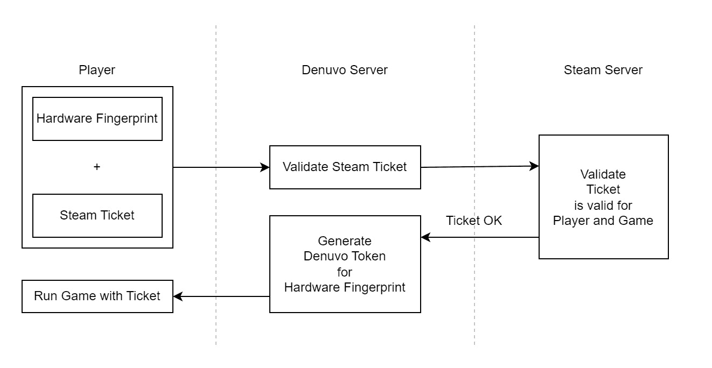
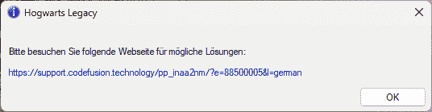
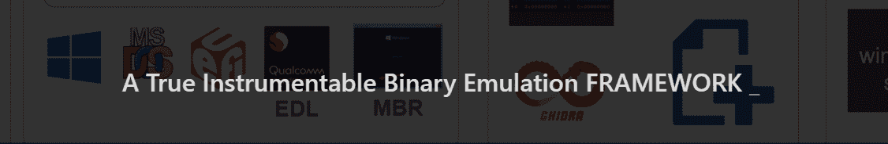
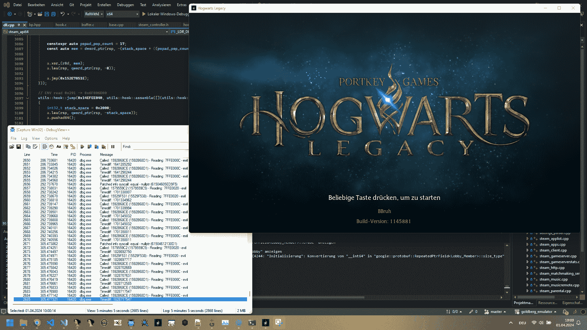

<!--yml
category: 未分类
date: 2024-05-27 12:47:49
-->

# Bypassing Denuvo in Hogwarts Legacy | Maurice's Blog 🐍

> 来源：[https://momo5502.com/posts/2024-03-31-bypassing-denuvo-in-hogwarts-legacy/](https://momo5502.com/posts/2024-03-31-bypassing-denuvo-in-hogwarts-legacy/)

When I announced my Black Ops 3 integrity bypass, someone commented that my research was not impressive and I should try analyzing Denuvo instead.

That kinda stuck with me, so I did what everyone would do and spent the last 5 months of my free time reverse engineering and bypassing the Denuvo DRM in Hogwarts Legacy.

I am obviously not as skilled and experienced as EMPRESS, who managed to do it within days, but that’s ok 😃

# How does Denuvo work?[#](#how-does-denuvo-work)

The game collects hardware/software features into a fingerprint and generates a Steam Ticket (proof of game ownership).

Fingerprint and Ticket are then sent to Denuvo Servers.

From there the Steam Ticket is sent to Steam to make sure the user really owns the game (I obviously don’t know what’s going on in their servers, so this is only an assumption, but it should be accurate enough).

If the user really owns the game, a Denuvo Token is generated, that only works on a PC with the exact fingerprint.

Using that token, the player can now run the game.

The game can not run without the token, as it is used to e.g. decrypt certain values at runtime and similar things.

Ontop of using the token to decrypt values, Denuvo regularly verifies the hardware features for the fingerprint still match with the token, at runtime.

# What was my goal?[#](#what-was-my-goal)

Cracking the game was not a goal I had. I like Hogwarts Legacy and thus causing any harm is not my intention. I wanted to do research purely for myself.

Therefore this post is going to be intentionally vague and not going to show how I analyzed and patched the game in detail, because I don’t need anymore legal trouble than I already have.

The actual goal I had in mind was to find all features the game uses to derive the fingerprint and to patch them. Ontop of that, I want to patch most of the runtime checks.

For a real crack, it is obviously needed to patch all of the runtime checks. Finding all of them is still an extremely time consuming task, so everyone who has achieved that deserves my utmost respect.

However, I do believe that once I have patched some/most of the runtime checks and discovered all hardware features, I would be capable to patch all of them with enough time and motivation.

The real challenge I saw for myself was to analyze the protection to discover all the bindings it uses for the fingerprint.

# How did I do it?[#](#how-did-i-do-it)

Using a Denuvo Token on a PC that has a mismatching fingerprint shows the following dialog:

Therefore the goal is to get past that dialog.

This is the part I wish I could talk more about, but I don’t think that’s a good idea. Instead I will roughly scratch the surface and at least outline the tools I used.

To figure out what features the game collects I used the [Qiling](https://qiling.io/) reverse engineering framework.
Qiling emulates any kind of binary allowing to fully instrument it. It is truly a powerful framework:

However, it requires a whole lot of scripting and adaption. It is by far not a tool that does all the work for you out-of-the-box.

In fact, it even has quite a lot of bugs (e.g. wrongly emulated Windows APIs) and lacks quite a few essential features: I had to implement so many basics that I expected the framework to handle, e.g. TLS support 🥲.

It feels like it is mainly designed for Linux, so maybe one day I can either upstream my patches/fixes or write my own framework. Who knows.

But even with all these flaws, I can not stress enough how helpful of a tool it was.

Getting fully accomodated to Qiling and finding most of the fingerprint features took me about two months. Discovering the last one took the remaining 3 months and I only discovered it on accident.

To verify that a certain feature really is part of the fingerprint, I patched/spoofed it and checked that my previously valid Denuvo Token is now invalid and shows the error dialog.

For most of my patches, I had to use quite a lot of runtime disassembling to dynamically build my hooks and stubs, which lead me to discover quite a few bugs in various disassemblers 😂. (In hindsight, thinking about this, folks at Denuvo might have intentionally included instructions that cause bugs with those disassemblers. I don’t know if that’s the case, but if it is, that’s hella smart.)

However, as making a portable crack was not a goal, I made extensive use of my own [hypervisor](https://github.com/momo5502/hypervisor). I used it for example to install EPT hooks at a few locations that were otherwise too tedious to patch manually.

With all features at hand, I forced the game to generate a token on my PC, using a fingerprint for my PC. Using all my patches and hooks (~2000 in total), I now wanted to run the game on my laptop using the token generated for my PC.

After some time, I managed to get it to run until the start screen:

This is the point I wanted to reach. The game can now launch with a token issued for a different machine and I am absolutely happy.

The game obviously still crashes here and there with the PC token. Sometimes I can launch into the game and play, sometimes it crashes. This is where one would need to patch all runtime checks.
Knowing how the game performs these, it is just a matter of time and motivation.
However, as previously mentioned, this is still a huge task task to pull off, so everyone who managed to do that deserves my utmost respect.

# Are there no details I can tell you?[#](#are-there-no-details-i-can-tell-you)

There is one thing Denuvo does, that is extremely simple, yet so sophisticated. It doesn’t make up a huge part of the protection and I haven’t seen it being documented anywhere, yet:

Denuvo doesn’t always use the stack in a linear fashion.

On modern computers, the stack usually grows downwards. If something is pushed onto the stack, the stack pointer is decremented. If it is removed from the stack, the pointer is incremented.

That means all memory above the pointer is reserved, everything below is free.

This concept does not apply with Denuvo in place. Elements are stored above the pointer, as well as below.

As long as everyone else adheres to that, everything works out fine. However, as soon as someone tries to use the stack linearly, values in the seemingly free region are going to be overwritten, resulting in the game to crash.

This happens for example when using hardware breakpoints. When the exception triggered by the breakpoint is dispatched to the application, the exception context is stored on the stack, overwriting values the game uses.

This essentially makes hardware breakpoints and many other techniques either extremely difficult to use, or even impossible.

What I did instead, to still be able to use hardware breakpoints, was to write a small debugger. It is attached to the game and its only job is to receive the exceptions triggered by the hardware breakpoints. That way, the exceptions are not dispatched to the game, thus not corrupting the stack.

Such a technique is so simple, but still results in all hooks having to take that into account and thus becoming vastly more complex. Very impressive.

# What about performance?[#](#what-about-performance)

Everyone knows the rumors that Denuvo kills performance, but is that actually true?

Precisely measuring the performance impact Denuvo causes is extremely difficult. It requires knowing all the exact pieces of code Denuvo executes. Identifying these is an insanely huge amount of work.

What I’ll do instead is to reason about it using measurements done by my hooks.
This is not going to measure the performance impact directly, but it will give us is an estimate, a feeling, of how relevant it is to even talk about performance loss in combination with Denuvo.

A good analogy to visualize what I’m going to measure is the following:

Imagine you are a developer and want to measure how much meetings slow down your pace of development. This is what I consider hard to measure.
Instead, what I’m going to measure is: Do you even have that many meetings, so that it is relevant to even think about how much they slow you down?
As in, if you have one meeting per year, doing the exhaustive test is just not worth it, because it doesn’t really matter that much.

Note that this analysis only applies to Hogwarts Legacy. I don’t know if any of that applies to other games protected by Denuvo!

[https://www.youtube.com/embed/6JriEmiZ1t0](https://www.youtube.com/embed/6JriEmiZ1t0)

VIDEO

Every time the console prints `[MOMO] OVERHEAD` one of my hooks triggers. This essentially means Denuvo intervenes in the execution of the game (that I had to patch). This in turn means Denuvo causes at least “some” (non-zero) performance overhead during those times.

One can see that Denuvo does indeed intervene from time to time, but what one can clearly see: It doesn’t do that very often, definitely not every frame.
It’s only once every few seconds. Even less, sometimes it doesn’t do anything. Only when major things happen, scene switches, loading screens or similar, the logs seem to accumulate.

What this exactly tells us is that during regular gameplay, only a small amount of Denuvo code is executed compared to during scene switches or loading screens. Potential performance issues during those occasions don’t seem relevant to me though.

In fact was really surprised how few `OVERHEAD` lines were logged, as I expected the rumors to be true and tons of lines to be spamed, but this is not case! I don’t see any spamming happening, unlike in other DRMs who interact in every frame.

I don’t know the exact overhead each line implies, but what I know is what I had to patch. My hooks only need to change the execution a super tiny bit. While that doesn’t mean anything for sure, I conclude that my changes would need to be more complex if Denuvo did more.

What I also don’t know is if there are other pieces of code Denuvo executes at that time, that I just didn’t need to hook.
However, with 2000 hooks in place, I patched so many checks that I think it should at least give a good approximation and estimate.

To me personally, it tells that Denuvo executes checks so infrequently, that the likelyhood of it causing major performance issues seems rather low. In terms of the analogy, it might more be in the range of one meeting per year.
I don’t know whether this is actually the case or not. This requires a different, more time consuming measurement, which to me doesn’t seem worth setting up.

Next time I am going to play a Denuvo protected game, I am not going to worry about it being the major cause of performance issues.

It seems the protection is very well integrated into the game. Being a DRM developer myself, I know this is often a super tough challenge and definitely requires the protection to be manually integrated and adapted for the game.

# Why not measure FPS?[#](#why-not-measure-fps)

I understand that all the previous test measured is the frequency of Denuvo interactions. What’s missing is their magnitude.

There is unfortunatly no way I could measure that. Looking at the FPS is not going to give me any conclusive results either.

This is the case for two reasons:

1.  The places Denuvo was integrated into could itself be complex. That means the game itself might be performing complex tasks on its own, that could have caused drops regardless of Denuvo executing a check at that time. This is likely going to be the case, as those are the locations where DRM checks are usually inserted.

2.  My hooks cause the overhead. There are many layers of complexity I introduce. Using EPT hooks through my hypervisor will cause at least 2 page faults resulting in 2 VM exits (due to the permission toggles). Ontop of that, I’m using `OutputDebugString` to log to the console, which is very expensive, due to raising an exception. What makes this even worse, however, is that I make the game debug itself. This results in the exceptions and console logs being synchronously intercepted by the debugger, while the game has to wait.

So, looking at FPS and measuring drops is going to yield either two scenarios:

There are no drops at all, which means everything is super optimized, or there are FPS drops.
In case of FPS drops, the results are going to be inconclusive, as it could mean Denuvo is bad, the game is bad, or the most likely scenario: my hooks are bad.

The goal of my measurement was simply to give people a gut feeling in which direction things go, regarding performance.
And, to me at least, it shows Denuvo is not that bad. And definitely not as bad as other DRMs I have seen.

# Summary[#](#summary)

This was the last thing I currently had on my bucket list and I’m so happy to cross that one off. It is to note that Denuvo could have done things a bit differently that would have made my analysis a lot harder.
However, I still have to admit that it’s an extremely strong protection. There was definitely more than one occasion when I was about to give up. On top of its protection, it seems to be very well integrated into the game and I was not able to measure any relevant performance overheads caused by it.

Developing DRMs is always a super challenging task. Whether the use of DRMs is good or not, whether it feeds capitalism or just protects the hard work done by developers is something I can’t decide. After all though, I think Denuvo does not deserve all the hate it gets.