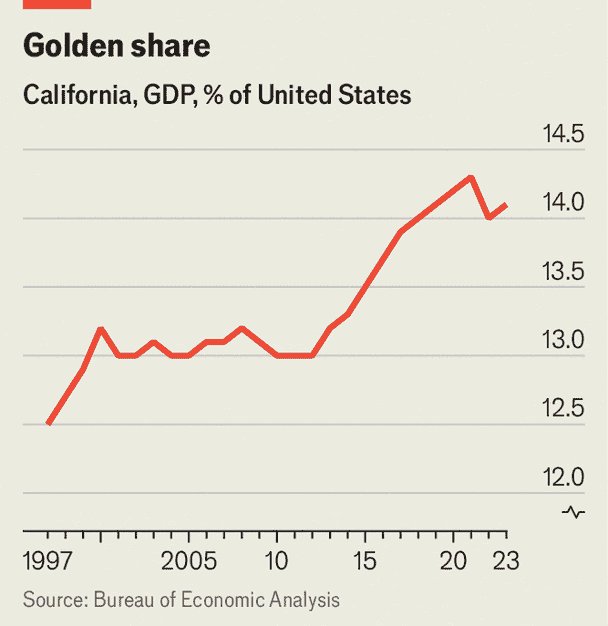

<!--yml
category: 未分类
date: 2024-05-27 12:47:50
-->

# California is gripped by economic problems, with no easy fix

> 来源：[https://www.economist.com/united-states/2024/03/31/california-is-gripped-by-interlocking-economic-problems-with-no-easy-solution](https://www.economist.com/united-states/2024/03/31/california-is-gripped-by-interlocking-economic-problems-with-no-easy-solution)

HOME TO MANY of America’s most progressive policies, from criminal justice to [vehicle emissions](https://www.economist.com/the-economist-explains/2022/08/27/how-revolutionary-is-californias-ban-on-petrol-powered-cars), California serves a unique role as a punchbag for right-wing politicians. Every few years it becomes fashionable to declare that it is a failed state, or that the California dream is turning into a nightmare. This rhetoric is often overblown: in terms of pure economic heft California remains the most powerful American state. But for all its continuing [prowess in innovation](https://www.economist.com/finance-and-economics/2024/02/12/san-franciscos-surprising-comeback) (not least in artificial intelligence), California again appears to be entering one of its periodic rough patches.

Chart: The Economist