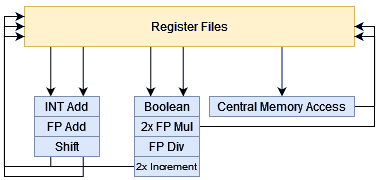
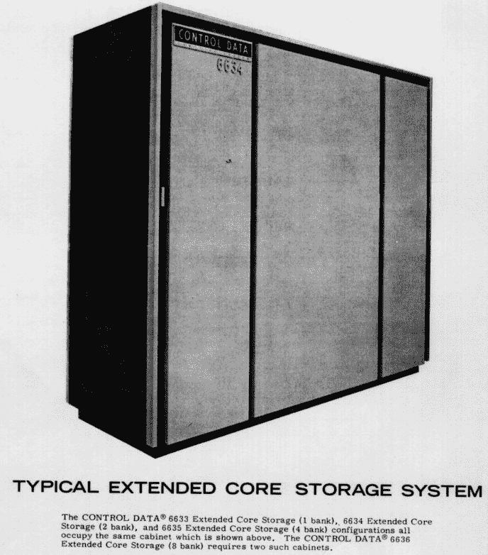
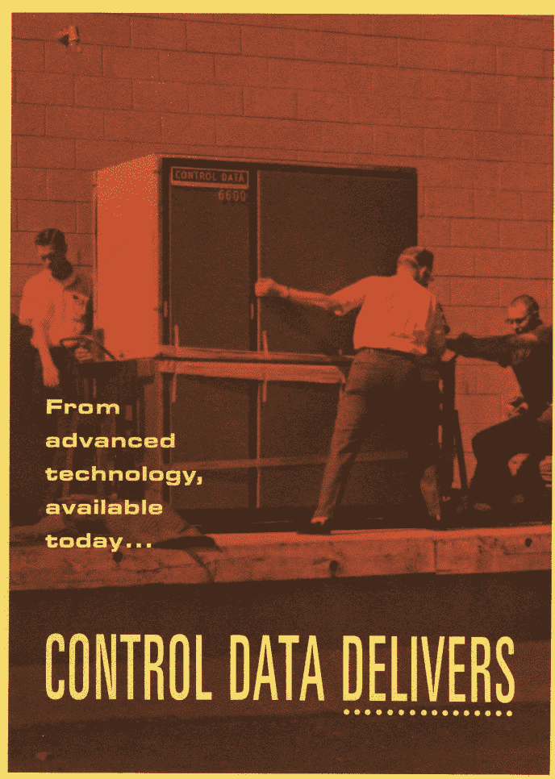

<!--yml
category: 未分类
date: 2024-05-27 12:48:01
-->

# Inside Control Data Corporation’s CDC 6600 – Chips and Cheese

> 来源：[https://chipsandcheese.com/2024/04/01/inside-control-data-corporations-cdc-6600/](https://chipsandcheese.com/2024/04/01/inside-control-data-corporations-cdc-6600/)

Computers fill essential roles in modern, growing economies. Banks, airlines, and other large business have used computers to efficiently handle large amounts of data. As these businesses grow and cope with ever larger datasets, their compute needs will only increase. Control Data Corporation (CDC) is well aware of this trend, and is constantly innovating to keep pace with competitors like IBM and DEC.

The company’s CDC 6600 brings a variety of exciting techniques into play in pursuit of increased performance. With features like parallel, nonblocking execution units, high performance Central Memory, and independent IO processors, CDC hopes to get an edge over the competition.

## High Level

The CDC 6600’s Central Processor is a 60-bit scalar, in-order architecture with nonblocking execution units and 18-bit addressing. It directly accesses up to 960 KB of Central Memory. An optional Extended Core Storage unit allows over 14 MB of storage for customers with very large memory demands.

Both the Central Processor and Central Memory run at the same high 10 MHz clock frequency. Matched CPU and memory speeds let the CDC 6600 get by without a complex, multi-level cache hierarchy. Customers can enjoy consistent memory access performance throughout the entire Central Memory address space.

## Frontend: Branch Prediction

There is no branch prediction.

## Frontend: Instruction Fetch

Instructions fetched from Central Memory into an instruction queue, which can hold eight 60-bit words and can act as a loop buffer. To save memory bandwidth, the CDC 6600 only initiates instruction fetch once a branch jumps out of the instruction queue, or when the instruction queue is almost empty. Instruction fetches from Central Memory have a latency of eight cycles. Branches have 9 cycle latency if the target is found in the instruction queue, or 15 cycle latency if the target has to be fetched from Central Memory.

RNI (Read Next Instruction) timing from CDC’s reference manual

Because instructions are fetched from the same Central Memory that the data side writes to without any intermediate caches, self modifying code can be handled by simply ensuring that modifications happen at least eight 60-bit words ahead of the currently executing instruction. Unlike some other CPUs, self modifying code doesn’t require costly cache invalidations and refills.

The CDC 6600 features a simple instruction set with under 100 instructions, and directly executes all instructions in hardware. Therefore, it doesn’t need a decoder.

## In-Order Execution Engine

Once instructions are fetched into the instruction queue, a reservation control section handles them in program order and ensures their needs are met. Scoreboards in the reservation control unit track which functional units are busy, and which registers are waiting to be written by an in-flight instruction. Once those dependencies are satisfied, the instruction can be executed. Register files are directly addressed, and no register renaming is required.

Detecting read-after-write conflicts

Because the CDC 6600 doesn’t do register renaming, it has to resolve WAR (write-after-read) hazards too. Each writeback is therefore checked against all registers waiting to be read.

Once an instruction is issued, it reads its inputs from the register files. To simplify wiring, some functional units share input and result buses. The CDC 6600’s instruction set features 24 registers. Eight of these are 60-bit operand registers for high precision math, and are numbered X0 to X7\. These aren’t general purpose registers. To ease register file design, data loaded from Central Memory can only be placed into X0 through X5, and Central Memory writes have to come from X6 or X7\. The other 16 registers are split between eight address registers (A0-A7) and eight increment registers (B0-B7). To save transistors, the address and increment registers are 18 bits long. After all, no one should need a larger address space.

The CDC 6600 features ten independent functional units that can theoretically all be active in parallel. These functional units are not pipelined and have multi-cycle latencies, so programs need a mix of instructions to avoid slowdowns due to oversubscribed execution units.

To increase performance, the increment and floating point multiply units are duplicated. That allows, for example, a FP multiply instruction to start executing while a prior FP multiply is still in progress. The CDC 6600 can achieve 4.5 MFLOPs with a perfect mix of FP multiplies and adds. Achieving such high throughput may be difficult because FP multiplies suffer from very high 10 cycle latency.

From the 6600 Central Processor training manual, volume II. “Third order conflicts” refer to WAR hazards

### Memory Protection

An access starts within the core when a program places a value into an address register and executes the appropriate Increment instruction. Because the CDC 6600 is a powerful system capable of multitasking, it uses a memory protection scheme to prevent different programs from stepping on each other.

To make every transistor go as far as possible, CDC avoids unreasonably expensive techniques like paging and virtual memory. Instead, it uses a more resource efficient segmentation scheme. Each program has a Reference Address (RA) that defines its segment base, and a Field Length (FL) that indicates how much memory the program uses in 60-bit words.

Memory accesses outside of the bounds denoted by RA and RA+FL causes a halt. Delivering precise exceptions that the operating system can resume from would be a ludicrous waste of precious logic. Instead, programmers should be honest about the storage their programs need, and get good at their job.

## Memory Access

The CDC 6600’s Central Memory has a capacity of up to 960 KB, or 131072 60-bit words. It’s further subdivided into 4096 word banks, selected by the low bits of the memory address. A 960 KB configuration thus has 32 banks. Programs use the CDC 6600’s eight 18-bit address register to access memory, though only 17 bits are required. The 18th bit is simply not used.

Each bank operates independently to provide high performance. Under ideal conditions, the Central Processor can read one 60-bit word per cycle, for 75 MB/s of bandwidth. Achieving such high bandwidth requires the programmer to avoid bank conflicts, because each bank takes multiple cycles to service a request. The Central Memory’s arbitration logic (“hopper”) of course has to detect bank conflicts.

Instead of using transistors to compare an incoming address with that of in-flight requests, the hopper simply issues the address and assumes there was a conflict if the destination bank doesn’t accept the address within 175 ns. In that case, the access will enter a 300 ns replay loop until it succeeds. Loads that don’t experience a bank conflict can complete in 300 ns, or three cycles.

The CDC 6600’s memory subystem is both fast and simple

### Extended Core Storage

Control Data Corporation offers Extended Core Storage (ECS) for customers with very high memory requirements. Specifically, ECS can store up to two million 60-bit words, or over 14 MB. ECS uses magnetic core storage like Central Memory and can also achieve a maximum throughput of one 60-bit word at 10 MHz. However, such high capacity storage demands a different design.

From the ECS reference manual

Instead of being word-addressable like Central Memory, ECS stores words in 488-bit (61 byte) lines. ECS also runs at a lower 312.5 KHz clock frequency, relying on banks to achieve high bandwidth. Each ECS bank has 125,952 60-bit words, or 944.6 KB of storage, and at least four banks are required to sustain one 60-bit word at 10 MHz. Because ECS has such incredibly high capacity, the CDC 6600’s address registers are not wide enough to directly address it. Therefore, ECS access instructions use the 60-bit X0 register to provide an address, relative to the program’s segment base address in ECS.

Despite its lower clock speed, the ECS can maintain high performance because both a read and a write can happen over the same cycle. A read takes place over 800 ns, followed by 1600 ns for a write. All of this happens within a 3200 ns cycle.

Control Data Corporation understands that reliability is important for any computer user, so ECS features 5K words (38.4 KB) of “reserve memory” to tolerate failures. If part of ECS memory fails, the user can bring reserve memory into operation in 1K word increments by simply exchanging two wires. ECS storage is also parity protected.

## Physical Design

Despite offering an impressive amount of compute power, the CDC 6600 can be easily handled by any computer enthusiast. Because it aggressively economizes transistor and core storage use, the entire computer can fit within a single room.

Cooling is easily handled by a refrigeration unit at the end of each wing.

## Final Words

Control Data Corporation has designed a powerful computer that efficiently puts all available transistors (or not transistors) to use in maximizing performance. Its simple instruction set is closely tied to the hardware and directly executed. No logic is wasted translating instructions from one format to another. No part of the system does any guessing and recovery, which makes the CDC 6600 completely immune to speculative execution vulnerabilities.

From CDC’s advertisement

Furthermore, the CDC 6600 avoids wasting transistors on cache by using fast magnetic core storage in conjunction with an instruction fetch queue. With something as powerful as the CDC 6600, I don’t think the world will need more than maybe ten computers in service at any one point. The CDC 6600’s elegant and powerful design further demonstrates there will never be a need for giant machines with out-of-order execution running at ridiculous 5+ GHz clocks. Such processors would be impossible to construct.

Wait, what year is it again?

If you like our articles and journalism, and you want to support us in our endeavors, then consider heading over to our [Patreon](https://www.patreon.com/ChipsandCheese) or our [PayPal](https://www.paypal.com/donate/?hosted_button_id=4EMPH66SBGVSQ) if you want to toss a few bucks our way. If you would like to talk with the Chips and Cheese staff and the people behind the scenes, then consider joining our [Discord](https://discord.gg/TwVnRhxgY2).

### *Related Posts*