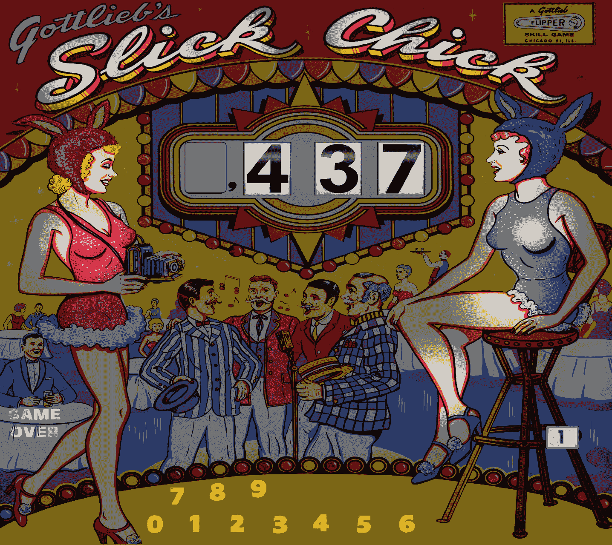
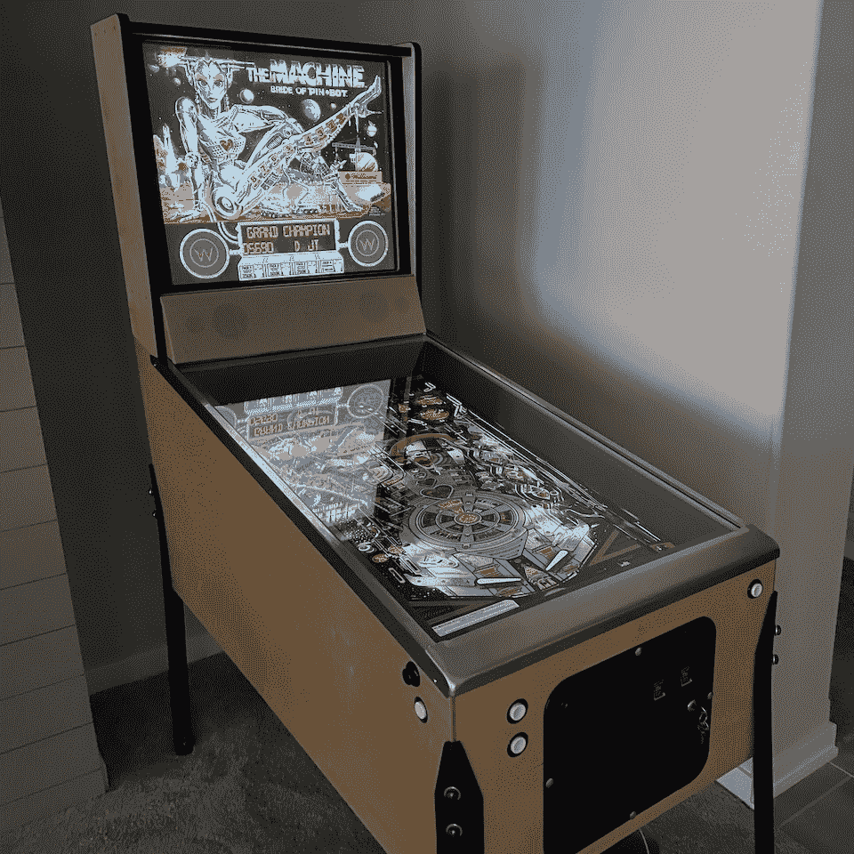
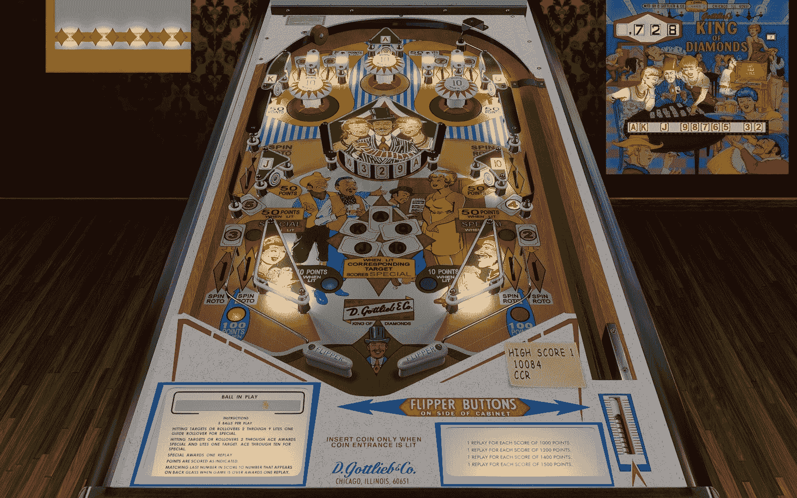
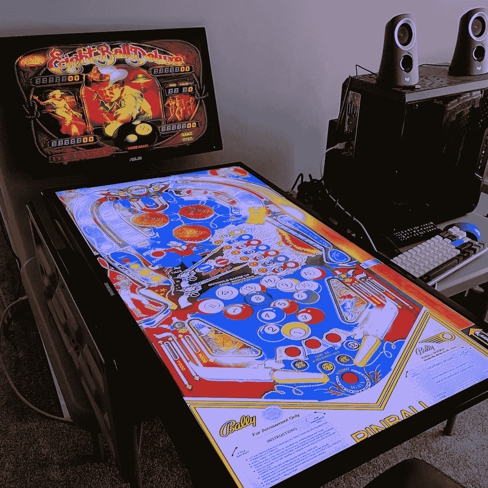
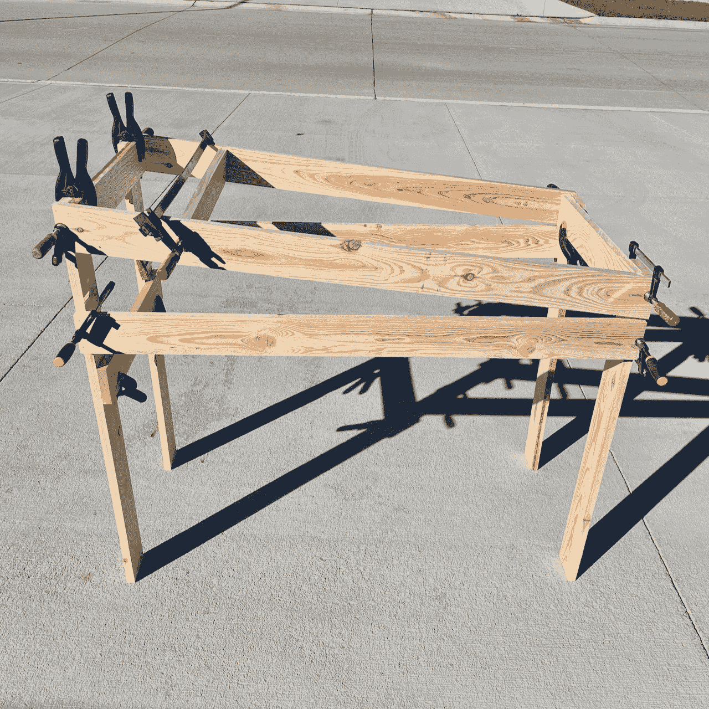
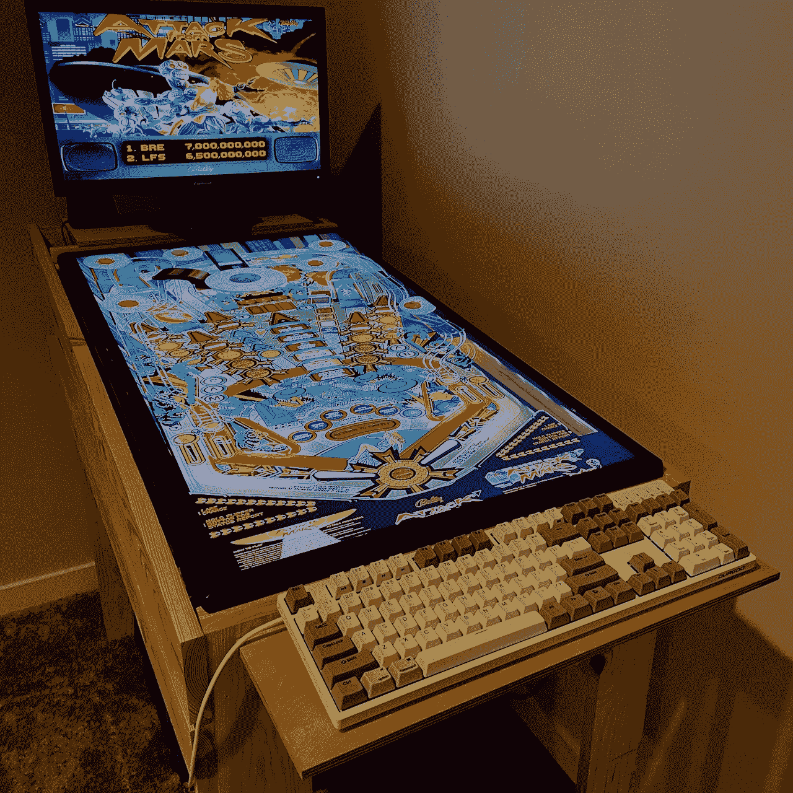

<!--yml
category: 未分类
date: 2024-05-27 12:48:06
-->

# Virtual Pinhead

> 来源：[https://www.engineersneedart.com/blog/pinhead/pinhead.html](https://www.engineersneedart.com/blog/pinhead/pinhead.html)

# Virtual Pinhead

Beautiful backglass art reproduction for the 1963 Gottlieb pinball game *Slick Chick* by the user HauntFreaks. He also works on the pinball tables as well and posts his creations on [VPUniverse](https://vpuniverse.com).

<date>2 Apr 2024</date>

### Down the ~~Rabbit Hole~~ Drain

Probably a visit years ago to the [Pacific Pinball Museum](https://www.pacificpinball.org) in Alameda, California was when I became a fan of pinball *art* — mainly the backglass. (The backglass is that vertical attract-mode billboard at the rear of the cabinet — often screen-printed glass). I’ve enjoyed playing pinball but it never had enough appeal such that I would seek out places to play. And I’ve certainly never had a strong desire to purchase a pinball cabinet of my own — fill my basement with machines.

Jump to the fall of last year though and I read [a post on Hacker News](https://news.ycombinator.com/item?id=37570422) about *virtual* pinball. While the author did manage to make playing pinball sound more appealing to me (I was not aware that nudging a pinball cabinet was anything other than verboten), I think I was more drawn to the challenge of *building* a virtual pinball cabinet.

Six months after that blog post and virtual pinball (Visual Pinball specifically) has become a hobby that I have fully immersed myself in. I still think I am unlikely to get a real pinball machine, but I’m afraid that I have not just one, but two virtual pinball cabinets in my basement. I’m also experimenting with a more modest-size “controller” that others with a smaller budget (or with less woodworking skills) might find more approachable.

Okay, so I do have a *virtual* pinball cabinet in my basement now. But it wasn’t there 6 months ago.

Further I have begun learning how these virtual pinball tables are created and scripted. To aid in stepping up the realism of a virtual table I even threw together a poor-man’s ray-tracer program I’ve used to generate an image file representing the complex shadows that cover the table’s playfield. It’s been a a crash course on pinball, including its history and along the way I discovered a dedicated community of pinball fans that are constantly trying to push virtual pinball to higher levels of authenticity and realism.

So take this as either another gentle introduction to virtual pinball or perhaps as a cautionary tale.

### Somewhat Virtual

I won’t go into every aspect of virtual pinball cabinets but if you’re new to them let me tell you briefly what they entail.

I’ve built plenty of [MAME](https://www.mamedev.org) cabinets and [Stepmania](https://www.stepmania.com) dancepads in the past so neither the woodworking nor the electronics aspect of building a virtual pinball cabinet seemed too daunting (but, yes, they do involve that). But when you do some research and find that people are dedicating as many as three displays to the project (and quite a large one for the playfield) it is obviously going to involve an outlay of cash. On top of that, if you really want the authentic look, you should source actual pinball cabinet legs, a coin door, lockdown bar, etc. Never mind a dedicated PC, a sound system, switches and various electronic interfaces.

The pursuit of course is to make virtual pinball as close to the real thing as possible — in the hardware as well as the software. Not knowing anyone who has a virtual pinball cabinet I would have to find out how close these cabinets are to the real thing by building one myself. And I think it goes without saying that, to the degree you can make virtual pinball seem real, having a single cabinet in your basement that can emulate thousands of different pinball machines is kind of a space-saver.

*(And I was going to add, no relays — no moving parts, but that’s not necessarily true for the purists. But I’ll touch on that later.)*

I did take a more budget-minded approach before diving into building the cabinet above, and I’ll talk about that, but I should probably walk back a step first and mention the virtual pinball software.

Talented users like *Silversurfer* also freely contribute to the hobby — apparently spending all day bent over *Affinity Designer* to recreate vector versions of backglass art from the golden era of pinball. The mashup above shows the paths/vectors on the right, finished result on the left. He's over sixty contributions to date.

### VPX

[VPX (Visual Pinball, version 10)](https://github.com/vpinball/vpinball/releases) is an open source virtual pinball project that runs on Windows. The code base has been around for a while. Pinball tables use what appears to be a flavor of Visual Basic for scripting. And while there is a new OpenGL implementation, I believe VPX is generally a DirectX-centric application.

> A clever person posted an experimental build of VPX for the M1 Apple hardware — as a kind of science project. But there are a lot of external processes and frameworks that would also require porting to give you the whole VPX experience.

But there’s still more to VPX than just the application. For one, there is a separate backglass server that handles displaying the score and the pinball backglass art. Also, modern solid-state (SS) pinball games have ROMs and so require PinMAME also be installed, emulating the needed hardware for those ROMs.

The VPX eco-system supports multiple displays so that you can put the backglass on its own display, and optionally even a dot-matrix display on a third monitor. VR is also supported by many tables (but not something that I have tried). If you add an accelerometer as one of your USB inputs, VPX supports X and Y nudging of the table and applies those impulses to the virtual table and ball physics. Yet another framework (DOF) supports driving actual pinball hardware so that you can have real solenoids, flashing LEDs and such that are triggered by in-game events. (And this was what I was hinting at earlier — people installing actual mechanical hardware in their virtual cabinets to get the authentic sound and feel.)

Additionally, VPX has a 7.1 audio mode intended to drive transducers (also called exciters) arranged in a physical cabinet. Two transducers near the player’s hands transmit realistic haptic sensations of flippers slapping the ball, the ball dropping down the drain, etc. Another pair further up the playfield deliver the sensation of bumpers, the ball hitting the rubber stopper. Even the ball merely rolling around the playfield adds an eerie realism.

From the [Pinscape v2 Build Guide](http://mjrnet.org/pinscape/BuildGuideV2/BuildGuide.php?sid=audio). Rear and side channels of VPX’s 7.1 audio output drive near and far transducers on the pinball cabinet. VPX calls this “SSF” for surround-sound feedback.

Then there are the files that represent the pinball tables, the files for the backglass, the ROMs…

As you can see, VPX is a game with a lot of moving parts and is notoriously difficult to get set up correctly. But it rewards those that make the effort to add that second display, add the nudge hardware, the transducers. But as I say, first you need to figure out how to get it installed.

### Software First

Before I could build anything resembling a cabinet, I first needed to overcome the hurdle of installing VPX (and all of its associated parts) on to the PC that I had lying around.

Like MAME (if you’re familiar with that) Visual Pinball is often played by way of a front-end. You can just launch VPX and select a table to play, but playing VPX indirectly from a front-end makes it easy to scroll through the many tables you might have installed on your machine.

You can absolutely play VPX without a cabinet and on a single display. Desktop mode is probably the most common way the game is played. This is *King of Diamonds* from 1967.

> For my first install I followed [the guide on VPForums.org](https://www.vpforums.org/index.php?app=tutorials&article=1). This went smoothly. I wanted to try another front-end though and so eventually went with Nail Buster’s [PinUP Popper “Baller” Installer](https://www.nailbuster.com/wikipinup/doku.php?id=baller_installer). (I know, like what planet are we on?) My recollection is that there were a few extra steps required but that I got it to work as well.

With VPX installed you’ll find it only comes with one pinball table and a few diagnostic tables (to test the nudge feature — things like that). There were a couple of places I headed to pull down tables, backglass files, ROMs (for tables that required them). [VPForums](https://www.vpforums.org) was in fact the first place I went — and they have a very good collection of files for Visual Pinball. The forums there are, I believe, the home for VPX development as well.

The other big site is [VPUniverse](https://vpuniverse.com). It too has all the usual virtual pinball tables and other files — has forums, etc. If it’s a particular table that you’re looking for sometimes one site will have it and not the other so I created accounts for both.

By following various tutorials and through some trial and error I was at last able to get the right files put in the right folders and was able to tell all interested parties which display to use for what element of the game. But I wasn’t yet playing on anything with even a semblance of a pinball cabinet.

As I often do, I decided to try to get to a pinball cabinet the slow way.

In cabinet-mode, you are looking more or less straight down on a pinball table. Of course with your main display lying face-up, horizontal in front of you, the playfield will look correct. This table is *Domino* (1968).

### The Slow Way

The first step in testing the waters for pinball-cabinet immersion was just to lay a large monitor on its back. So I grabbed a 30" or so 1080p TV that I had picked up from a Goodwill and laid it flat on a small table in my basement. This would be my pinball playfield.

A cheap ASUS desktop display I stood at the far end of the table to stand in for my pinball table’s backglass.

At this early stage though I would still rely on the keyboard shift keys to be my flipper buttons.

A TV laying on its back, a second monitor as backglass. Like making a “fort” with sheets when you were a kid.

Even playing this crude setup was kind of fun. The weird thing though was that the wife seemed to get into it more than I did. And she’s not a gamer at all; more or less ignored the many MAME machines that I built over the years. Maybe this virtual pinball was kind of a non-gamer’s game? Who knows, but I am always happy when she takes an interest in one of my projects.

Satisfied that my wife at least was having a good time, I wanted to go to the next phase and see what physical flipper buttons and maybe an accelerometer would add to the realism.

### Pocket Screws and Pine

To take the virtual pinball cabinet to the next level would involve, at the very least, enough of a physical cabinet that you could rest your palms on its corners, lay your fingers across flipper buttons. The author of the post on Hacker News emphasized the ability to nudge a pinball table as well — and I knew that there were USB interfaces that not only served to interface the flipper switches to the game but also provided the accelerometer used for nudging.

The basic cabinet is nearly done. No, really.

The cabinet (such as it is) that I came up with began as you see above. It was made almost entirely of 1×6’s (sourced from Lowes), pocket screws and Gorilla™ glue. To the cabinet in the photo above I still had only to add a plywwood floor (or pan?) and a small rear deck to place the speakers and backglass display on. (You may want to secure the backglass display if you think you’re going to do some serious nudging.) I suspect I had maybe $40 worth of lumber tied up in it. But I got a good deal of mileage out of it.

It might not look like much, but it’s free-standing now. Soon the keyboard would be replaced with buttons.

Soon holes were drilled for flipper buttons, magna-save buttons. Another button acted as a coin-insert switch so you could rack up credits. A button also stood in for the plunger (although you can get the real thing and interface it too with VPX). A couple of additional switches let you start a game, return to the main menu to select another table.

Besides the pocket-screw jig, I imagine only a drill (with a 1-1/8" Forstner bit) and a hand saw (or optionally a circular saw) would be necessary to take the hobby to this level. If it doesn’t embarrass you, you could stop here. Get a nice display for the playfield, something for a backglass. A cheap computer speaker system with a subwoofer will give you more than enough audio.

The wife and I had hours of fun with this dorm-room style set up.

> If you want to throw money at it (like everything, I suppose) you can just buy a ready-made virtual pinball cabinet. Do your homework though because there are apparently a lot of crappy commercial ones out there that will only disappoint you. To go all-in and do a 120Hz display with a graphics card that can handle that refresh rate plus 4K, you can see that cost-cutting commercial solutions are not going to be able to measure up. If you have even more money to throw around though I am sure you can find builders who will make you something top of the line.

I still wanted to try the SSF (surround-sound feedback) but at this point I already knew we would be having a pinball cabinet long-term in the basement. A final cabinet with solid sides would follow. I would go with steel pinball legs, even a coin door (in part as a means to easily access things like the volume controls for the various sound elements). A high grade multi-ply plywood is my cabinet wood of choice (sorry, MDF, you’re not allowed in my shop).

I was lucky to have discovered an interesting display from LG (their “DualUp”) to serve as the backglass display. It’s half a 16:9 display, so, 8:9 — nearly square. As backglass art was my initial draw to pinball I was happy to have found a display that would be a close match to the real thing.

Nope, never did the flashing LEDs. Never added a dot-matrix display (I lean old-school with regard to pinball). Still no mechanical bits inside the cabinet. *(Some of these things though I could certainly add later.)*

It was this final iteration where I added the surround-sound feedback (SSF) and the table then seemed to, figuratively of course, come alive. I highly recommend builders go this extra step. Adding SSF is next-level realism.

*(I see no reason I couldn’t have done the same on the 1×6 pine version.)*

> If you want to go all in, a YouTuber, [Way of the Wrench](https://www.youtube.com/@wayofthewrench), did a detailed [series](https://youtube.com/playlist?list=PLrqlHbqP7FIO5P8e8HtrBB01xqQtAWpJ5&si) on his construction of a full-size virtual pinball cabinet. I got a lot of tips from there. I kind of question his use of the word *budget* to describe his build though. He also has an earlier series on building a MAME cabinet, FWIW.

### Community

I touched a bit on this but there’s quite a community around virtual pinball generally and Visual Pinball specifically. Never mind that pinball (and here I mean actual physical machines) has quite a community as well.

With VPX being open source, none of the virtual pinball tables or backglass files are commercial either. So in addition to the programmers that support and push forward the code base, you also have users that pop out to the Pinball Hall of Fame in Las Vegas to photograph the playfields, plastics and backglass of rare pinball tables (and many for which the manufacturing run ended fifty or sixty years ago) in order to bring the digital files into paint programs to clean them up for use in virtual pinball.

Other volunteers use software tools to import the artwork to create the backglass files. From their research they position the lights, add the score reels, sequence the lights.

Other volunteers create the virtual tables. Those with expertise might even recreate the table in 3D tools like Blender in order to capture nuances of lighting and shadows — exporting the resulting texture-maps, shadow-maps for use in the table. Others with coding skills manage table scripting to implement table logic, animation, etc.

Among the people dedicating their time to the hobby you’ll find many who own pinball tables themselves (suprise!) or have a passion for preserving the old ones in as faithful a manner as the software will allow. (And often, I might add, pushing the software further than perhaps the developers even realized it could go.)

If you start down this path you might even find yourself learning about the history of pinball itself. Early woodrail tables, wedgeheads — when ball-lifters gave way to automatic ball releases. Bells became chimes, became digital sounds. Reels went to VFD, went to dot-matrix displays. Relays and motors … you can probably guess what happened to those.

This was only meant to be a kind of introduction. In future posts I plan to take a few deep dives into a few topics that I only touched on here.

Stay tuned.

> Of late I’m part of a collective on VPUniverse that are bent on taking existing VPX pinball tables and dialing up the authenticity. Scripting, artwork, sounds, geometry … there’s a lot of stuff we’re learning about and sharing. When we are happy with a table we release it as username: *EMUnderdogs*. (*EM* refers to the older electro-mechanical pinball tables that we enjoy working on.)