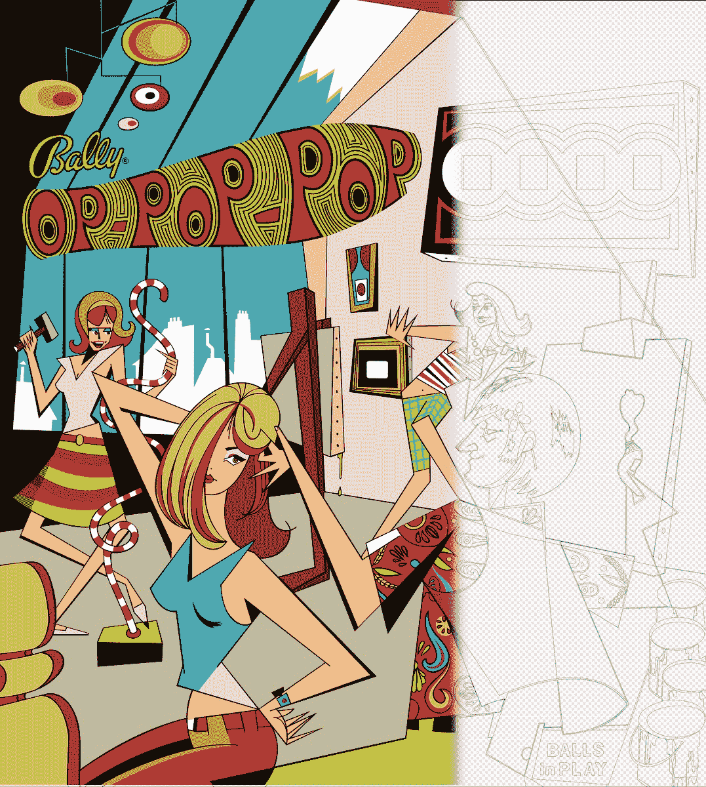
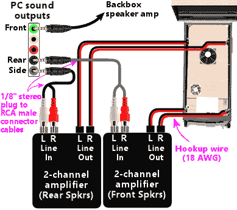

<!--yml

category: 未分类

date: 2024-05-27 12:48:06

-->

# 虚拟弹球头

> 来源：[https://www.engineersneedart.com/blog/pinhead/pinhead.html](https://www.engineersneedart.com/blog/pinhead/pinhead.html)

# 虚拟弹球头

用户HauntFreaks为1963年Gottlieb弹球游戏*Slick Chick*制作了精美的背景艺术复制品。他还参与制作弹球桌，并在[VPUniverse](https://vpuniverse.com)上发布他的作品。

<date>2024年4月2日</date>

### 下滑 ~~兔子洞~~ 排水口

或许几年前访问加利福尼亚州阿拉米达的[太平洋弹球博物馆](https://www.pacificpinball.org)时，我成为了弹球*艺术*的粉丝 —— 主要是背景艺术。 （背景艺术是指位于弹球机柜后部的垂直吸引模式广告牌 —— 经常是丝网印刷玻璃）。我喜欢玩弹球，但它从未有足够的吸引力让我去寻找玩的地方。我也从未有过强烈的购买自己弹球机柜的愿望 —— 把我的地下室填满机器。

然而，去年秋天我阅读了[Hacker News上的一篇文章](https://news.ycombinator.com/item?id=37570422)关于*虚拟*弹球。尽管作者成功地让我觉得玩弹球更有吸引力（我不知道碰撞弹球柜会被禁止），但我更被*建造*虚拟弹球柜的挑战所吸引。

六个月后的博客文章和虚拟弹球（特别是Visual Pinball）已成为我全身心投入的一项爱好。我仍然认为我不太可能买一个真正的弹球机，但我恐怕不仅在地下室有一个，而是有两个虚拟弹球柜。我还在尝试一个更为适中的“控制器”，以便那些预算较小（或木工技能较少）的人更容易接受。

好吧，所以现在我的地下室确实有一个*虚拟*弹球柜了。但6个月前并没有这样一个。

此外，我开始学习如何创建和编写这些虚拟弹球桌。为了提升虚拟桌面的真实感，我甚至编写了一个简易的光线追踪程序，用于生成代表桌面玩场复杂阴影的图像文件。这真是弹球的一场速成课程，包括其历史，沿途我发现了一个致力于将虚拟弹球推向更高真实度和逼真度的狂热爱好者社区。

因此，可以把这视为又一个对虚拟弹球的轻松介绍，或者可能是一个告诫性故事。

### 有点虚拟

我不会详细介绍虚拟弹球柜的每一个方面，但如果你对它们还不熟悉，让我简要告诉你它们包含了什么。

我以前制作过许多[MAME](https://www.mamedev.org)街机和[Stepmania](https://www.stepmania.com)舞毯，因此在建造虚拟弹球柜的木工和电子方面似乎并不是太可怕的任务（但确实涉及到这些）。但是，当你进行一些研究并发现有人把多达三个显示器用于项目（而且还有一个相当大的用于游戏区）时，显然会涉及到一笔资金投入。此外，如果你真的想要真实的外观，你应该寻找真正的弹球柜腿部、投币门、锁定杆等。更不用说专用的个人电脑、音响系统、开关和各种电子接口了。

当然，追求的目标是尽可能地使虚拟弹球接近真实 —— 无论是在硬件还是软件上。我不认识任何人有虚拟弹球柜，因此我只能通过自己建造一个来找出这些柜子距离真实物体有多近。我认为不言而喻，可以通过在地下室放置一个单一的柜子，该柜子可以模拟成千上万种不同的弹球机，来节省空间。

*(我本来要补充说，没有继电器 —— 没有活动部件，但这对于纯粹主义者来说并不一定是真的。但我稍后会谈到这一点。)*

在制作上述柜子之前，我确实采取了更加注重预算的方法，并且我会谈谈这一点，但我可能应该先退一步，提一下虚拟弹球软件。

像*Silversurfer*这样的有才华的用户也免费为这项爱好做出贡献 —— 显然整天都在弯腰在*Affinity Designer*上重新创建黄金时代弹球背景艺术的矢量版本。上面的混合图显示了右侧的路径/矢量，左侧的成品。迄今为止，他已经做出了六十多项贡献。

### VPX

[VPX（Visual Pinball，版本10）](https://github.com/vpinball/vpinball/releases)是一个在Windows上运行的开源虚拟弹球项目。代码基础已经存在一段时间了。弹球台使用的似乎是一种Visual Basic的脚本语言。虽然有一个新的OpenGL实现，但我认为VPX通常是一个以DirectX为中心的应用程序。

> 一个聪明的人发布了针对M1苹果硬件的VPX实验版本 —— 作为一种科学项目。但是还有许多外部进程和框架需要移植，以获得完整的VPX体验。

但是VPX还不仅仅是一个应用程序。首先，还有一个单独的背景玻璃服务器，用于显示分数和弹球背景艺术品。此外，现代固态（SS）弹球游戏有ROM，因此需要安装PinMAME，以模拟这些ROM所需的硬件。

VPX生态系统支持多个显示器，因此您可以将背景板放在独立的显示器上，甚至可以在第三个显示器上显示点阵显示器。许多桌子也支持VR（但这不是我尝试过的东西）。如果您将加速计作为您的USB输入设备之一添加，VPX支持对桌子进行X和Y轴的推挤，并将这些脉冲应用于虚拟桌面和球体物理。另一个框架（DOF）支持驱动实际的弹球硬件，因此您可以拥有由游戏事件触发的真实电磁铁、闪烁LED等。 （这就是我早些时候暗示的东西——人们在他们的虚拟机柜中安装实际的机械硬件以获得真实的声音和感觉。）

此外，VPX还有一个旨在驱动安装在物理机柜中的传感器（也称为激振器）的7.1音频模式。位于玩家手附近的两个传感器传输弹簧板打击球的逼真触觉感，以及球下落的感觉等。另一对传感器位于游戏区的上方，传递保险杠的感觉，球击中橡胶挡块的感觉。即使球仅仅在游戏区滚动也增加了一种怪异的逼真感。

来自[Pinscape v2 构建指南](http://mjrnet.org/pinscape/BuildGuideV2/BuildGuide.php?sid=audio)。VPX的7.1声道输出的后置和侧置通道驱动弹球机柜附近和远处的传感器。VPX将此称为“SSF”，即环绕声反馈。

接下来是代表弹球桌的文件，背景板的文件，ROM文件……

正如您所见，VPX是一个有许多活动部分并且众所周知难以正确设置的游戏。但它会奖励那些努力添加第二个显示器，添加推挤硬件和传感器的人。但正如我所说，首先您需要弄清楚如何安装它。

### 首先软件

在我能够制作出类似于机柜的任何东西之前，我首先需要克服将VPX（及其所有相关部件）安装到我周围空着的PC上的障碍。

像MAME（如果您熟悉的话），Visual Pinball经常通过一个前端来玩。您可以直接启动VPX并选择要玩的桌子，但是通过前端间接玩VPX可以轻松地浏览您可能在计算机上安装的众多桌子。

您绝对可以在没有机柜且在单个显示器上玩VPX。桌面模式可能是游戏最常见的方式。这是*1967年的金钻石*。

> 对于我的第一个安装，我按照[VPForums.org上的指南](https://www.vpforums.org/index.php?app=tutorials&article=1)进行。这进行得很顺利。不过我想尝试另一个前端，所以最终选择了Nail Buster的[PinUP Popper “Baller” Installer](https://www.nailbuster.com/wikipinup/doku.php?id=baller_installer)。（我知道，这就像我们在哪个星球上一样？）我记得需要一些额外的步骤，但最终我也让它正常运行了。

安装了VPX后，你会发现它只带了一款弹球桌和几款诊断桌（用于测试轻击功能等等）。有几个地方我去下载桌面，背景文件，以及需要ROM的桌子。实际上，[VPForums](https://www.vpforums.org)是我第一个去的地方 —— 它有很好的Visual Pinball文件收藏。我相信那里的论坛也是VPX开发的家园。

另一个重要的网站是[VPUniverse](https://vpuniverse.com)。它也有所有常见的虚拟弹球桌和其他文件 —— 还有论坛等。如果你在寻找特定的弹球桌，有时一个网站会有而另一个网站没有，所以我为两个网站都创建了账户。

通过遵循各种教程并通过一些试验和错误，我最终能够将正确的文件放在正确的文件夹中，并告诉所有感兴趣的人使用哪个显示器来显示游戏的哪个部分。但我还没有在任何类似弹球柜的设备上玩过游戏。

就像我经常做的那样，我决定用最慢的方式达到一个弹球柜。

在柜式模式下，您基本上是从上方俯视弹球桌。当然，您的主显示器平放在您面前，播放区域看起来是正确的。这台机器是*多米诺*（1968）。

### 缓慢的方式

测试进入弹球柜的第一步是将一个大型显示器平放在背面。所以我拿起了一个从Goodwill买来的30英寸左右的1080p电视，将其平放在我地下室的小桌子上。这将成为我的弹球游戏区域。

一台便宜的华硕台式显示器我放在桌子的远端，代替我的弹球桌的背面玻璃板。

然而，在这个早期阶段，我仍然依赖键盘上的Shift键作为我的翻转按钮。

一个平放在背面的电视，第二个显示器作为背景玻璃板。就像小孩子时候用床单搭“堡垒”一样。

即使玩这种粗糙的设置也有点儿乐趣。不过奇怪的是，妻子似乎比我更投入。她根本不是玩家，多年来我建造的许多MAME游戏机她都基本忽视了。也许这款虚拟弹球确实是非玩家的游戏？谁知道呢，但她对我的一个项目感兴趣时，我总是很开心。

满意至少我的妻子玩得开心，我想进入下一个阶段，看看实际的翻转按钮和可能的加速计会增加多少真实感。

### 隐藏螺丝和松木

要将虚拟弹球柜升级到下一个级别，至少需要足够大的物理柜子，可以将手掌放在角落，手指横跨翻转按钮。Hacker News上这篇帖子的作者强调了推动弹球台的能力，我知道有USB接口不仅可以用于接口翻转开关到游戏，还提供用于推动的加速度计。

基本柜子差不多完成了。不，真的。

这个柜子（虽然如此）就像你看到的那样开始建造。它几乎完全由1×6英寸的木板（来自Lowes）、隐藏螺丝和Gorilla™胶水组成。在上面的柜子上，我只需要加上一块胶合板地板（或许是平板？）和一个小的后置平台，放置扬声器和背景玻璃显示器。（如果你打算玩得认真，可能需要固定背景玻璃显示器。）我想我可能在它身上花了大约40美元的木材。但我从中获得了很多乐趣。

它可能看起来不起眼，但现在已经可以独立站立。很快，键盘将被按钮替换。

很快，为翻转按钮、马格纳-保存按钮钻了孔。另一个按钮作为投币插入开关，这样你就可以累积积分。还有一个按钮代替弹簧启动器（虽然你也可以获取真正的东西并与VPX接口）。另外几个开关让你启动游戏，返回主菜单选择另一张桌子。

除了隐藏螺丝夹具，我想只需要一把钻头（带有1-1/8英寸的福斯纳钻头）和一把手锯（或者选择使用圆锯），就可以将这个爱好提升到这个水平。如果你不觉得丢脸，可以在这里停下。为游戏区域找一个漂亮的显示器，为背景玻璃找点东西。一个带有低音炮的便宜电脑音响系统足以提供足够的音频效果。

我和妻子在这种宿舍风格的设置中玩了好几个小时。

> 如果你想往里面扔钱（就像所有东西一样，我想），你可以买一个现成的虚拟弹球柜。不过你要做好功课，因为显然市面上有很多糟糕的商业产品会让你失望。如果你想全力以赴，用一台可以处理那种刷新率加上4K分辨率的显卡做一个120Hz显示器，你会发现那些削减成本的商业解决方案无法与之匹敌。如果你有更多钱可以挥霍，我相信你一定能找到制造商为你打造顶级产品。

尽管如此，我仍然想尝试SSF（环绕声反馈），但在这一点上我已经知道我们将会在地下室长期拥有一个弹球机柜。最终带有实心侧板的柜子会跟随而来。我会选择高等级的多层合板作为我的柜子木材（抱歉，MDF，你不能进入我的工作室）。

我很幸运能发现LG的有趣显示器（他们的“DualUp”），用作背景玻璃显示器。它是16:9显示器的一半，所以是8:9 —— 几乎是正方形。由于背景玻璃艺术是我对弹球的初衷，我很高兴找到了一个接近真实的显示器。

没错，从来没有做过闪烁的LED。从未添加过点阵显示器（我在弹球机方面更偏向老派）。机柜内也没有任何机械零件。*(虽然这些东西我后来肯定可以添加。)*

正是在这个最后的迭代中，我添加了环绕声反馈（SSF），桌子似乎也在象征意义上活了起来。我强烈推荐制造者再走一步。添加SSF是提升逼真度的下一个层次。

*(我认为我在1×6松木版本上也可以做同样的事情。)*

> 如果你想全力以赴，一位YouTuber，[Way of the Wrench](https://www.youtube.com/@wayofthewrench)，详细记录了他建造全尺寸虚拟弹球柜的系列视频。我从中得到了很多建议。不过，我对他用“预算”一词来描述他的构建有些疑问。他还有一个早期系列视频介绍建造MAME柜，顺便说一句。

### 社区

我稍微提到了这一点，但总体上虚拟弹球和特别是Visual Pinball都有一个非常活跃的社区。更不用说实际的物理机器弹球机已经有了相当的社区。

由于VPX是开源的，虚拟弹球桌或背景玻璃文件都不是商业性质的。因此，除了支持和推动代码库的程序员外，还有用户去拉斯维加斯的弹球名人堂拍摄罕见弹球桌的游戏区、塑料件和背景玻璃（其中许多的制造已经在五六十年前结束），以将数字文件带入绘图程序中进行清理，以供虚拟弹球使用。

其他志愿者使用软件工具导入艺术作品，创建背景玻璃文件。通过他们的研究，他们定位灯光，添加计分轮，编排灯光顺序。

其他志愿者创建虚拟桌子。具有专业知识的人甚至可能在Blender等3D工具中重新创建桌面，以捕捉光影的微妙差别 —— 导出结果的纹理图、阴影图用于桌面。其他具有编码技能的人管理桌面脚本，实现桌面逻辑，动画等。

在致力于这项爱好的人群中，你会发现许多人拥有自己的弹球桌（惊讶吧！），或者对尽可能保持软件允许的最忠实方式的旧桌子有着激情。（我要补充的是，通常情况下，他们甚至推动了软件超出开发者可能意识到的界限。）

如果你开始追随这条路，甚至可能会发现自己在学习弹球历史。早期的木制轨道桌、楔形头部——当球抬升器被自动球释放器所取代时。铃声变成钟声，再变成数字音效。卷轴变成VFD，又变成点阵显示。继电器和电动机……你可能可以猜到这些发生了什么。

这只是一种介绍。未来的文章中，我计划深入探讨一些我在这里只是触及的几个主题。

敬请关注。

> 最近，我加入了VPUniverse上的一个团体，致力于提升现有的VPX弹球桌的真实性。脚本、艺术作品、声音、几何……有很多东西我们正在学习和分享。当我们对一张弹球桌感到满意时，我们会发布它，用户名为：*EMUnderdogs*。（*EM* 指的是我们喜欢的旧的电动机械弹球桌。）
