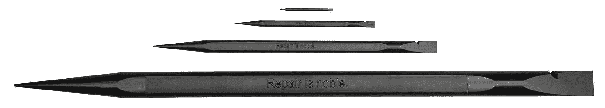
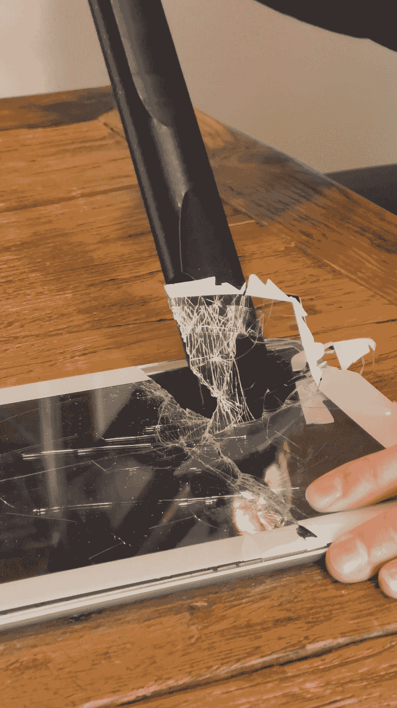

<!--yml
category: 未分类
date: 2024-05-27 12:47:40
-->

# iFixit Announces New Spudger Pro and Spudger Pro Ultra | iFixit News

> 来源：[https://www.ifixit.com/News/93647/ifixit-announces-new-spudger-pro-and-spudger-pro-ultra](https://www.ifixit.com/News/93647/ifixit-announces-new-spudger-pro-and-spudger-pro-ultra)

In the ever-evolving world of tech repair, where devices are becoming more complex and glued together, we at iFixit have always prided ourselves on staying ahead of the curve. But today, we’re not just ahead; we’re rewriting the rules. 

The standard Spudger, Spudger XL, Spudger Pro, and Spudger Pro Ultra

Carefully opening an iPad

Meet the pinnacle of repair technology: the Spudger XL, Spudger Pro, and Spudger Pro Ultra. Born from the shards of countless broken screens, the ashes of hundreds of burnt batteries, and a little technological wizardry, these aren’t your average tools. They are monuments to precision, durability, and innovation. Composed of cutting-edge nano molecular carbon flex lattice technology they’re practically science fiction. 

The Spudger XL, at twice the size of our standard Spudger, is perfect when you need a little extra prying power. It’s great for removing stubborn components, fixing small appliances, and household repairs. Dealing with a stuck power connector? Prying apart pesky adhesive? The Spudger XL turns the daunting into the doable, making it a must-have for any repair enthusiast or DIYer, looking to expand their toolkit.

Flawless

But if you need even more leverage, the Spudger Pro has got you covered. With 5x more prying and poking power than the standard Spudger, it’s the go-to tool for dealing with the toughest adhesives or really stuck connectors. The Spudger Pro does them all with ease, making child’s play of repairs that used to have you breaking out in a sweat. Whether it’s getting into a phone or detaching the screen from an iPad, the Spudger Pro is your veritable Excalibur for repair.

So if you need a little extra leverage for the stubborn and the stuck, the Spudger XL is your go-to tool. For repairs that demand more muscle, the Spudger Pro steps it up, and when you absolutely must fix everything, the Spudger Pro Ultra brings the ultimate in repair prowess to your toolkit.

Repair Wizard with the Spudger Pro Ultra

Still not enough? The Spudger Pro Ultra has enough prying force to practically scare any device open without touching it. Its imposing size means you’ll never have to worry about adhesive or stuck parts ever again. Additionally, using our technomancy skills, we’ve imbued the Spudger Pro Ultra with the power of 1734 standard Spudgers. In theory, this spudger should outperform our standard spudger by a factor of 13\. That means for every device you fix using the Spudger Pro Ultra, another 12 devices will fix themselves. Imagine walking into a room and simply by holding the Spudger Pro Ultra, smartphone screen cracks disappear, batteries regain their charge capacity, and dried-out thermal paste becomes new. It’s not just a tool; it’s the next repair revolution.

We’re proud to be releasing these revolutionary repair tools. Get yours [here](https://www.tiktok.com/@ifixit.com/video/7352954004638354734?lang=en)!